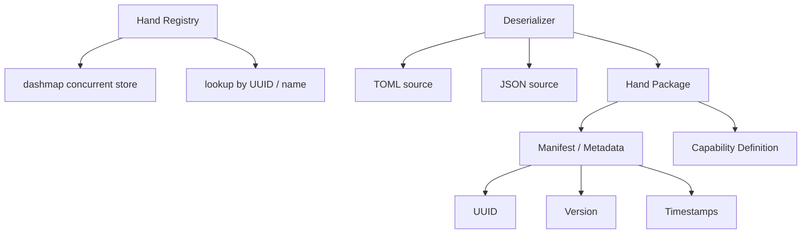

# Other — librefang-hands

# librefang-hands

Curated autonomous capability packages for LibreFang.

## Overview

A **Hand** is a self-contained, curated capability package that encapsulates a discrete unit of autonomous functionality. Hands serve as the primary mechanism by which LibreFang defines, distributes, and manages the skills available to the system. Each hand is independently versioned, identifiable, and loadable.

This crate provides the data structures, loading logic, registry, and validation for working with hands.

## Conceptual Model


```mermaid
graph TD
    A[Hand Package] --> B[Manifest / Metadata]
    A --> C[Capability Definition]
    B --> D[UUID]
    B --> E[Version]
    B --> F[Timestamps]
    G[Hand Registry] --> H[dashmap concurrent store]
    G --> I[lookup by UUID / name]
    J[Deserializer] --> K[TOML source]
    J --> L[JSON source]
    J --> A
```

## Key Responsibilities

| Concern | Implementation Detail |
|---|---|
| **Hand identity** | Each hand carries a `uuid::Uuid` for unique identification. |
| **Serialization formats** | Hands can be loaded from both TOML and JSON via `serde`, `toml`, and `serde_json`. |
| **Concurrency-safe registry** | A `dashmap`-backed store allows concurrent registration and lookup of hands. |
| **Timestamping** | `chrono` is used for creation and modification timestamps on hand metadata. |
| **Diagnostics** | `tracing` spans and events are emitted during loading, validation, and registration. |
| **Error handling** | `thiserror` derives structured error types for parse failures, validation errors, and registry conflicts. |

## Core Components

### Hand Definition

The central data structure representing a capability package. It is `Serialize`/`Deserialize`-owned and contains:

- A unique identifier (`Uuid`)
- A human-readable name
- A version string
- Creation and last-modified timestamps
- Capability-specific configuration or payload

### Hand Registry

A concurrency-safe collection (`DashMap`-backed) that stores loaded hands. Supports:

- Insertion of new hands with conflict detection
- Lookup by UUID or by name
- Removal of hands

### Loader / Deserializer

Reads hand definitions from TOML or JSON sources, validates them, and produces ready-to-register `Hand` instances. Invalid or malformed input results in structured errors rather than panics.

### Error Types

Custom error enum covering:

- TOML parse errors
- JSON parse errors
- Schema validation failures (missing required fields, invalid values)
- Registry conflicts (duplicate UUID or name)

## Integration with LibreFang

```text
librefang-types       ← shared type definitions used across crates
        ↑
librefang-hands       ← this crate
        ↓ (dev-dependency only)
librefang-runtime     ← used in tests to verify hands integrate with the runtime
```

- **`librefang-types`**: Provides shared types that hands reference (e.g., common enums, result aliases).
- **`librefang-runtime`**: Not a production dependency—used exclusively in tests to confirm that loaded hands can be handed off to the runtime correctly.

## Loading a Hand

Hands are typically loaded from a TOML manifest file or a JSON blob. The general flow is:

1. **Read** the source content (file, string, etc.).
2. **Deserialize** into the hand data structure using the appropriate format.
3. **Validate** required fields and constraints.
4. **Register** in the hand registry for later lookup.

Errors at any stage produce a typed error carrying context about what failed and why.

## Testing

Tests use:

- **`tempfile`** — to create temporary directories and files for filesystem-based loading tests.
- **`serial_test`** — to serialize tests that share global registry state, preventing race conditions.
- **`librefang-runtime`** — to verify end-to-end integration of loaded hands with the runtime environment.