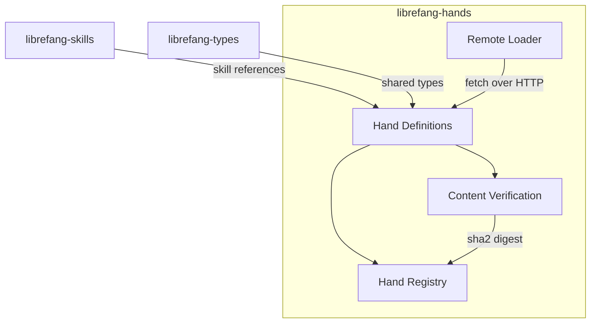

# Other — librefang-hands

# librefang-hands

Curated autonomous capability packages for LibreFang.

## Purpose

In LibreFang's capability model, **skills** are individual, atomic abilities. **Hands** are higher-order bundles — curated, named collections of skills assembled into coherent capability packages that can be loaded, shared, and deployed as a unit. Think of a hand as a pre-configured toolkit: rather than assembling individual skills each time, consumers request a hand that bundles everything needed for a particular domain or task.

## Architecture

```mermaid
graph TD
    subgraph "librefang-hands"
        HD[Hand Definitions]
        HR[Hand Registry]
        RL[Remote Loader]
        V[Content Verification]
    end

    SK[librefang-skills] -->|skill references| HD
    TY[librefang-types] -->|shared types| HD
    HD --> HR
    HD --> V
    RL -->|fetch over HTTP| HD
    V -->|sha2 digest| HR
```

Hands are defined declaratively (TOML-based configuration), validated for integrity (SHA-2 content hashing), and managed through a concurrent registry (`DashMap`-backed). Remote hands can be fetched via HTTP and verified before registration.

## Key Dependencies

| Dependency | Role |
|---|---|
| `librefang-skills` | References to individual skills that a hand bundles |
| `librefang-types` | Shared domain types used across all LibreFang crates |
| `serde` / `serde_json` / `toml` | Declarative hand definitions loaded from config files |
| `sha2` / `hex` | Content hashing for integrity verification |
| `dashmap` | Thread-safe concurrent registry of loaded hands |
| `reqwest` | Fetching hand definitions from remote sources |
| `tokio` / `futures` | Async I/O for loading and fetching |
| `uuid` / `chrono` | Unique identity and timestamp metadata |
| `thiserror` | Typed error definitions |
| `tracing` | Structured logging throughout the loading pipeline |

## Loading Pipeline

A hand goes through these stages:

1. **Deserialization** — A hand definition (TOML or JSON) is parsed into a structured type referencing skills and metadata.
2. **Resolution** — Each referenced skill is validated against the skill registry to ensure it exists and is available.
3. **Verification** — If a content hash is present, it is recomputed and compared against the declared digest.
4. **Registration** — The validated hand is inserted into the concurrent registry, keyed by its unique identifier.

Remote loading follows the same pipeline after fetching the definition over HTTP.

## Relationship to Other Crates

- **`librefang-types`** — Provides the foundational types that hand definitions build upon.
- **`librefang-skills`** — Supplies the skill registry that hands reference. A hand does not duplicate skill logic; it curates references.
- **`librefang-runtime`** — Consumes hands at execution time. Used only as a dev-dependency here for integration testing.

## Testing

The dev-dependencies reveal the testing strategy:

- **`tempfile`** — Creates temporary directories and files for testing TOML/JSON loading from disk without polluting the filesystem.
- **`wiremock`** — Mock HTTP server for testing the remote hand loader without hitting real endpoints.
- **`serial_test`** — Serializes tests that share state (likely the global hand registry), preventing race conditions in concurrent test suites.
- **`librefang-runtime`** — Integration tests that exercise hands end-to-end within the full runtime.

Tests that interact with the shared registry should use `#[serial]` attributes from `serial_test` to avoid interference.