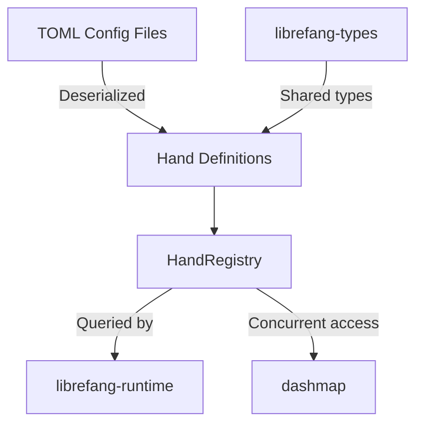

# Other — librefang-hands

# librefang-hands

Curated autonomous capability packages for the LibreFang system.

## Overview

A **hand** is a self-contained capability package — a unit of autonomous behavior that can be discovered, loaded, and managed by the LibreFang runtime. This crate defines the data model for hands, handles their deserialization from configuration (TOML), maintains a thread-safe registry, and provides error types specific to hand lifecycle operations.

Hands are the primary extension mechanism in LibreFang. Each hand encapsulates a discrete capability (e.g., network scanning, file manipulation, system introspection) along with the metadata needed to curate, version, and safely execute it.

## Architecture

```mermaid
graph TD
    A[TOML Config Files] -->|Deserialized| B[Hand Definitions]
    B --> C[HandRegistry]
    C -->|Queried by| D[librefang-runtime]
    E[librefang-types] -->|Shared types| B
    C -->|Concurrent access| F[dashmap]
```

## Key Dependencies and What They Signal

| Dependency | Role in This Crate |
|---|---|
| `librefang-types` | Shared type definitions — hand structs likely derive or compose types from this crate |
| `serde` / `serde_json` / `toml` | Serialization framework. Hands are defined in TOML and deserialized into Rust structs |
| `thiserror` | Ergonomic error types for hand loading, validation, and registry operations |
| `uuid` | Unique identifiers for each hand instance |
| `chrono` | Timestamps — likely for hand creation, versioning, or last-executed tracking |
| `dashmap` | Lock-free concurrent hash map — the `HandRegistry` is accessed from multiple threads |
| `tracing` | Structured logging/instrumentation of registry operations |

## How Hands Work

### Definition

A hand is defined via TOML configuration. The crate parses these files into strongly-typed Rust structs using `serde`. This gives hand authors a declarative, human-readable format while the runtime gets type-safe access.

### Registry

The `HandRegistry` (backed by `dashmap`) provides concurrent, lock-free access to loaded hands. The runtime and any number of worker threads can query the registry simultaneously without contention bottlenecks.

### Lifecycle

1. **Discovery** — TOML files are located (paths provided by the runtime or configuration)
2. **Parsing** — Each file is deserialized into a hand definition struct
3. **Validation** — Metadata is checked for completeness and correctness
4. **Registration** — Valid hands are inserted into the registry, keyed by unique ID
5. **Execution** — The runtime queries the registry and dispatches work to hands (execution itself lives in `librefang-runtime`)

## Relationship to Other Crates

- **`librefang-types`** — This crate consumes shared types. Hand definitions compose or derive from types defined there, ensuring consistency across the workspace.
- **`librefang-runtime`** — A dev-dependency only, used in tests. The runtime is the consumer of this crate's registry and hand definitions at production time. The dependency direction is `librefang-runtime` → `librefang-hands` at compile time, reversed only for test infrastructure.

## Error Handling

All errors specific to hand operations use `thiserror`-derived types. This keeps error variants explicit, adds context via `#[source]` annotations, and integrates cleanly with `tracing` spans. Callers can match on specific failure modes (parse failure, validation error, duplicate registration, etc.) without downcasting.

## Testing

Tests use `serial_test` to serialize test functions that share state. This is necessary because the registry is a global or shared resource — parallel test execution could cause intermittent failures from concurrent registry mutations.

`tempfile` is used to create temporary TOML fixtures in tests, keeping test data isolated and cleaned up automatically.

## When to Modify This Crate

- **Adding new hand metadata fields** — Extend the hand definition struct and update TOML parsing
- **Changing registry semantics** — The `dashmap`-backed registry lives here
- **Adding validation rules** — Hand validation logic is this crate's responsibility
- **New error variants** — Add to the `thiserror`-derived error enum