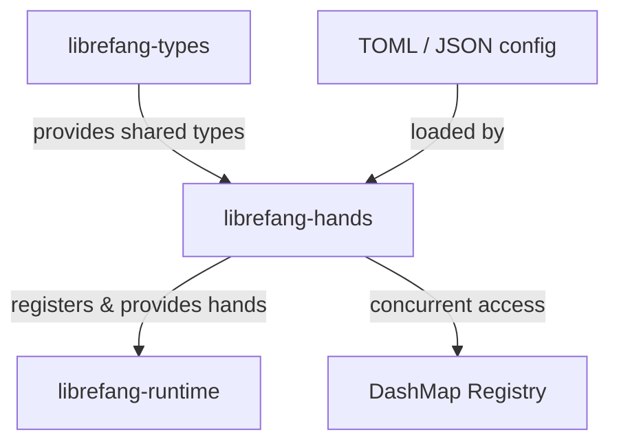

# Other — librefang-hands

# librefang-hands

## Purpose

The `librefang-hands` module provides the **Hands system** for LibreFang — a mechanism for defining, loading, and managing curated autonomous capability packages called *hands*.

A "hand" represents a discrete, composable unit of autonomous behavior that can be deployed into the LibreFang runtime. This module handles the lifecycle of these capability packages: discovery, deserialization from configuration (TOML), validation, storage, and runtime access.

## Architecture

The module sits between the type definitions layer (`librefang-types`) and the execution layer (`librefang-runtime`). It does not execute hands itself — it is responsible for the **packaging and registry** concerns.

```mermaid
graph TD
    A[librefang-types] -->|provides shared types| B[librefang-hands]
    B -->|registers & provides hands| C[librefang-runtime]
    D[TOML / JSON config] -->|loaded by| B
    B -->|concurrent access| E[DashMap Registry]
```

## Key Dependencies and Their Roles

| Dependency | Role in this module |
|---|---|
| `librefang-types` | Shared type definitions used across all LibreFang crates |
| `serde`, `serde_json`, `toml` | Deserialization of hand definitions from configuration formats |
| `dashmap` | Concurrent hashmap for thread-safe storage of the hand registry |
| `uuid` | Unique identification of hand instances |
| `chrono` | Timestamping hand creation, registration, and lifecycle events |
| `thiserror` | Typed error definitions for hand loading and validation failures |
| `tracing` | Structured logging throughout the hand lifecycle |

`librefang-runtime` and `tempfile` are dev-dependencies, used only in integration tests to verify that hands can be correctly loaded and handed off to the runtime.

## Core Concepts

### Hands

A hand is a curated package describing an autonomous capability. Hands are declaratively defined — typically via TOML configuration files — and then loaded into an in-memory registry at startup or on demand.

### Registry

The module uses `dashmap` to maintain a concurrent registry of loaded hands. This allows multiple runtime threads to query available hands without locking the entire data structure. Each hand is keyed by a unique identifier (UUID).

### Configuration Loading

Hands are defined in configuration files (TOML or JSON). The module deserializes these into typed structures (inheriting shared types from `librefang-types`), validates them, and inserts them into the registry.

### Error Handling

All fallible operations — parsing, validation, registry conflicts — return structured errors derived via `thiserror`. This ensures that callers (particularly the runtime) can handle failures gracefully and provide meaningful diagnostics.

## Integration with the Wider System

1. **Upstream**: `librefang-types` provides the base types that hand definitions are built upon.
2. **Downstream**: `librefang-runtime` consumes registered hands during execution. The dev-dependency on `librefang-runtime` confirms this integration path is tested.
3. **Testing**: The `serial_test` dev-dependency indicates that some tests must run sequentially — likely those involving shared filesystem state via `tempfile` for temporary configuration files during integration tests.

## Development Notes

- When adding a new hand definition format, ensure the corresponding `serde` deserializers cover all required fields and that validation catches missing or malformed entries before they reach the registry.
- The concurrent registry (`dashmap`) means that hand registration and lookup are safe to call from async or multi-threaded contexts without external synchronization.
- Run tests with `cargo test -p librefang-hands`. Tests that touch the filesystem (via `tempfile`) are serialized with `serial_test` to avoid race conditions.