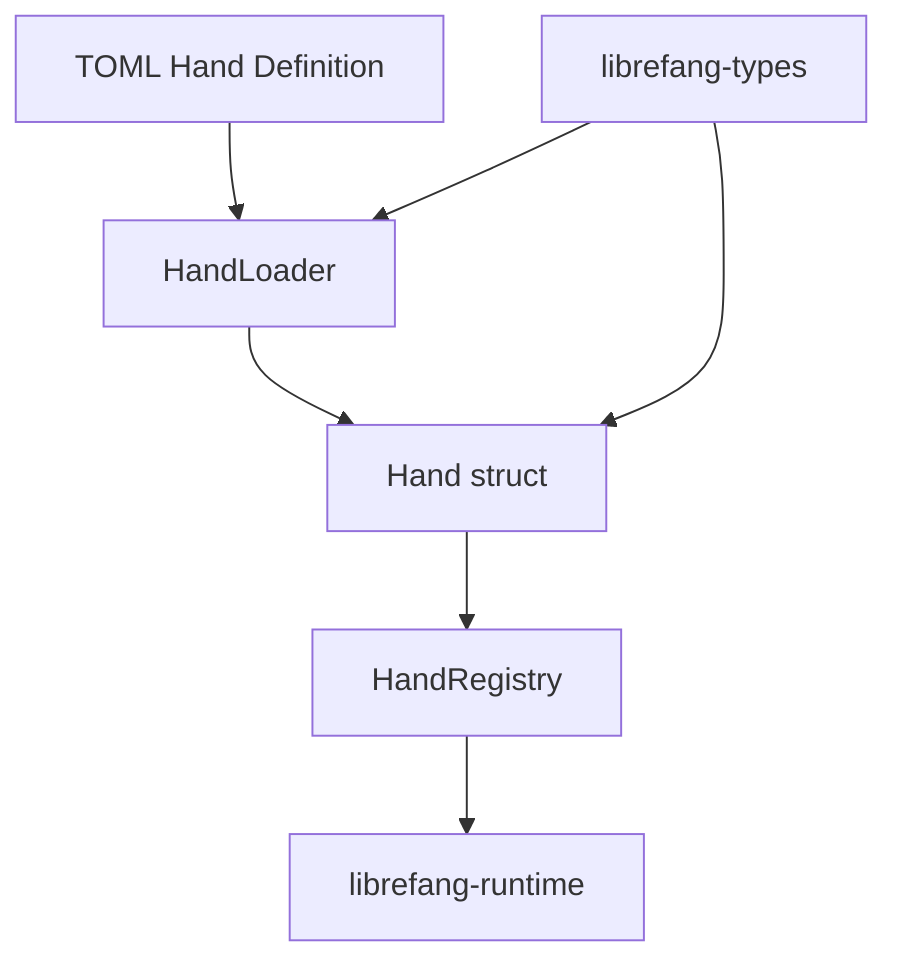

# Other — librefang-hands

# librefang-hands

Hands system for LibreFang — curated autonomous capability packages.

## Overview

A **hand** in LibreFang is a self-contained, declaratively defined capability package. Each hand describes a distinct autonomous behavior that can be loaded, validated, and dispatched by the runtime. This crate provides the data structures, loading logic, validation, and registry for managing hands throughout their lifecycle.

The crate is intentionally decoupled from execution — it owns hand *definition* and *discovery*, not hand *execution*. That responsibility falls to `librefang-runtime`.

## Architecture

```mermaid
graph TD
    A[TOML Hand Definition] --> B[HandLoader]
    B --> C[Hand struct]
    C --> D[HandRegistry]
    D --> E[librefang-runtime]
    F[librefang-types] --> B
    F --> C
```

Hands are authored as TOML files on disk. The loader reads and deserializes them into typed structs, validates their contents, and registers them in a concurrent registry (`DashMap`-backed) keyed by unique hand IDs.

## Key Concepts

### Hand

A hand represents a single autonomous capability. It carries:

- **Identity** — A unique identifier (UUID-based) and a human-readable name.
- **Metadata** — Description, author, version, and creation timestamp.
- **Capability specification** — The parameters, triggers, and constraints that define what the hand can do.

### Hand Registry

The registry is a thread-safe collection (`DashMap`) that holds all loaded hands. It supports:

- Insertion and lookup by ID.
- Concurrent access from multiple tasks or threads without external locking.
- Iteration over registered hands for dispatch or introspection.

### Hand Loader

Responsible for:

1. Reading TOML hand definitions from the filesystem.
2. Deserializing into the `Hand` type using `serde`.
3. Running validation checks (required fields, schema correctness, constraint sanity).
4. Returning structured errors via `thiserror` when a definition is malformed.

### Validation

Before a hand enters the registry, it passes through validation that checks for structural correctness and semantic issues. Errors are typed and include context about what failed and where.

## Dependencies

| Crate | Role |
|---|---|
| `librefang-types` | Shared types used across LibreFang crates |
| `serde` / `serde_json` / `toml` | Deserialization of hand definitions |
| `thiserror` | Derived error types for loading and validation failures |
| `tracing` | Structured logging during load, validate, and register operations |
| `uuid` | Unique hand identification |
| `chrono` | Timestamp handling for metadata |
| `dashmap` | Lock-free concurrent map backing the registry |

## Testing

Tests use `tempfile` to create isolated directory structures with sample TOML definitions, ensuring the loader and validation logic work against real filesystem reads without polluting the working tree. The `serial_test` crate prevents race conditions in tests that share temporary directories. `librefang-runtime` is available as a dev-dependency for integration tests that exercise the full load → register → dispatch path.