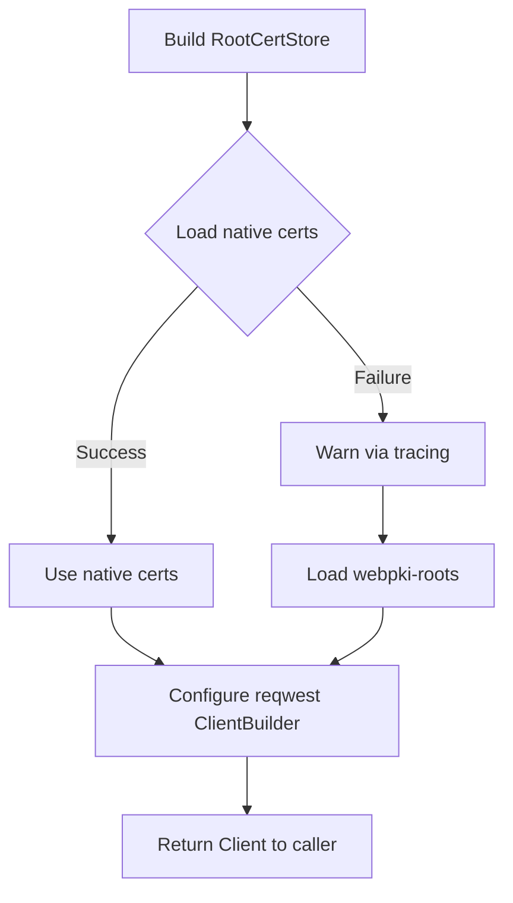

# Other — librefang-http

# librefang-http

Shared HTTP client builder providing consistent TLS configuration and proxy support across the LibreFang workspace.

## Purpose

Every component in LibreFang that makes outbound HTTP requests (scrapers, feed fetchers, API clients) needs a properly configured `reqwest` client. This crate centralizes that configuration so TLS trust anchors and proxy settings are handled uniformly rather than duplicated across crates.

The two core concerns this module owns:

- **TLS certificate resolution** — Builds a `rustls::RootCertStore` by loading the system's native certificate store, with a fallback to Mozilla's bundled `webpki-roots` if native certs are missing or unreadable.
- **Client construction** — Exposes a pre-configured `reqwest::ClientBuilder` (or fully-built `reqwest::Client`) so downstream crates don't have to think about TLS backends, cipher suites, or proxy environment variables.

## Dependencies

| Crate | Role |
|---|---|
| `reqwest` | HTTP client; uses the `rustls-tls` feature (via workspace) rather than native-tls |
| `rustls` | Pure-Rust TLS implementation |
| `webpki-roots` | Mozilla's CA certificate bundle, bundled at compile time |
| `rustls-native-certs` | Loads certificates from the OS trust store |
| `tracing` | Emits warnings when certificate sources fail |
| `librefang-types` | Shared type definitions across the workspace |

## How TLS Certificate Loading Works



The strategy is defensive: on most Linux systems, `rustls-native-certs` will find certificates in `/etc/ssl/certs` or the distribution's equivalent. On minimal containers or unusual environments, that load may return empty or error. When that happens, the module logs a warning and falls back to `webpki-roots`, ensuring HTTPS requests still work.

## Integration with Other Crates

Downstream crates depend on `librefang-http` at the library level:

```toml
# In a sibling crate's Cargo.toml
[dependencies]
librefang-http = { path = "../librefang-http" }
```

They then use the provided builder/client instead of calling `reqwest::Client::new()` directly. This guarantees that every outbound request shares the same TLS trust anchors and proxy behavior.

## Relationship to `librefang-types`

This crate depends on `librefang-types` for any shared configuration structs or error types related to HTTP setup (e.g., proxy configuration, timeout settings). It does **not** depend on higher-level crates — nothing in `librefang-http` knows about feeds, scraping, or domain-specific logic.

## Building and Testing

From the workspace root:

```bash
cargo build -p librefang-http
cargo test -p librefang-http
```

Because the module uses `rustls` rather than `native-tls`, no system OpenSSL development headers are required. The only runtime requirement for full native cert loading is that the host system has a populated certificate store — otherwise the webpki-roots fallback is used automatically.