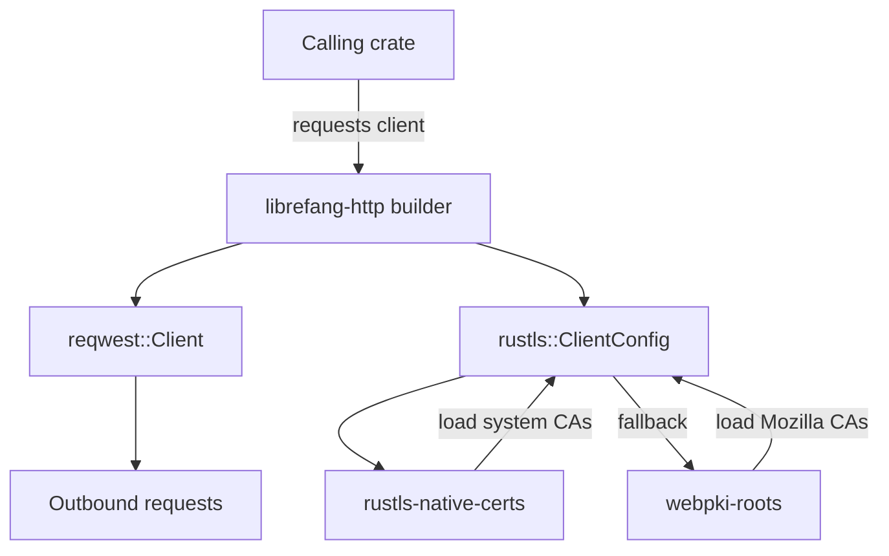

# Other — librefang-http

# librefang-http

Shared HTTP client builder providing proxy awareness and TLS certificate fallback for the LibreFang ecosystem.

## Purpose

This crate centralizes the construction of `reqwest::Client` instances so that every component in LibreFang makes outbound HTTP requests with a consistent TLS and proxy configuration. Rather than each crate independently wiring up its own client, they delegate to the builder exposed here.

## Key Responsibilities

### TLS Configuration

The crate uses **rustls** rather than the native TLS stack, configured with a two-tier certificate loading strategy:

1. **System certificates** — Loaded via `rustls-native-certs`, which reads the OS certificate store.
2. **Mozilla roots fallback** — If the system store is empty or unavailable, `webpki-roots` provides Mozilla's curated root set.

This ensures the client works across minimal containers (where no system CA bundle exists) as well as standard OS environments (where corporate or custom CAs may be installed).

### Proxy Support

The builder forwards proxy configuration through to reqwest, respecting standard environment variables (`HTTP_PROXY`, `HTTPS_PROXY`, `NO_PROXY`) by default.

## Dependencies

| Crate | Role |
|---|---|
| `librefang-types` | Shared type definitions used across LibreFang crates |
| `reqwest` | Underlying HTTP client that this crate configures |
| `rustls` | Pure-Rust TLS implementation |
| `webpki-roots` | Bundled Mozilla CA certificates (fallback) |
| `rustls-native-certs` | Loader for OS-native CA certificates (primary) |
| `tracing` | Structured logging for TLS load successes and failures |

## Architecture

## Integration

Other LibreFang crates depend on `librefang-http` and call into it to obtain a preconfigured `reqwest::Client`. The `librefang-types` dependency keeps any shared configuration or option types consistent across the boundary.

Tracing spans are emitted when certificate loading succeeds or fails, making it straightforward to diagnose TLS handshake issues in production logs without enabling verbose reqwest debugging.