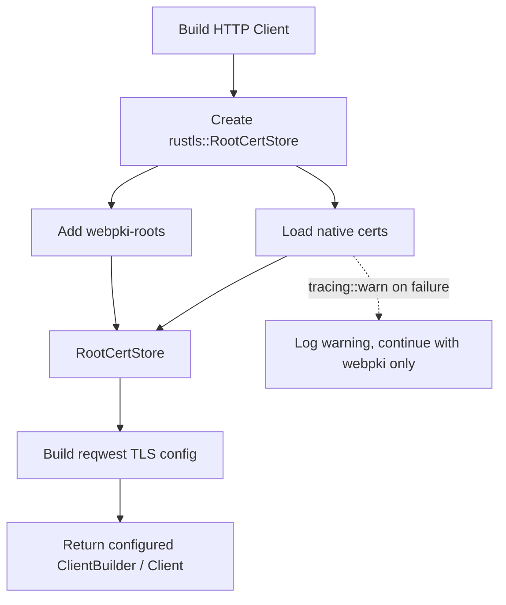

# Other — librefang-http

# librefang-http

Shared HTTP client builder with proxy support and TLS certificate fallback for the LibreFang workspace.

## Purpose

This crate provides a centralized, reusable HTTP client construction layer consumed by other LibreFang crates that need to make outbound HTTP requests. It encapsulates two concerns that would otherwise be duplicated across the codebase:

1. **TLS configuration** — Assembling a `rustls` certificate store that attempts to load the bundled Mozilla roots (`webpki-roots`) and augments them with the host system's native certificate store (`rustls-native-certs`). This "both sources, fallback" strategy maximizes compatibility across platforms and deployment environments.

2. **Proxy and client assembly** — Building a `reqwest` client with the correct TLS backend, proxy settings, and any workspace-standard defaults.

All other LibreFang crates that need HTTP capabilities depend on this crate rather than configuring `reqwest` directly.

## Dependencies

| Dependency | Role |
|---|---|
| `librefang-types` | Shared type definitions used across the workspace |
| `reqwest` | HTTP client; configured with the `rustls-tls` backend |
| `rustls` | TLS implementation used to build a custom certificate verifier |
| `webpki-roots` | Bundled Mozilla CA certificates — works everywhere without system dependency |
| `rustls-native-certs` | Loads certificates from the OS trust store — supplements `webpki-roots` for corporate/self-signed CAs |
| `tracing` | Structured logging for certificate loading diagnostics |

## TLS Certificate Strategy



The certificate store is populated from both sources. If native certificate loading fails (for example, in a minimal container without ca-certificates), the bundled Mozilla roots remain available and the process continues. Failures are emitted via `tracing::warn` so operators can diagnose TLS issues from logs.

## Relationship to the Workspace

```
librefang-types  ←──  librefang-http  ←──  (other LibreFang crates)
```

- **Imports from** `librefang-types` for any shared configuration or error types.
- **Consumed by** any crate in the workspace that makes outbound HTTP calls, ensuring consistent TLS and proxy behavior without each crate reimplementing client setup.

## Linting

This crate inherits workspace-level lints (`[lints] workspace = true`), so it follows the same style and correctness rules as the rest of the LibreFang project.