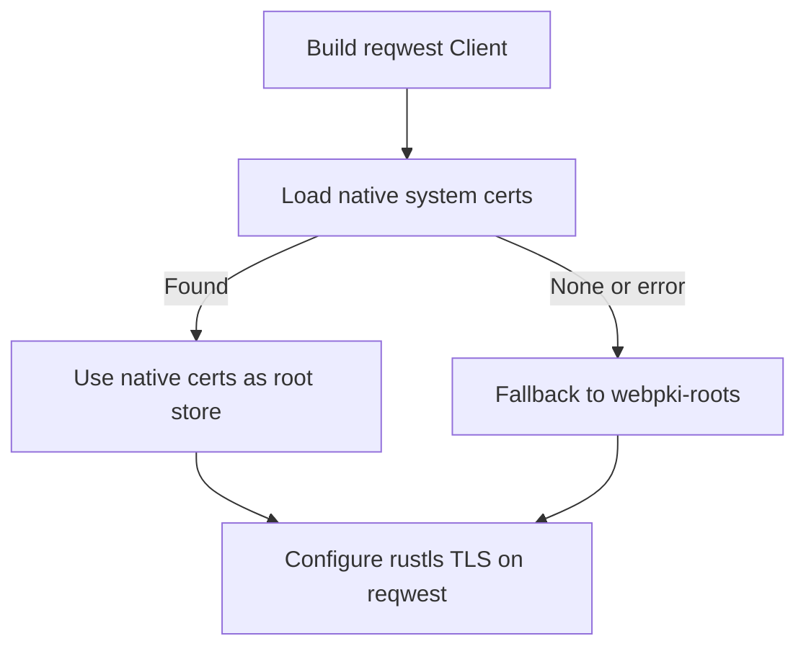
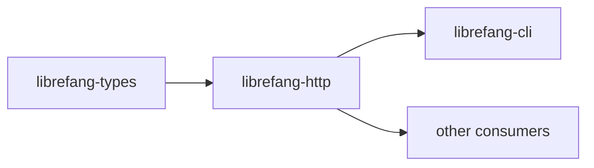

# Other — librefang-http

# librefang-http

Shared HTTP client builder providing consistent TLS configuration and proxy support across the LibreFang workspace.

## Purpose

This crate centralizes the construction of `reqwest::Client` instances so that every component in LibreFang——shares identical TLS and proxy behaviour. Rather than each binary configuring its own HTTP stack, they delegate to this library to produce a pre-configured client.

## Dependencies

| Crate | Role |
|---|---|
| `reqwest` | Underlying HTTP client |
| `rustls` | TLS backend (avoids native OpenSSL linkage) |
| `webpki-roots` | Mozilla CA certificate bundle |
| `rustls-native-certs` | System certificate store loader |
| `librefang-types` | Shared type definitions across the workspace |
| `tracing` | Diagnostic logging |

## TLS Certificate Resolution

The crate implements a two-tier certificate loading strategy:

1. **Native certificates first** — loads certificates from the operating system's trust store via `rustls-native-certs`.
2. **WebPKI roots as fallback** — if native certificate loading fails or yields no results, falls back to Mozilla's `webpki-roots` bundle.

This ensures the client works both in environments with managed PKI (corporate proxies, custom CAs installed system-wide) and in minimal containers where no system cert store exists.

## Proxy Support

The builder configures `reqwest` to respect standard proxy environment variables (`HTTP_PROXY`, `HTTPS_PROXY`, `NO_PROXY`) automatically. This is critical for deployments behind corporate firewalls or when routing traffic through inspection proxies.

## Integration with Other Crates

`librefang-http` consumes types from `librefang-types` and exposes a client builder that downstream crates call at startup. Because it has no incoming or outgoing internal call edges, it functions as a leaf utility——dependents call into it, but it does not call back into the rest of the workspace.

## Usage Pattern

Consumers depend on this crate in their `Cargo.toml` and use the builder to obtain a ready-made `reqwest::Client` rather than constructing one directly. All TLS configuration, certificate loading, and proxy setup is handled internally, keeping downstream code focused on request logic rather than transport concerns.