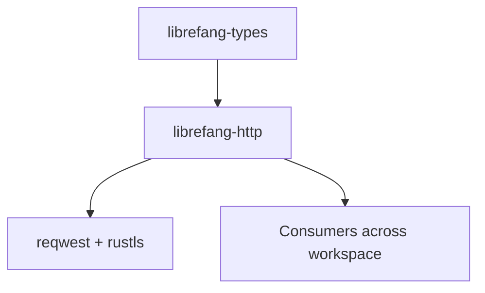

# Other — librefang-http

# librefang-http

## Purpose

`librefang-http` provides a shared HTTP client builder for the LibreFang project. It encapsulates the configuration of TLS backends and proxy settings so that every crate in the workspace that needs to make HTTP requests does so through a consistent, centrally-configured client.

## Role in the Workspace

This crate sits between the low-level type definitions (`librefang-types`) and any crate that performs network I/O. Rather than each consumer configuring its own `reqwest::Client` — and each potentially handling TLS certificate loading and proxy detection differently — they call into this library to obtain a pre-configured client.

## Key Dependencies

| Dependency | Role |
|---|---|
| `reqwest` | The HTTP client library being configured and exported. |
| `rustls` | TLS backend. Chosen over native TLS for cross-platform consistency and control over certificate verification. |
| `webpki-roots` | Bundles Mozilla's root certificates. Used as a fallback when the system certificate store is unavailable or incomplete. |
| `rustls-native-certs` | Loads certificates from the operating system's native store. Preferred source for trust anchors. |
| `tracing` | Structured logging for certificate loading failures, proxy detection events, and other diagnostics. |
| `librefang-types` | Shared types used across the workspace; this crate may reference configuration or error types defined there. |

## TLS Certificate Strategy

The crate implements a two-tier certificate loading approach:

1. **System certificates first.** `rustls-native-certs` loads the host OS trust store. This is the preferred path because it respects any custom CAs the user or administrator has installed (corporate proxies, development CAs, etc.).

2. **WebPKI roots as fallback.** If the system store fails to load or is empty, `webpki-roots` provides Mozilla's curated set of root certificates so the client can still verify servers.

`tracing` is used to emit warnings when the system store fails to load, making it easy to diagnose TLS issues in production.

## Proxy Support

The crate configures the `reqwest` client to respect standard proxy environment variables (`HTTP_PROXY`, `HTTPS_PROXY`, `NO_PROXY`, and their lowercase equivalents). This is typically handled through reqwest's built-in proxy detection, ensuring behavior consistent with other HTTP tooling on the host system.

## Usage Pattern

Consumers depend on this crate and call its builder or constructor function to obtain a `reqwest::Client` (or `reqwest::ClientBuilder`) that is already configured with the correct TLS backend and proxy settings. They then use that client as they would any standard reqwest client — no special handling is required at the call site.