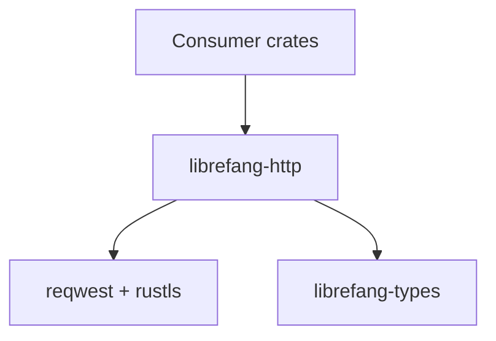

# Other — librefang-http

# librefang-http

Shared HTTP client builder with proxy support and TLS certificate fallback for the LibreFang project.

## Purpose

This crate provides a centralized, reusable HTTP client construction layer. Rather than each component in LibreFang independently configuring `reqwest` clients with their own TLS and proxy settings, `librefang-http` encapsulates that logic once and exposes a builder or factory that other crates can depend on.

The two core concerns it abstracts:

1. **TLS root certificate loading** — attempts to load certificates from multiple sources, falling back gracefully when one fails.
2. **HTTP client configuration** — assembles a `reqwest::Client` with the resolved TLS backend and any applicable proxy settings.

## Dependencies

| Crate | Role |
|---|---|
| `reqwest` | HTTP client; the underlying transport being configured |
| `rustls` | Pure-Rust TLS backend used instead of native TLS |
| `webpki-roots` | Mozilla's curated set of root CA certificates, bundled at compile time |
| `rustls-native-certs` | Loads root certificates from the host OS certificate store at runtime |
| `tracing` | Structured logging for diagnostics during certificate loading and client construction |
| `librefang-types` | Shared types used across the LibreFang workspace |

## TLS Certificate Fallback Strategy

The module uses **rustls** rather than OpenSSL or the `native-tls` backend. Certificate roots are resolved at startup through a fallback chain:

1. **Native system certificates** — `rustls-native-certs` loads whatever root CAs the operating system trusts. This works well on Linux, macOS, and Windows where the system maintains a certificate bundle.

2. **Bundled Mozilla roots** — if the system store is unavailable or empty (common in minimal containers like `scratch` or `distroless`), `webpki-roots` provides a statically compiled set of Mozilla's trusted roots.

`tracing` calls log which source was used and whether any failures occurred, making it straightforward to diagnose TLS handshake issues in production.

## Integration with LibreFang

Other crates in the workspace add `librefang-http` as a dependency when they need to make outbound HTTP requests. This ensures consistent TLS behavior and proxy configuration across the entire application without duplicating setup code.

The dependency relationship looks like:

Any crate that needs an HTTP client depends on `librefang-http`, which in turn manages the `reqwest`/`rustls` configuration and references shared types from `librefang-types`.