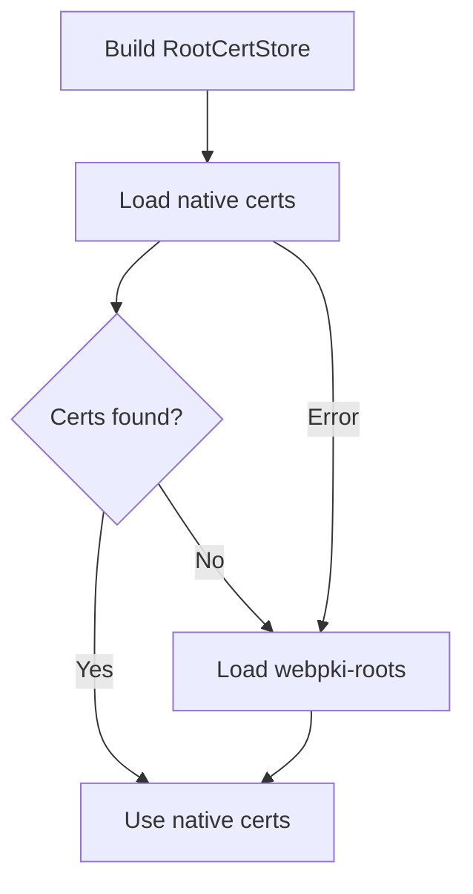

# Other — librefang-http

# librefang-http

Shared HTTP client builder providing consistent proxy support and TLS configuration with fallback certificate loading for the LibreFang project.

## Purpose

This crate centralizes HTTP client construction so that every component in LibreFang makes outbound requests the same way. Instead of each binary or library configuring its own `reqwest::Client`, consumers call into this crate to get a pre-configured client that handles:

- **TLS via rustls** — avoids depending on OpenSSL at build time.
- **Certificate fallback** — attempts to load the native system certificate store first; if that fails or is empty, falls back to the bundled Mozilla roots from `webpki-roots`.
- **Proxy support** — respects standard environment variables (`HTTP_PROXY`, `HTTPS_PROXY`, `NO_PROXY`) so deployment environments control proxying without code changes.

## Dependencies and Their Roles

| Dependency | Role |
|---|---|
| `reqwest` | Underlying HTTP client, compiled with the `rustls-tls` backend. |
| `rustls` | TLS implementation; provides `ClientConfig` for custom certificate setup. |
| `rustls-native-certs` | Loads certificates from the OS trust store (Linux, macOS, Windows). |
| `webpki-roots` | Bundled Mozilla CA certificates used as a fallback when the native store is unavailable or empty. |
| `librefang-types` | Shared type definitions used across LibreFang crates. |
| `tracing` | Structured logging for certificate-loading diagnostics and error reporting. |

## Certificate Loading Strategy

The module builds a `rustls::RootCertStore` in two stages:



1. Call into `rustls_native_certs` to discover and parse system certificates.
2. If that succeeds and yields at least one certificate, use those roots.
3. If it fails, or the store is empty, append the certificates from `webpki_roots::TLS_SERVER_ROOTS`.
4. Log the outcome at `debug`/`warn` level via `tracing` so operators can diagnose TLS handshake failures in the field.

This fallback ensures the client works both on hardened production hosts with managed certificate stores and inside minimal containers that ship no CA bundle.

## Usage

Other LibreFang crates add a dependency on `librefang-http` and use the provided builder to obtain a `reqwest::Client`. No individual crate needs to understand TLS configuration or certificate paths—this module owns that concern entirely.

```rust
// Typical usage from another crate
let client = librefang_http::build_client()?;
let response = client.get("https://example.com").send().await?;
```

## Relationship to the Wider Codebase

`librefang-http` sits at the bottom of the dependency graph as an infrastructure library. It depends on `librefang-types` for any shared types it needs, and it is consumed by higher-level crates and binaries that make outbound HTTP calls. Keeping this logic here avoids duplication and ensures a single place to update TLS or proxy behavior project-wide.