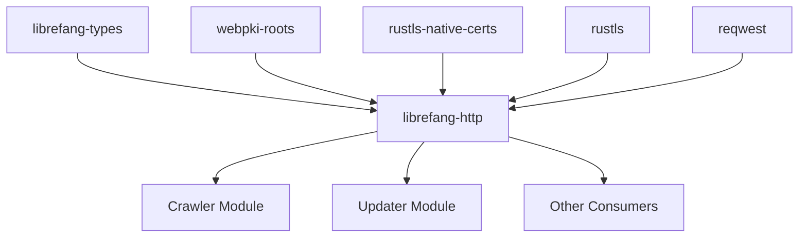

# Other — librefang-http

# librefang-http

Shared HTTP client builder providing consistent proxy support and TLS certificate fallback for the LibreFang project.

## Overview

This crate centralizes HTTP client construction so that every component in LibreFang — crawlers, updaters, API clients — uses the same TLS configuration, proxy behavior, and connection settings. Rather than each module independently configuring `reqwest::Client`, consumers call into this library to obtain a preconfigured client builder or ready-to-use client.

## Purpose in the Stack

Network code in LibreFang must work across diverse environments: container images without system certificate stores, developer machines with corporate proxies, and hardened servers with restrictive TLS policies. `librefang-http` absorbs that complexity once, ensuring the rest of the codebase can make HTTP requests without worrying about certificate chain loading or proxy environment variables.

## TLS Certificate Strategy

The crate uses **rustls** exclusively (no OpenSSL binding) and applies a two-tier certificate loading strategy:

1. **`webpki-roots`** — Ships Mozilla's curated root certificate bundle directly into the binary. This guarantees connectivity even when the host OS has no certificate store (e.g., minimal Docker images like `scratch` or `distroless`).

2. **`rustls-native-certs`** — Loads certificates from the operating system's native store. This picks up custom/private CAs that an organization may have installed, which `webpki-roots` would not know about.

The builder merges both sets into a single `rustls::RootCertStore`, so valid chains anchored in either set are accepted. This dual approach eliminates the common failure modes where one source alone is insufficient.

## Proxy Support

Proxy configuration is delegated to `reqwest`'s built-in proxy handling, which respects standard environment variables (`HTTP_PROXY`, `HTTPS_PROXY`, `NO_PROXY`, and their lowercase equivalents). The builder does not override this behavior, giving operators control through environment configuration without code changes.

## Key Dependencies

| Dependency | Role |
|---|---|
| `reqwest` | HTTP client with optional rustls TLS backend |
| `rustls` | Pure-Rust TLS implementation |
| `webpki-roots` | Bundled Mozilla root certificates |
| `rustls-native-certs` | OS-native certificate store loader |
| `librefang-types` | Shared types used across LibreFang crates |
| `tracing` | Structured logging for connection and TLS diagnostics |

## Usage

Other LibreFang crates depend on `librefang-http` and call its builder to obtain a `reqwest::Client` or `reqwest::ClientBuilder`:

```rust
// Obtain a fully configured client ready for requests
let client = librefang_http::build_client()?;

// Or get a builder for further customization before building
let client = librefang_http::client_builder()
    .timeout(Duration::from_secs(30))
    .build()?;
```

Exact function signatures are defined in the crate's public API. The returned client is a standard `reqwest::Client`, so all reqwest methods (`.get()`, `.post()`, etc.) work without adapter code.

## Architecture



## Logging and Diagnostics

The crate uses `tracing` to emit diagnostic events when:

- The TLS root certificate store is being populated
- Native certificate loading succeeds or fails
- The number of loaded certificates from each source is known

This helps operators debug TLS handshake failures in production without guessing which certificate source is missing roots.