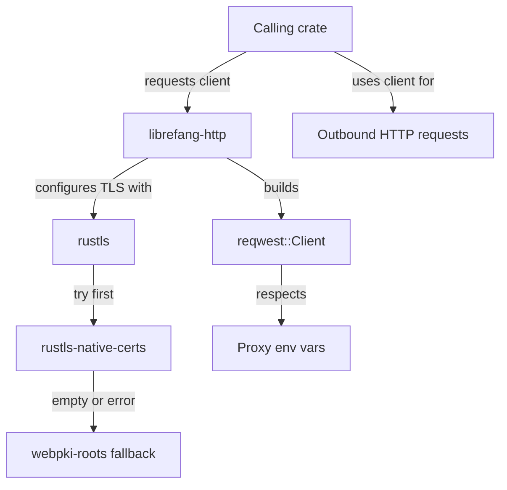

# Other — librefang-http

# librefang-http

Shared HTTP client builder providing a pre-configured `reqwest` client with proxy support and TLS certificate fallback logic for the LibreFang project.

## Purpose

Rather than each crate in the workspace constructing its own `reqwest::Client` with ad-hoc TLS and proxy configuration, this module centralizes that logic into a single reusable builder. Any workspace member that needs to make outbound HTTP requests should depend on this crate and use the client it produces.

## Key Design Decisions

### Pure-Rust TLS via rustls

This module uses **rustls** instead of native-tls/openssl. This means:

- No system OpenSSL dependency — simpler cross-compilation and static builds.
- Certificate verification is handled entirely in Rust.

### Dual Certificate Loading (Fallback Strategy)

The module depends on both `webpki-roots` and `rustls-native-certs`, which enables a fallback strategy for TLS root certificates:

1. **Attempt to load native system certificates** via `rustls-native-certs` — these are the CA certificates installed on the host OS (e.g., `/etc/ssl/certs` on Linux, the Windows certificate store, or the Keychain on macOS).
2. **Fall back to Mozilla's WebPKI root bundle** via `webpki-roots` if native certificate loading fails or produces an empty set — this ensures the client works in minimal environments (scratch containers, minimal Docker images) where no system CA store is present.

### Proxy Support

The underlying `reqwest` client is configured to respect standard proxy environment variables (`HTTP_PROXY`, `HTTPS_PROXY`, `NO_PROXY`, etc.) through reqwest's built-in proxy handling. This allows the operator to route LibreFang's outbound HTTP traffic through a corporate proxy or network egress point without code changes.

## Architecture

## Dependency Interactions

| Dependency | Role |
|---|---|
| `librefang-types` | Shares type definitions across the workspace; this module may reference configuration types or error types defined there. |
| `reqwest` | The underlying HTTP client. This module configures and exposes a `reqwest::Client` (or `ClientBuilder`) for consumers. |
| `rustls` | Provides the `ClientConfig` used to construct a TLS backend for reqwest. |
| `rustls-native-certs` | Loads the host system's root CA certificates into the rustls configuration. |
| `webpki-roots` | Ships Mozilla's curated root CA bundle as a static fallback. |
| `tracing` | Emits structured log events (e.g., warnings when native cert loading fails and fallback is activated). |

## Usage by Other Crates

Consumers add this crate as a dependency and call its builder/client constructor to obtain a ready-to-use `reqwest::Client`. The returned client comes pre-configured with appropriate TLS roots and proxy awareness, so callers simply use standard reqwest methods (`get`, `post`, etc.) without worrying about transport-layer setup.

No execution flows were detected originating from or terminating in this module — it is a pure utility library that produces a configured client and returns it to the caller. All request execution happens in the consuming crate.