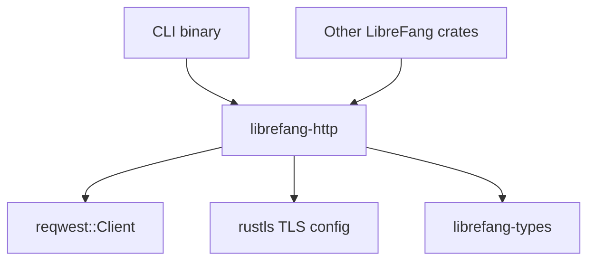

# Other — librefang-http

# librefang-http

Shared HTTP client builder providing consistent TLS configuration and proxy support across the LibreFang project.

## Purpose

This crate centralizes HTTP client construction so that every component in LibreFang makes outbound requests with the same TLS stack, certificate validation strategy, and proxy behavior. Rather than each crate independently configuring a `reqwest::Client`, they call into this library to obtain a pre-configured client builder or fully-built client.

## Why This Exists

Repeatedly configuring `reqwest` with rustls, certificate stores, and proxy settings across multiple binaries and libraries leads to drift and bugs. This crate encodes the project's HTTP policies in one place:

- **TLS via rustls** — avoids an OpenSSL dependency and keeps the build statically linkable.
- **Certificate fallback chain** — loads native system certs first (`rustls-native-certs`); if that fails or produces an empty set, falls back to Mozilla's `webpki-roots` bundle so requests work on minimal containers and CI hosts.
- **Proxy awareness** — respects environment proxy variables (`HTTP_PROXY`, `HTTPS_PROXY`, `NO_PROXY`) through reqwest's built-in proxy support.
- **Consistent tracing** — integrates with the project-wide `tracing` subscriber so HTTP-level errors and connection events appear in structured logs.

## Dependencies and Their Roles

| Dependency | Role |
|---|---|
| `librefang-types` | Shared types used across LibreFang (config structs, error types, etc.) that influence client configuration. |
| `reqwest` | Underlying HTTP client. This crate wraps its builder API. |
| `rustls` | TLS implementation. Used to construct a custom `rustls::ClientConfig` with the project's certificate strategy. |
| `webpki-roots` | Mozilla's root certificate store. Serves as the fallback when native certs are unavailable. |
| `rustls-native-certs` | Loads certificates from the OS trust store. Preferred source of root certs. |
| `tracing` | Structured logging for certificate loading failures, proxy detection, and TLS handshake issues. |

## How It Fits into LibreFang

Any crate or binary that needs to make outbound HTTP calls depends on `librefang-http`, calls its builder function, and receives a `reqwest::Client` (or `reqwest::ClientBuilder`) ready for use. The caller does not need to know about TLS internals or certificate paths.

## Integration Points with `librefang-types`

This crate reads shared configuration types from `librefang-types` to determine:

- Whether to enforce certificate validation or accept invalid certs (e.g., for testing or air-gapped environments).
- Proxy configuration if explicitly provided rather than inferred from environment variables.
- Timeout values and connection pool settings.

See `librefang-types` documentation for the specific config structs involved.

## Building a Client

The typical usage pattern is:

1. Load configuration via `librefang-types`.
2. Pass relevant config into this crate's builder function.
3. Receive a configured `reqwest::Client`.
4. Use that client for all outbound requests.

All logging during client construction (cert loading, proxy detection, TLS warnings) is emitted through `tracing` at appropriate levels (`debug` for routine operations, `warn` for fallback behavior, `error` for failures).