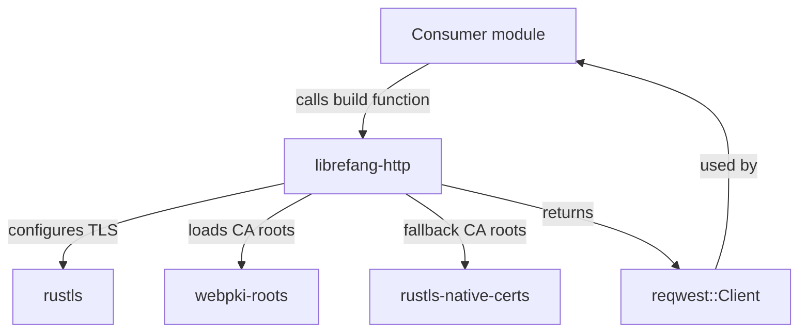

# Other — librefang-http

# librefang-http

Shared HTTP client builder providing consistent TLS configuration and proxy support across the LibreFang project.

## Purpose

Rather than each LibreFang component independently constructing its own `reqwest::Client` with ad-hoc TLS and proxy settings, this crate centralizes that logic. Every HTTP call made by the application—whether fetching remote configs, communicating with game services, or downloading resources—goes through a client built by this module.

## Architecture

The module exposes a builder/factory function that returns a fully configured `reqwest::Client`. Consumers never deal with TLS internals directly.

## TLS Strategy

TLS configuration follows a two-tier certificate root loading strategy:

1. **Primary — `webpki-roots`**: Bundles Mozilla's curated set of root certificates. This works everywhere regardless of the host OS but only trusts certificates from well-known CAs.

2. **Fallback — `rustls-native-certs`**: Loads the host operating system's native certificate store. This is necessary for environments with custom/private CAs (corporate proxies, self-signed infrastructure) whose roots aren't in Mozilla's set.

The fallback ensures that LibreFang works out of the box on standard setups while remaining flexible in restricted network environments. All TLS is handled by `rustls`—there is no dependency on OpenSSL.

## Proxy Support

Relies on `reqwest`'s built-in proxy detection, which respects standard environment variables (`HTTP_PROXY`, `HTTPS_PROXY`, `NO_PROXY`). This keeps proxy configuration consistent with the rest of the system without requiring custom logic.

## Dependencies

| Crate | Role |
|---|---|
| `reqwest` | HTTP client; the constructed output type |
| `rustls` | TLS backend (no OpenSSL linkage) |
| `webpki-roots` | Bundled Mozilla CA certificates |
| `rustls-native-certs` | OS-native CA certificate loading |
| `librefang-types` | Shared types used across LibreFang |
| `tracing` | Structured logging for certificate loading and errors |

## Integration

Other LibreFang crates depend on `librefang-http` and call its build function to obtain a `reqwest::Client`. The types exchanged over HTTP (request/response shapes) come from `librefang-types`, keeping serialization concerns separate from transport concerns.

Because no incoming or outgoing calls were detected in static analysis, the module is purely a utility: it builds a client and returns it, with no callbacks, trait objects, or runtime hooks into the rest of the application.