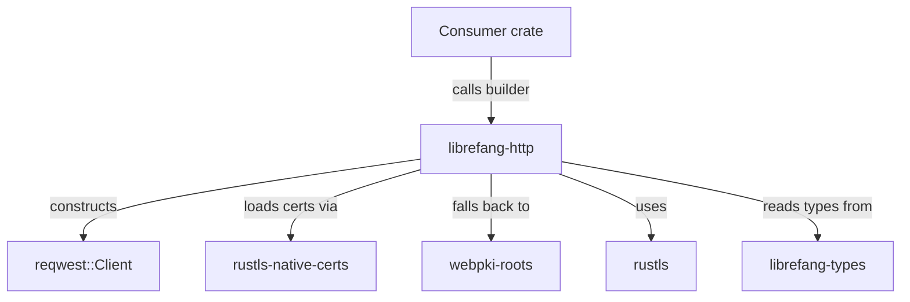

# Other — librefang-http

# librefang-http

Shared HTTP client builder providing centralized proxy configuration and TLS certificate handling for the LibreFang project.

## Purpose

This crate encapsulates the construction of `reqwest::Client` instances so that every component in LibreFang performs HTTP requests with consistent TLS behavior and proxy settings. Rather than each crate independently configuring its own HTTP client, they delegate to this library to avoid duplicating certificate-loading logic and proxy environment handling.

## Architecture

## Key Responsibilities

### TLS Certificate Resolution

The crate uses **rustls** as its TLS backend (not native TLS) and applies a two-tier certificate loading strategy:

1. **System certificate store** — via `rustls-native-certs`. Loads the operating system's trusted root certificates (e.g., `/etc/ssl/certs` on Linux, the Windows certificate store, or Keychain on macOS).
2. **Bundled Mozilla roots** — via `webpki-roots`. If system certificate loading fails or produces no valid roots, the crate falls back to Mozilla's curated root certificate bundle compiled into the binary.

This ensures the application works reliably across environments — from standard desktop/server setups where system certs are available, to minimal containers where they may not be present.

### Proxy Support

The builder configures the `reqwest` client to respect standard proxy environment variables (`HTTP_PROXY`, `HTTPS_PROXY`, `NO_PROXY`, etc.) through reqwest's built-in proxy handling.

### Shared Type Integration

The crate depends on `librefang-types` to accept any configuration structures or error types that are shared across the project, keeping the builder API consistent with the rest of the codebase.

## Dependencies

| Dependency | Role |
|---|---|
| `reqwest` | HTTP client construction and request execution |
| `rustls` | Pure-Rust TLS implementation |
| `rustls-native-certs` | Loads root certificates from the OS trust store |
| `webpki-roots` | Bundled Mozilla root certificates as a fallback |
| `tracing` | Structured logging of certificate loading and client build events |
| `librefang-types` | Shared configuration and error types |

## Usage by Other Crates

Consumer crates depend on `librefang-http` and call into it to obtain a preconfigured `reqwest::Client`. This avoids each consumer needing to independently manage TLS root stores or proxy settings. The `tracing` instrumentation inside this crate means certificate loading issues and build failures are visible in whatever tracing subscriber the application configures.