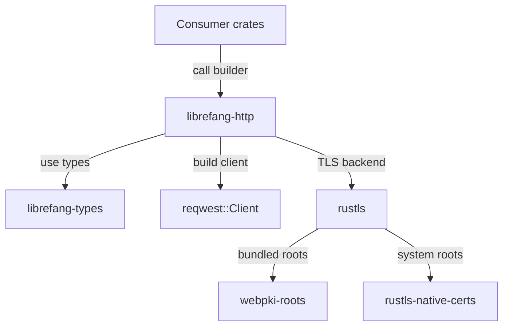

# Other — librefang-http

# librefang-http

Shared HTTP client builder providing centralized configuration of proxies, TLS, and certificate resolution for the LibreFang project.

## Overview

Rather than each crate in the workspace constructing its own `reqwest::Client` with ad-hoc TLS settings, `librefang-http` encapsulates a single client builder strategy. This ensures every component that makes outbound HTTP calls uses a consistent TLS stack and proxy configuration.

The crate depends on `librefang-types` for shared domain types and exposes a `reqwest`-based client ready for use across the workspace.

## Architecture


```mermaid
graph TD
    A[Consumer crates] -->|call builder| B[librefang-http]
    B -->|use types| C[librefang-types]
    B -->|build client| D[reqwest::Client]
    B -->|TLS backend| E[rustls]
    E -->|bundled roots| F[webpki-roots]
    E -->|system roots| G[rustls-native-certs]
```

## TLS Strategy

The crate uses **rustls** exclusively — it does not link against native TLS backends such as OpenSSL or Secure Transport. This keeps the dependency tree static and cross-compilation straightforward.

Certificate root stores are resolved with a fallback chain:

1. **`rustls-native-certs`** — Loads root certificates from the host operating system's trust store (e.g. `/etc/ssl/certs` on Linux, the Keychain on macOS, the Windows certificate store). Preferred when running on infrastructure where certificates are managed by ops teams (corporate CAs, internal PKI).

2. **`webpki-roots`** — Falls back to Mozilla's bundled root certificate set compiled into the binary. Guarantees the client works in minimal containers or environments where the system trust store is absent or incomplete.

This two-tier approach means the client works out of the box in development (webpki-roots) while respecting system-level trust in production deployments.

## Dependencies

| Dependency | Purpose |
|---|---|
| `librefang-types` | Shared types and domain abstractions used across the workspace |
| `reqwest` | HTTP client; likely configured with `rustls-tls` feature to select rustls as the TLS backend |
| `rustls` | Pure-Rust TLS implementation |
| `webpki-roots` | Mozilla's CA certificate bundle for environments without a system trust store |
| `rustls-native-certs` | Loader for the operating system's native certificate store |
| `tracing` | Structured logging for certificate resolution failures, proxy configuration, and connection errors |

## Integration Points

This crate is an **internal utility library** — it does not define an executable or service. Other workspace members import it to obtain a pre-configured `reqwest::Client` rather than building one from scratch. The `tracing` dependency ensures that TLS negotiation issues and proxy misconfigurations are visible in whatever tracing subscriber the consuming binary sets up.

### Usage pattern (from a consumer crate)

```toml
[dependencies]
librefang-http = { path = "../librefang-http" }
```

Consumer crates call into this library to obtain a client, then use standard `reqwest` methods for making requests. All proxy and TLS configuration is handled here centrally.

## Linting

Follows the workspace-level lint configuration defined in the root `Cargo.toml`, ensuring consistency with the rest of the LibreFang project.