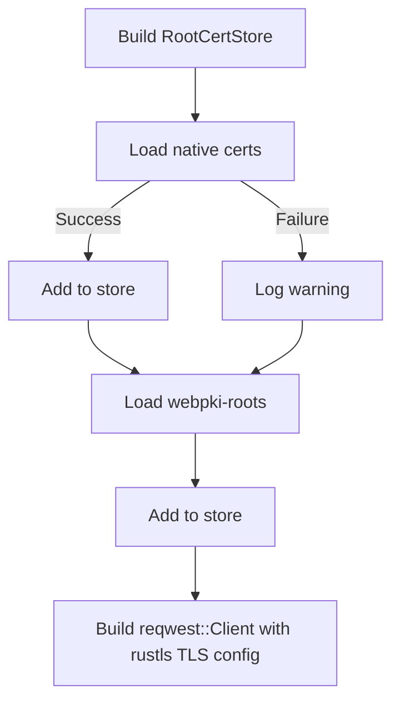

# Other — librefang-http

# librefang-http

Shared HTTP client builder providing consistent TLS configuration and proxy support across the LibreFang workspace.

## Purpose

All LibreFang components that make outbound HTTP requests share the same requirements: validated TLS connections, system proxy awareness, and resilient certificate loading. This crate centralises that logic so every binary and library in the workspace constructs its `reqwest::Client` the same way.

## Dependencies

| Crate | Role |
|---|---|
| `reqwest` | HTTP client (backed by `rustls`) |
| `rustls` | TLS implementation |
| `webpki-roots` | Bundled Mozilla CA certificates |
| `rustls-native-certs` | Loads platform-native certificate stores |
| `tracing` | Diagnostic logging |
| `librefang-types` | Shared domain types used by callers |

## TLS Certificate Strategy

The module builds a `rustls::RootCertStore` using a **fallback chain**:

1. **Platform-native certificates** (`rustls-native-certs`) — loads the OS certificate store (e.g. `/etc/ssl/certs` on Linux, Windows certificate store, macOS Keychain).
2. **WebPKI roots** (`webpki-roots`) — bundled Mozilla CA certificates used as a fallback when native loading fails or returns no certs.

Both sources are merged into a single `RootCertStore`, giving the client the broadest possible set of trusted CAs. Failures during native cert loading are logged via `tracing` but do not abort client construction.


```mermaid
flowchart TD
    A[Build RootCertStore] --> B[Load native certs]
    B -->|Success| C[Add to store]
    B -->|Failure| D[Log warning]
    C --> E[Load webpki-roots]
    D --> E
    E --> F[Add to store]
    F --> G[Build reqwest::Client with rustls TLS config]
```

## Proxy Handling

The builder defers to `reqwest`'s default proxy behaviour, which respects standard environment variables:

- `HTTP_PROXY` / `http_proxy`
- `HTTPS_PROXY` / `https_proxy`
- `NO_PROXY` / `no_proxy`

No additional proxy configuration layer is added on top.

## Integration with the Workspace

```
librefang-types  ←  librefang-http  ←  (consumers: binaries, other libraries)
```

Consumers depend on `librefang-http` to obtain a preconfigured `reqwest::Client`. The module itself depends on `librefang-types` for any shared types it needs to reference (e.g. configuration structs).

## Usage

Add the dependency in your crate's `Cargo.toml`:

```toml
[dependencies]
librefang-http = { path = "../librefang-http" }
```

Then use the builder to obtain a client. The exact API surface (function names, builder methods) is defined in the crate's `lib.rs`; refer to rustdoc for the current signatures. The general pattern is:

1. Call the provided builder/function to get a `reqwest::Client`.
2. Use that client for all outbound requests — it will already carry the correct TLS roots and proxy settings.

## Logging

The module emits `tracing::warn!` events when native certificate loading fails, and `tracing::debug!` events during the certificate loading process. Ensure your binary initialises a `tracing` subscriber to capture these messages.