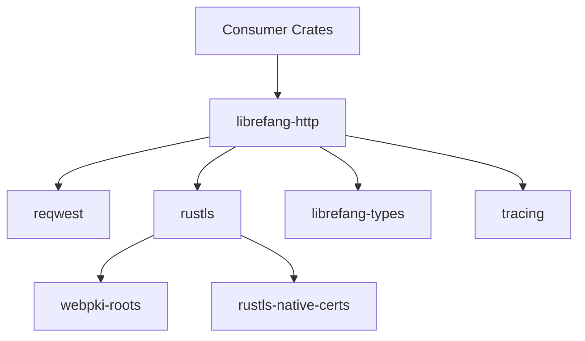

# Other — librefang-http

# librefang-http

Shared HTTP client builder with proxy and TLS fallback for LibreFang.

## Purpose

This crate provides a centralized, reusable HTTP client builder for the LibreFang workspace. It encapsulates all TLS configuration and proxy handling so that downstream crates (CLI tools, daemons, test harnesses) do not need to independently manage certificate trust stores or `reqwest` client construction.

By consolidating this logic, every component that makes outbound HTTP requests shares the same:

- **TLS trust roots** — Mozilla's WebPKI roots plus the system's native certificate store.
- **Proxy behaviour** — consistent environment-variable-based proxy support.
- **Client defaults** — timeouts, headers, and other connection settings.

## Architecture


```mermaid
graph TD
    A[librefang-http] --> B[reqwest]
    A --> C[rustls]
    C --> D[webpki-roots]
    C --> E[rustls-native-certs]
    A --> F[librefang-types]
    A --> G[tracing]
    H[Consumer Crates] --> A
```

### Dependency roles

| Dependency | Role |
|---|---|
| `reqwest` | HTTP client; the builder produces a `reqwest::Client` (or `ClientBuilder`) ready for use. |
| `rustls` | Pure-Rust TLS backend used instead of native OpenSSL to avoid system-library dependency issues. |
| `webpki-roots` | Bundles Mozilla's trusted root certificates so TLS works out of the box on any machine. |
| `rustls-native-certs` | Loads certificates from the operating system's trust store as a supplementary source, covering custom/private CAs. |
| `librefang-types` | Workspace crate providing shared types (config structs, error types, etc.) that the builder accepts as input. |
| `tracing` | Structured logging for certificate loading failures, proxy detection, and other diagnostic events. |

## TLS Fallback Strategy

The crate uses `rustls` as its TLS provider and builds a composite certificate verifier:

1. **Primary** — `webpki-roots` provides a known-good set of Mozilla CA certificates. This ensures the client works on minimal systems (containers, scratch images) that lack a system trust store.
2. **Fallback / supplementary** — `rustls-native-certs` loads whatever CA certificates the host OS provides. This covers environments with private CAs or custom root certificates.

Both sets are combined so that a server presenting a certificate valid under *either* trust store is accepted. Failures to load native certificates are logged via `tracing` but do not prevent client creation, since the WebPKI roots are always available.

## Integration

Consumer crates depend on `librefang-http` and call the provided builder to obtain a configured `reqwest::Client`. They then use that client for all outbound requests.

```toml
# In a consumer crate's Cargo.toml
[dependencies]
librefang-http = { path = "../librefang-http" }
```

The builder is designed to accept configuration from `librefang-types` (e.g., proxy settings, timeout values, custom CA paths), keeping all configuration schemas in one place.

## Relationship to the Workspace

- **Depends on** `librefang-types` for configuration types and error definitions.
- **Consumed by** any workspace crate that needs to make HTTP requests (API clients, updaters, telemetry reporters).
- **No inbound code calls** — this crate is a pure utility; nothing in the workspace calls *into* it at the type level. Other crates construct clients through it at runtime.

## Design Decisions

**Why rustls over native-tls?**  
Using `rustls` eliminates a dependency on the system's OpenSSL library, making builds reproducible and cross-compilation straightforward. It also gives explicit control over which root certificates are trusted.

**Why both WebPKI and native certs?**  
WebPKI roots guarantee functionality on any platform. Native certs support enterprise environments where internal CAs are required. Loading both maximizes compatibility without sacrificing security.

**Why a shared builder crate?**  
Without it, every consumer would need to duplicate TLS configuration, proxy setup, and client defaults. A shared builder ensures consistent behaviour across the entire LibreFang codebase and provides a single place to adjust connection policies.