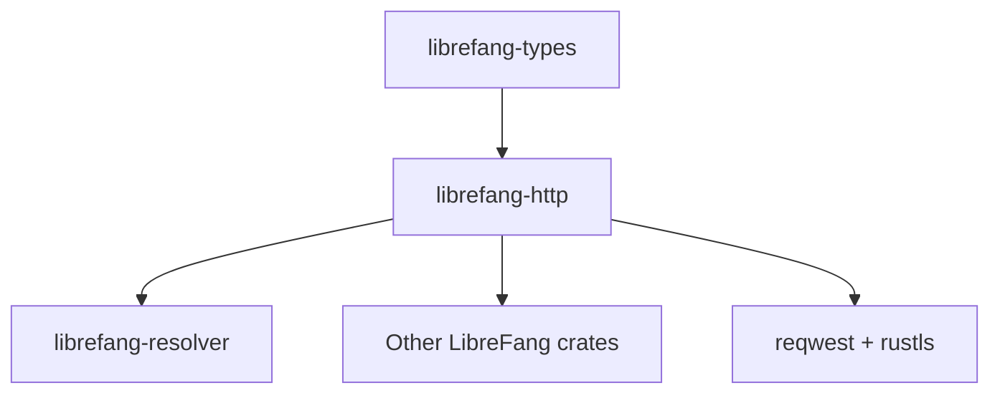

# Other — librefang-http

# librefang-http

Shared HTTP client builder providing consistent TLS configuration and proxy support across the LibreFang workspace.

## Purpose

This crate centralizes `reqwest` client construction so that every component in LibreFang——makes HTTP requests with identical TLS behavior and proxy handling. Any crate that needs to speak HTTP depends on this library rather than building its own client, preventing certificate trust mismatches and duplicated boilerplate.

## Dependencies

| Dependency | Role |
|---|---|
| `reqwest` | HTTP client runtime (workspace-managed version) |
| `rustls` | TLS backend — avoids OpenSSL linkage |
| `webpki-roots` | Mozilla's bundled CA certificates |
| `rustls-native-certs` | Loads system certificate store as a fallback |
| `tracing` | Structured logging for TLS and proxy diagnostics |
| `librefang-types` | Shared domain types used across the workspace |

## TLS Certificate Strategy

The crate implements a two-tier certificate trust chain:

1. **Primary** — `webpki-roots` provides a pinned set of well-known Mozilla CA certificates. This guarantees consistent behavior regardless of the host OS.
2. **Fallback** — `rustls-native-certs` loads whatever CA bundle the operating system provides. This covers corporate environments with private CAs, self-signed infrastructure, or non-standard root certificates.

Both pools are merged into a single `rustls::RootCertStore` so that the resulting `reqwest::Client` trusts the union of Mozilla's roots and the system's roots. If native cert loading fails entirely, the client still functions with the webpki roots alone.

## Proxy Support

Proxies are left to `reqwest`'s default behavior, which respects the standard `HTTP_PROXY`, `HTTPS_PROXY`, and `NO_PROXY` environment variables. This crate does not hardcode proxy configuration, keeping it flexible for different deployment scenarios.

## Relationship to the Workspace

```mermaid
graph TD
    A[librefang-types] --> B[librefang-http]
    B --> C[librefang-resolver]
    B --> D[Other LibreFang crates]
    B --> E[reqwest + rustls]
```

`librefang-http` sits between the shared types layer and any crate that makes outbound HTTP calls. It consumes types from `librefang-types` and exposes a pre-configured `reqwest::Client` (or builder) that downstream crates use directly.

## Usage Pattern

Downstream crates add `librefang-http` as a dependency and call its builder to obtain a ready-to-use client. The returned client already has:

- A `rustls`-backed TLS connector (no OpenSSL required)
- The merged certificate store described above
- Sensient default timeouts and redirect policies from the workspace's `reqwest` version
- `tracing` instrumentation for connection and TLS events

Consumers should not need to touch TLS configuration themselves.

## Build Notes

Because this crate uses `rustls` exclusively, the workspace avoids an OpenSSL build dependency. This simplifies cross-compilation and reduces the binary's attack surface. Ensure the workspace `reqwest` dependency is configured with `default-features = false` and `features = ["rustls-tls"]` (or equivalent) so that no OpenSSL backend is accidentally pulled in through feature unification.