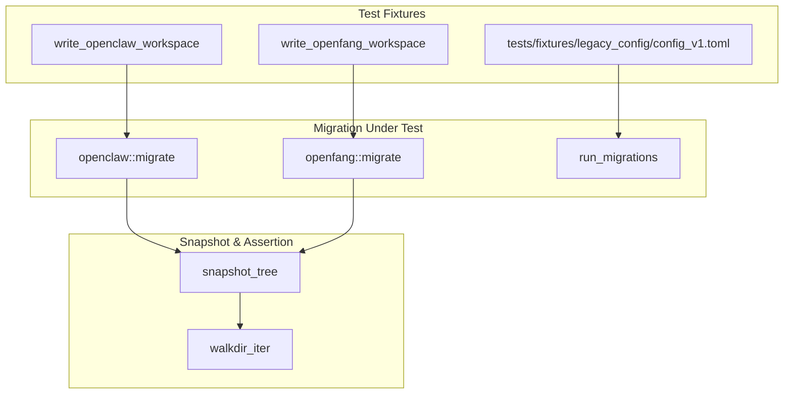

# Other — librefang-import-tests

# librefang-import/tests — Idempotency & Forward-Compatibility Tests

## Purpose

This integration test module (`idempotency.rs`) verifies filesystem-level contracts for the `librefang-import` migration crate that unit tests alone cannot cover. While in-crate tests in `src/openclaw.rs` assert that `report.imported.is_empty()` on a second run, these tests go further by comparing the **actual bytes on disk** after repeated or interrupted migrations.

Three guarantees are under test:

1. **Idempotency** — a second migration run produces a byte-identical destination tree (no duplicate sessions, no clobbered configs, no rewritten timestamps).
2. **Crash recovery** — a partially-completed migration (files deleted between runs, simulating a process killed mid-write) can be re-driven to a correct state without corrupting surviving entries.
3. **Forward compatibility** — the prior major version's `KernelConfig` shape still deserializes and round-trips through `run_migrations`.

## Test Architecture



## Helper Functions

### `snapshot_tree(root: &Path) -> BTreeMap<PathBuf, Vec<u8>>`

Reads every regular file under `root` and returns a sorted map from relative path to byte contents. Using `BTreeMap` ensures deterministic iteration order so that `assert_eq!` failures point at the first differing path rather than depending on `HashMap`'s non-deterministic ordering.

Returns an empty map if `root` doesn't exist.

### `walkdir_iter(root: &Path) -> Vec<PathBuf>`

A minimal recursive directory walker built on `std::fs::read_dir`. Avoids pulling the `walkdir` crate into dev-dependencies. Symlinks are deliberately ignored since neither migrator produces them, and ignoring them keeps snapshots stable across platforms.

### `write_openclaw_workspace(dir: &Path)`

Creates a minimal but representative OpenClaw source workspace at `dir`:

- `openclaw.json` — JSON5 agent/channel configuration with two agents (`coder`, `researcher`) and a Telegram channel definition
- `memory/coder/MEMORY.md` — per-agent memory file
- `sessions/agent_coder_main.jsonl` — a session file (critical for verifying idempotency does not duplicate sessions)

### `write_openfang_workspace(dir: &Path)`

Creates a minimal OpenFang source workspace at `dir`:

- `config.toml` — config version 2 with `[default_model]` table
- `secrets.env` — environment file with an API key (tests verbatim `.env` rewriting)
- `agents/coder/agent.toml` — agent manifest
- `data/index.db` — binary blob file

### `opts(source, src, dst) -> MigrateOptions`

Constructs a `MigrateOptions` with `dry_run: false` and the given source type, source directory, and target directory. All migration tests run with `dry_run` disabled to exercise actual filesystem writes.

## Test Cases

### A. Idempotency Tests

#### `openclaw_second_run_is_byte_identical`

Verifies the OpenClaw migration marker (`dst.join(".openclaw_migrated")`) correctly short-circuits a second run:

1. Write an OpenClaw workspace, run migration once, snapshot the destination tree.
2. Run migration again — assert `report.imported.is_empty()`.
3. Snapshot the destination tree a second time and assert byte-level equality with the first snapshot.

The marker prevents any writes on the second run, so even timestamped content inside the marker body must remain identical.

#### `openfang_second_run_is_byte_identical`

OpenFang has no marker file — it relies on per-entry `dest_path.exists()` skips:

1. Write an OpenFang workspace, run migration once, snapshot destination.
2. Run migration again — assert `report.imported.is_empty()` and that every previously-imported entry appears in `report.skipped` (count matches first run's imported count).
3. Assert byte-level equality of the destination tree.

### B. Partial-Write Recovery Tests

#### `openclaw_partial_write_is_recoverable`

Simulates a killed process by deleting a file and the migration marker:

1. Run a full migration, snapshot baseline.
2. Select a "victim" file (prefers an agent manifest like `agents/coder/agent.toml`, falls back to any non-marker file).
3. Delete the victim file and `.openclaw_migrated` marker.
4. Run migration again.
5. Assert the victim file is recreated with identical byte content.
6. Assert every other non-marker file is byte-identical to baseline (never-clobber semantics, ref #3795).
7. The marker's existence is checked but its body is not compared (it contains a wall-clock timestamp).

#### `openfang_partial_write_is_recoverable`

Same crash-recovery shape for OpenFang (no marker to delete):

1. Run full migration, snapshot baseline.
2. Delete `agents/coder/agent.toml` (a rewritten file, exercising the rewrite path on recovery).
3. Run migration again.
4. Assert victim is recreated with identical content.
5. Assert all other files are unchanged.

### C. Forward-Compatibility Tests

These tests use the fixture at `tests/fixtures/legacy_config/config_v1.toml`, which represents the prior major version's `KernelConfig` shape — specifically the v1 layout before the v1→v2 migration hoisted `[api].api_key/api_listen/log_level` to root level.

The fixture is intentionally minimal: only `config_version` plus the `[api]` table. This is the smallest representation that exercises both raw deserialization and the migration path without attempting to reconstruct every legacy field.

#### `legacy_v1_config_parses_into_current_kernel_config`

Asserts that a v1 TOML config deserializes into the current `KernelConfig` type. Unknown fields like `[api]` are ignored under `#[serde(default)]`, and missing root fields fall back to `Default`. Verifies `config_version == 1`.

#### `legacy_v1_config_migrates_forward_to_current_version`

Asserts that `run_migrations(&mut raw, 1)` produces `CONFIG_VERSION` and correctly hoists the `[api]` table:

- `[api]` table is removed
- `api_key` = `"legacy-secret-key"` at root
- `api_listen` = `"127.0.0.1:4545"` at root
- `log_level` = `"info"` at root

## Relationship to the Rest of the Codebase

| External Symbol | Source Module | Role in Tests |
|---|---|---|
| `openclaw::migrate` | `librefang-import/src/openclaw.rs` | Migration function under test |
| `openfang::migrate` | `librefang-import/src/openfang.rs` | Migration function under test |
| `MigrateOptions`, `MigrateSource` | `librefang-import/src/lib.rs` | Configuration types passed to migrate |
| `KernelConfig` | `librefang-types/src/config/` | Target type for legacy config deserialization |
| `run_migrations`, `CONFIG_VERSION` | `librefang-types/src/config/version.rs` | Config version migration engine |

## Running These Tests

```sh
# All idempotency tests
cargo test -p librefang-import --test idempotency

# Individual test
cargo test -p librefang-import --test idempotency openclaw_second_run_is_byte_identical
```

All tests use `tempfile::TempDir` for isolation — no state leaks between runs, no cleanup required.