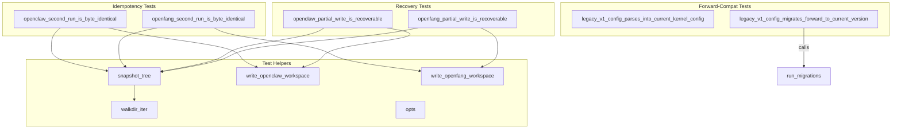

# Other — librefang-import-tests

# librefang-import/tests/idempotency.rs

End-to-end integration tests verifying that the migration crate produces deterministic, recoverable results at the filesystem level.

## Purpose

Unit tests inside `src/openclaw.rs` already assert that `report.imported.is_empty()` on a second migration run. This test module validates the **stronger contract that callers actually depend on**: the bytes on disk. It covers three concerns raised in issue #3407:

1. **Idempotency** — A second migration run produces a byte-identical destination tree (no duplicate sessions, no clobbered configs, no rewritten timestamps).
2. **Partial-write recovery** — If a migration is killed mid-write (simulated by deleting a file), re-running the migration recreates the missing file without corrupting surviving entries.
3. **Forward compatibility** — A prior major version's `KernelConfig` TOML shape still deserialises into the current types and round-trips through `run_migrations`.

## Test Architecture

## Helper Functions

### `snapshot_tree(root: &Path) -> BTreeMap<PathBuf, Vec<u8>>`

Reads every regular file under `root` and returns a sorted map of relative path → byte contents. Using `BTreeMap` guarantees deterministic iteration order, so `assert_eq!` failures point at the first differing path alphabetically rather than depending on `HashMap` insertion order.

### `walkdir_iter(root: &Path) -> Vec<PathBuf>>`

A minimal recursive directory walker that avoids pulling the `walkdir` crate into dev-dependencies. Collects all regular files (ignores symlinks deliberately for cross-platform snapshot stability) and returns them sorted.

### `write_openclaw_workspace(dir: &Path)`

Creates a minimal openclaw source workspace containing:

| Path | Purpose |
|------|---------|
| `openclaw.json` | Agent definitions, channel config, memory/session settings (JSON5) |
| `memory/coder/MEMORY.md` | Per-agent memory file |
| `sessions/agent_coder_main.jsonl` | A session file that idempotency must not duplicate |

The fixture mirrors the shape used by the in-crate `create_json5_workspace` helper in `src/openclaw.rs`, trimmed to only what the idempotency assertions need.

### `write_openfang_workspace(dir: &Path)`

Creates a minimal openfang source workspace containing:

| Path | Purpose |
|------|---------|
| `config.toml` | Top-level config with `config_version`, `api_listen`, `log_level`, `[default_model]` |
| `secrets.env` | Environment file that must be copied verbatim |
| `agents/coder/agent.toml` | Agent manifest (exercises the `.toml` rewrite path) |
| `data/index.db` | Binary file (exercises byte-exact copy) |

### `opts(source, src, dst) -> MigrateOptions`

Constructs a `MigrateOptions` with `dry_run: false` for the given source type and directory paths.

## Test Cases

### Group A — OpenClaw Idempotency

**`openclaw_second_run_is_byte_identical`**

Runs openclaw migration twice against the same source and destination directories. Asserts:

- The first run produces a non-empty destination tree.
- The second run's `report.imported` is empty (marker-based short-circuit).
- `snapshot_tree` output is byte-identical between both runs, including the timestamped marker body at `.openclaw_migrated`.

The openclaw migrator uses a marker file to detect prior runs. On the second invocation, the marker causes the migrator to return before any writes, guaranteeing the on-disk tree is untouched.

### Group B — OpenFang Idempotency

**`openfang_second_run_is_byte_identical`**

Runs openfang migration twice. Unlike openclaw, openfang has no marker file — it relies on per-entry `dest_path.exists()` checks to skip already-present files. Asserts:

- First run imports entries with no skips.
- Second run imports nothing and skips every previously-imported entry.
- The destination tree is byte-identical across both runs.

### Group C — Partial-Write Recovery

**`openclaw_partial_write_is_recoverable`**

Simulates a killed migration by:

1. Running a full migration to establish a baseline snapshot.
2. Deleting a victim file (preferring an `agent.toml` if present).
3. Deleting the `.openclaw_migrated` marker so the next run proceeds past the short-circuit guard.
4. Re-running migration.

Asserts the victim file is recreated with its original byte content, and every other non-marker file is unchanged. Marker existence is verified but its body is not byte-compared (it contains a wall-clock timestamp).

**`openfang_partial_write_is_recoverable`**

Same shape as the openclaw test but simpler — no marker to remove. Deletes `agents/coder/agent.toml` (a rewritten file, so recovery re-exercises the rewrite path) and verifies it is recreated identically while all other files remain untouched.

Both recovery tests validate the never-clobber semantics implemented by `promote_staging` (reference #3795).

### Group D — Forward Compatibility

**`legacy_v1_config_parses_into_current_kernel_config`**

Loads `tests/fixtures/legacy_config/config_v1.toml` and verifies it deserialises directly into `librefang_types::config::KernelConfig`. The v1 layout has fields like `api_key`, `api_listen`, and `log_level` nested under an `[api]` table. Current `KernelConfig` uses `#[serde(default)]` and ignores unknown fields, so the `[api]` table is silently dropped and missing root-level fields fall back to `Default`.

**`legacy_v1_config_migrates_forward_to_current_version`**

Parses the same fixture as a raw `toml::Value` and passes it through `run_migrations(&mut raw, 1)`. Asserts:

- The returned version equals `CONFIG_VERSION` (migration reaches the current version).
- The `[api]` table is removed.
- `api_key`, `api_listen`, and `log_level` are hoisted to root level with their original values.

## Fixture: `tests/fixtures/legacy_config/config_v1.toml`

The legacy config fixture is intentionally minimal — only `config_version = 1` plus the `[api]` table with the three hoisted fields. This is the smallest representation that exercises both raw deserialisation and the v1→v2 migration path. A complete v1 config is not reconstructed because the schema surface area has grown too large to safely mirror from the test side.

## Relationship to Other Code

| Dependency | Usage |
|------------|-------|
| `librefang_import::openclaw::migrate` | OpenClaw migration entry point under test |
| `librefang_import::openfang::migrate` | OpenFang migration entry point under test |
| `librefang_import::{MigrateOptions, MigrateSource}` | Configuration types passed to migrators |
| `librefang_types::config::KernelConfig` | Current config struct for forward-compat deserialisation |
| `librefang_types::config::run_migrations` | Config version migration pipeline |
| `librefang_types::config::CONFIG_VERSION` | Current config version constant |
| `tempfile::TempDir` | Isolated temporary directories for source/destination trees |

## Design Decisions

- **No `walkdir` dev-dependency**: The test crate compiles separately from the main crate. A hand-rolled `walkdir_iter` over `std::fs::read_dir` keeps dev-dependencies minimal.
- **`BTreeMap` for snapshots**: Deterministic ordering makes assertion failures actionable — they always point at the first differing path.
- **Marker body not byte-compared in recovery tests**: The `.openclaw_migrated` marker contains a wall-clock timestamp. Recovery tests verify its existence but not its content, since a new timestamp is expected on re-run.
- **Symlinks ignored**: Neither migrator produces symlinks, and ignoring them keeps snapshots stable across platforms.