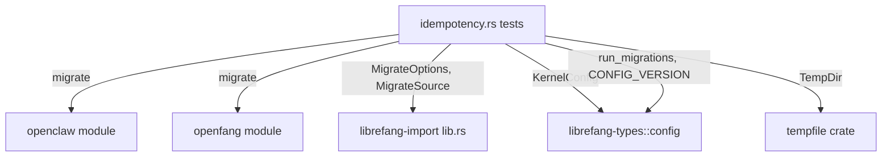

# Other — librefang-import-tests

# Idempotency & Forward-Compatibility Tests

## Overview

`tests/idempotency.rs` contains end-to-end integration tests that verify the filesystem-level contracts of the migration system in the `librefang-import` crate. These tests sit above the unit-level idempotency checks in `src/openclaw.rs` and validate what callers actually observe on disk: no duplicate sessions, no clobbered configs, no rewritten timestamps on re-run, and correct recovery from interrupted migrations.

The tests also verify forward compatibility — that configuration files from the prior major version (`config_version = 1`) still deserialize into the current `KernelConfig` type and can be migrated to the latest schema via `run_migrations`.

## Test Categories

### A. Second-Run Byte-Identity

Two tests assert that running a migration twice leaves the destination tree **byte-identical**:

| Test | Migration Path | Idempotency Mechanism |
|------|---------------|----------------------|
| `openclaw_second_run_is_byte_identical` | OpenClaw | Marker file (`.openclaw_migrated`) short-circuits before writes |
| `openfang_second_run_is_byte_identical` | OpenFang | Per-entry `dest_path.exists()` skip check |

Both tests follow the same pattern:

1. Populate a temporary source workspace using a fixture helper
2. Run `migrate` once and snapshot the entire destination tree
3. Run `migrate` again and assert the report indicates zero imports
4. Snapshot the tree again and assert byte-level equality with the first snapshot

### B. Partial-Write Recovery

Two tests simulate a killed migration process by deleting a file from the destination between runs:

| Test | Victim Selection | Marker Handling |
|------|-----------------|-----------------|
| `openclaw_partial_write_is_recoverable` | First `agent.toml` containing `"coder"`, or any non-marker file | Marker also removed to bypass short-circuit guard |
| `openfang_partial_write_is_recoverable` | `agents/coder/agent.toml` (a rewritten file) | N/A — OpenFang has no marker |

The recovery contract:

- The deleted file **must** be recreated with its original byte content
- Every surviving file **must not** be clobbered (`promote_staging` never-clobber semantics, issue #3795)
- The OpenClaw marker's wall-clock timestamp body is exempted from byte comparison (only existence is checked)

### C. Forward-Compatibility

Two tests validate legacy config handling against `librefang-types::config`:

- **`legacy_v1_config_parses_into_current_kernel_config`** — Confirms that the v1 fixture at `tests/fixtures/legacy_config/config_v1.toml` deserializes into the current `KernelConfig` struct. This relies on `#[serde(default)]` ignoring unknown fields (the old `[api]` table) and `Default` fallback for missing root-level fields.

- **`legacy_v1_config_migrates_forward_to_current_version`** — Confirms that `run_migrations(&mut raw, 1)` successfully lifts the v1 schema to `CONFIG_VERSION`, specifically:
  - The `[api]` table is removed
  - `api_key`, `api_listen`, and `log_level` are hoisted to root level

## Test Utilities

### `snapshot_tree(root: &Path) -> BTreeMap<PathBuf, Vec<u8>>`

Reads every regular file under `root` and returns a sorted map from relative path to byte contents. Using `BTreeMap` ensures deterministic iteration order so that `assert_eq!` failures point at the first differing path by lexicographic order, rather than depending on `HashMap`'s non-deterministic iteration.

Symlinks are deliberately skipped because neither migrator produces them and their resolution behavior varies across platforms.

### `walkdir_iter(root: &Path) -> Vec<PathBuf>`

A minimal recursive directory walker built on `std::fs::read_dir`. Exists to avoid pulling `walkdir` into the test crate's dev-dependency tree — it's already a runtime dependency but the test crate compiles separately.

### `write_openclaw_workspace(dir: &Path)` / `write_openfang_workspace(dir: &Path)`

Create minimal but representative source workspaces in temporary directories:

- **OpenClaw workspace**: An `openclaw.json` (JSON5 with agents, channels, memory config), a per-agent memory file, and a session JSONL file
- **OpenFang workspace**: A `config.toml`, `secrets.env`, an agent manifest, and a binary data file

These fixtures are intentionally narrow — only the files needed to exercise the idempotency assertions — so that snapshot diffs remain readable when a regression breaks them.

### `opts(source, src, dst) -> MigrateOptions`

Constructs a `MigrateOptions` with `dry_run: false` pointing at the given temp directories.

## Module Dependencies



## Fixture Files

The legacy config fixture lives at `tests/fixtures/legacy_config/config_v1.toml` and represents the minimal v1 schema — only `config_version` plus the `[api]` table with `api_key`, `api_listen`, and `log_level`. It is intentionally incomplete because the full v1 surface area has grown too large to reconstruct field-by-field; the minimal fixture is sufficient to assert that the load-and-migrate path still functions.

## Running

```sh
# All idempotency tests
cargo test -p librefang-import --test idempotency

# Individual test
cargo test -p librefang-import --test idempotency openclaw_second_run_is_byte_identical
cargo test -p librefang-import --test idempotency legacy_v1_config_migrates_forward_to_current_version
```