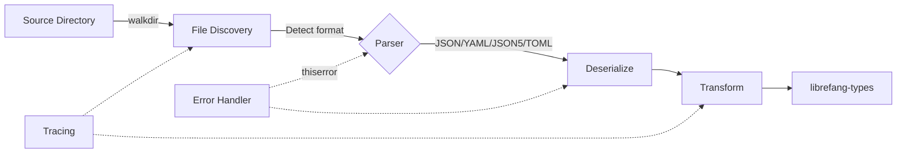

# Other — librefang-import

# librefang-import

Import engine for migrating configurations and agent definitions from other agent frameworks into LibreFang.

## Purpose

This module handles the ingestion of external agent framework data—configuration files, agent definitions, conversation histories, and related metadata—and transforms them into LibreFang's native types. It provides a format-agnostic pipeline that can parse multiple configuration languages, normalize the data, and emit structures compatible with the rest of the LibreFang ecosystem.

## Supported Input Formats

The module accepts configuration and data files in the following formats:

| Format | Use Case |
|--------|----------|
| JSON (`serde_json`) | Common structured config, API exports |
| YAML (`serde_yaml`) | Human-readable agent configs |
| JSON5 (`json5`) | Relaxed JSON with comments, trailing commas |
| TOML (`toml`) | Rust-ecosystem configs, tool settings |

## Architecture

## Key Dependencies and Their Roles

### File Discovery — `walkdir`, `dirs`

- **`walkdir`** — Recursively traverses source directories to locate importable files. Used when importing from a framework's project tree or a user-provided directory.
- **`dirs`** — Resolves standard OS directories (config home, data home). Enables discovery of agent framework configs installed in conventional locations without requiring explicit paths from the user.

### Parsing — `serde`, `serde_json`, `serde_yaml`, `json5`, `toml`

All parsers feed into a common Serde deserialization pipeline. The module detects the file format based on extension or content, selects the appropriate parser, and deserializes into intermediate representations before mapping to `librefang-types`.

### Type Conversion — `librefang-types`

The final output of any import operation is one or more types from `librefang-types`. This crate is the sole internal dependency, ensuring that imported data is immediately usable by other LibreFang modules without further transformation.

### Error Handling — `thiserror`

All import failures are expressed as typed errors using `thiserror` derives. This covers:

- File I/O errors (missing files, permission denied)
- Parse errors (malformed JSON, invalid YAML structure)
- Conversion errors (missing required fields, incompatible schemas)

### Observability — `tracing`

Import operations emit structured trace events at key points: file discovery, parse start/end, conversion results, and warnings for skipped or partially-imported data.

### Timestamps — `chrono`

Used for parsing and normalizing date/time values found in source configs (e.g., agent creation timestamps, session metadata) into a consistent representation.

## Integration with LibreFang

This module sits at the edge of the system. It depends on `librefang-types` but is not depended upon by any other LibreFang crate. This means it can be included or excluded from a build without affecting core functionality—useful for reducing attack surface or binary size in production deployments that don't need migration support.

Typical usage: a CLI command or one-shot utility invokes this module's import functions, writes the resulting types to the LibreFang data store, and then the import module is no longer involved.

## Development Notes

- **Adding a new source framework**: Implement detection logic (file patterns, directory structure), define an intermediate deserialization struct for the source schema, and write a mapper from that struct into the relevant `librefang-types`.
- **Testing**: The `tempfile` dev-dependency supports integration tests that scaffold directory trees with sample config files, run the import pipeline, and assert the output. Prefer this approach over mocking the filesystem.
- **Extending format support**: A new format only requires wiring another Serde-capable parser into the existing format-detection branch. The downstream transformation logic remains unchanged.