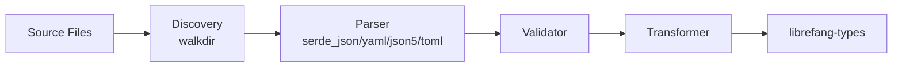

# Other — librefang-import

# librefang-import

Import engine for migrating configurations, agent definitions, and related data from other agent frameworks into LibreFang.

## Purpose

Migrating to LibreFang from an existing agent framework typically involves converting non-trivial amounts of configuration, agent definitions, and orchestration rules. This module provides the tooling to discover, parse, validate, and transform that external data into LibreFang-native types defined in `librefang-types`.

It is designed as a library crate consumed by the LibreFang CLI or other tooling—not as a standalone binary.

## Supported Input Formats

The crate links against multiple deserialization front-ends, allowing it to handle whatever format the source framework uses:

| Format | Dependency | Typical use |
|---|---|---|
| JSON | `serde_json` | REST-exported configs, common interchange format |
| YAML | `serde_yaml` | Human-edited config files |
| JSON5 | `json5` | Configs that include comments or trailing commas |
| TOML | `toml` | Rust-ecosystem and some Python configs |

All parsing goes through `serde`, so the concrete format is a detail that can be selected at runtime.

## Key Dependencies & What They Enable

- **`librefang-types`** — the target type system. Every imported entity is eventually converted into types defined here (agents, tasks, policies, etc.).
- **`walkdir`** — recursive directory traversal for discovering importable files when pointing the importer at a source directory rather than a single file.
- **`chrono`** — parsing and normalizing timestamps that may appear in source data (e.g., schedule definitions, audit logs).
- **`dirs`** — resolving platform-specific config directories when the source framework stores data in conventional locations (`~/.config/`, `%APPDATA%`, etc.).
- **`thiserror`** — structured error types for import failures with context (file path, parse location, validation rule).
- **`tracing`** — structured logging throughout the import pipeline for debugging and progress reporting.

## Architecture

The import process follows a pipeline model:

```
Discovery → Parsing → Validation → Transformation → Output
```

1. **Discovery** — Given a path or a well-known directory convention, enumerate candidate files using `walkdir`.
2. **Parsing** — Detect the format (or accept it as a parameter) and deserialize the raw file contents into an intermediate representation using the appropriate serde frontend.
3. **Validation** — Check that the parsed data is internally consistent and contains the minimum required fields for the source framework.
4. **Transformation** — Map the source framework's schema onto `librefang-types`. This is where framework-specific knowledge lives.
5. **Output** — Return the converted data as native LibreFang types, ready to be serialized and written to the LibreFang store by the caller.



## Error Handling

All fallible operations return `Result<T, ImportError>` (or a more specific error type) using `thiserror` derives. Errors are designed to carry enough context for a CLI to present actionable messages:

- File I/O errors include the affected path.
- Parse errors include the format and approximate location.
- Validation errors reference the specific rule that failed.
- Transformation errors identify the source entity that could not be mapped.

Callers are expected to handle errors at whatever granularity makes sense—batch imports may log and continue, while single-file imports may surface the error directly.

## Integration with the Rest of LibreFang

This crate has a unidirectional relationship with `librefang-types`:

- **Reads from** `librefang-types` for target types to map into.
- **Does not** depend on the database layer, the agent runtime, or the API server.

This keeps the import engine testable in isolation and avoids pulling in heavy runtime dependencies. The consuming crate (typically the CLI) is responsible for persisting the output through the appropriate store or service.

## Testing

Tests use `tempfile` (listed under `[dev-dependencies]`) to create ephemeral directory trees that mimic source framework layouts. This allows integration-level tests that exercise discovery, parsing, and transformation end-to-end without touching real configuration.