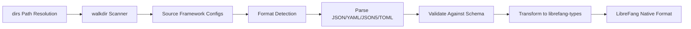

# Other — librefang-import

# librefang-import

Import engine for migrating configurations and data from other agent frameworks into LibreFang.

## Purpose

This module provides the tooling needed to bring existing agent framework configurations—policies, agent definitions, tool configurations, and related metadata—into the LibreFang ecosystem. It handles format detection, parsing, validation, and transformation so that teams adopting LibreFang don't need to manually rewrite their existing setups.

## Supported Input Formats

The dependency list reflects support for the most common configuration formats encountered in agent frameworks:

| Format | Use Case |
|--------|----------|
| **JSON** (`serde_json`) | Standard structured configs, API exports |
| **YAML** (`serde_yaml`) | Human-authored configs, CI/CD pipelines |
| **JSON5** (`json5`) | Extended JSON with comments, used by some Node-based frameworks |
| **TOML** (`toml`) | Rust-ecosystem configs, some Python tooling |

## Key Capabilities

### Directory Walking

Uses `walkdir` to recursively scan directories for importable configuration files. This supports batch migrations where an entire framework installation's config tree needs processing.

### Path Resolution

The `dirs` dependency provides access to standard platform directories (config home, data home, etc.), enabling the import engine to locate framework configurations installed in conventional locations without requiring explicit paths.

### Temporal Metadata

`chrono` is included to handle timestamp parsing and normalization. Many agent frameworks encode creation dates, last-modified timestamps, or scheduling information in disparate formats that need reconciliation during import.

## Architecture



## Integration with the Codebase

This module depends on **`librefang-types`**, which defines the canonical data structures for LibreFang agents, tools, policies, and related entities. The import engine's job is to produce valid instances of those types from foreign representations.

The relationship is unidirectional at the type level:

- **Reads from**: `librefang-types` (imports type definitions and validation logic)
- **Does not depend on**: runtime services, server infrastructure, or database layers

This keeps the import engine as a pure transformation layer that can be run as a standalone CLI tool, a build step, or a library call without pulling in heavy dependencies.

## Error Handling

Errors are structured through `thiserror`, providing typed error variants for common failure modes:

- Unrecognized or malformed configuration files
- Missing required fields in source data
- Schema validation failures after parsing
- Filesystem errors during directory traversal

Consumers can pattern-match on these variants to decide whether to skip a file, log a warning, or halt the import.

## Logging and Observability

`tracing` spans are used throughout to provide structured, filterable output during import runs. This is particularly important for batch migrations processing hundreds of files, where understanding progress and pinpointing failures matters.

## Development

```toml
# Run tests (uses tempfile for isolated filesystem fixtures)
cargo test -p librefang-import
```

The test suite uses `tempfile` to create temporary directory trees that simulate source framework installations, keeping tests hermetic and repeatable.