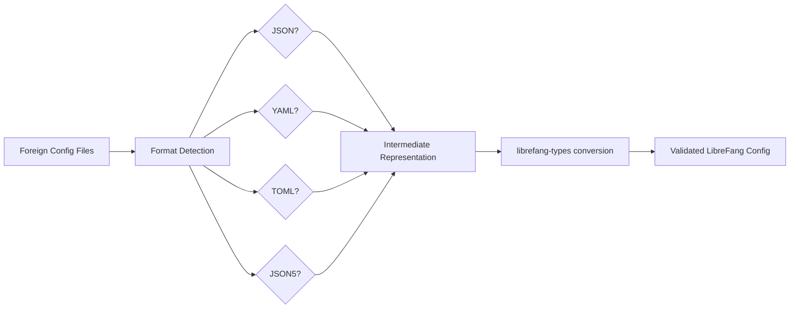

# Other — librefang-import

# librefang-import

Migration engine for importing agent configurations, prompts, and data from other agent frameworks into LibreFang's internal representation.

## Purpose

Switching agent frameworks typically requires manually rewriting prompt definitions, tool configurations, and agent metadata. `librefang-import` automates this by parsing foreign configuration files in a variety of formats and converting them into LibreFang-compatible types defined in `librefang-types`.

## Supported Input Formats

The crate pulls in parsers for five common configuration formats:

| Format | Crate | Typical source frameworks |
|--------|-------|--------------------------|
| JSON | `serde_json` | LangChain exports, AutoGPT configs |
| YAML | `serde_yaml` | Semantic Kernel, CrewAI |
| JSON5 | `json5` | Hand-written configs with comments |
| TOML | `toml` | Rust-native agent tools, custom setups |

## Key Dependencies

- **`librefang-types`** — The target data model. All import output is expressed as types from this crate.
- **`walkdir`** — Recursive directory traversal for batch imports of entire project trees.
- **`chrono`** — Timestamp normalisation. Foreign frameworks use varied date formats; `chrono` provides a unified parsing and comparison layer.
- **`dirs`** — Resolves standard platform directories (e.g. locating a user's existing agent framework config path).
- **`thiserror`** — Derives structured error types for import failures.
- **`tracing`** — Instrumentation for diagnosing failures during large batch imports.

## Architecture

The import pipeline follows three stages:

1. **Discovery** — `walkdir` scans a given root directory for candidate files based on extension (`.json`, `.yaml`/`.yml`, `.toml`, `.json5`).
2. **Parsing** — Each file is deserialised using the appropriate serde-based parser into an intermediate representation.
3. **Conversion** — The intermediate representation is mapped to `librefang-types` structs, validated, and returned to the caller.

## Error Handling

Import failures are expressed through enums derived with `thiserror`. Common failure modes include:

- Unsupported or unrecognised file formats
- Malformed configuration that cannot be deserialised
- Missing required fields in the source framework's config
- Semantic validation errors after conversion (e.g. an agent definition with no tools)

All errors carry enough context (file path, field name, expected type) to generate actionable `tracing` events.

## Integration with LibreFang

`librefang-import` is a standalone library crate. It has no incoming or outgoing runtime calls to other LibreFang crates — it depends only on `librefang-types` for the shared data model. This isolation means it can be used:

- As a CLI subcommand for one-off migrations
- As part of a setup wizard in a TUI or web UI
- In CI pipelines that validate imported configurations

## Testing

The dev-dependency on `tempfile` supports integration tests that construct directory trees of foreign config files on disk, run the import pipeline against them, and assert the resulting `librefang-types` output — then clean up automatically.