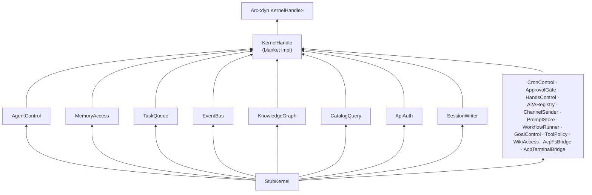

# Other — librefang-kernel-handle-src

# `librefang-kernel-handle` — Tests

## Purpose

The `tests.rs` module inside `librefang-kernel-handle` is a **compile-time safety net**. It exists to guarantee invariants about the crate's trait hierarchy that cannot be expressed through the type system alone. Specifically, it proves that:

1. The blanket implementation of `KernelHandle` (which composes every role trait) is reachable from a concrete type.
2. `KernelHandle` remains object-safe, so `Arc<dyn KernelHandle>` compiles.
3. Every individual role trait remains object-safe, so downstream consumers can erasure-cast to `Arc<dyn SomeRole>` if they only need a subset of the kernel's capabilities.
4. Default method implementations on role traits behave correctly for stub/mock consumers.

If any role trait accidentally gains a non-object-safe method (e.g., a generic parameter, `Self` by value, or a method that returns `impl Trait`), these tests fail at compile time.

## Architecture

`StubKernel` is a zero-sized struct with no runtime behavior. Every method either returns a stub error (`"stub".into()`) or an empty/neutral value. It is never used outside this file.

## Role Traits Covered

### Traits with methods

| Trait | Key methods | Async |
|---|---|---|
| `AgentControl` | `spawn_agent`, `send_to_agent`, `list_agents`, `kill_agent`, `find_agents` | Yes |
| `MemoryAccess` | `memory_store`, `memory_recall`, `memory_list` | No |
| `TaskQueue` | `task_post`, `task_claim`, `task_complete`, `task_list`, `task_delete`, `task_retry`, `task_get`, `task_update_status` | Yes |
| `EventBus` | `publish_event` | Yes |
| `KnowledgeGraph` | `knowledge_add_entity`, `knowledge_add_relation`, `knowledge_query` | Yes |
| `CatalogQuery` | `reasoning_echo_policy_for`*, `supports_vision_for`* | No |
| `ApiAuth` | `auth_snapshot` | No |
| `SessionWriter` | `inject_attachment_blocks` | No |

*Methods with default implementations — stubs inherit these without overriding.

### Marker traits (no methods)

`CronControl`, `ApprovalGate`, `HandsControl`, `A2ARegistry`, `ChannelSender`, `PromptStore`, `WorkflowRunner`, `GoalControl`, `ToolPolicy`, `WikiAccess`, `AcpFsBridge`, `AcpTerminalBridge`

These carry no behavior but are required by the `KernelHandle` blanket impl. Adding a method to any of them will break this test module, which is intentional — it forces an explicit decision about whether the trait should remain a marker.

## Tests

### `stub_satisfies_kernel_handle_via_blanket_impl`

Verifies that a type implementing all role traits automatically satisfies `KernelHandle` without an explicit `impl KernelHandle for StubKernel`. Uses a local helper function `assert_kernel_handle<T: KernelHandle + ?Sized>` to trigger the blanket resolution at compile time.

### `dyn_kernel_handle_is_object_safe`

Constructs `Arc<dyn KernelHandle>` from `StubKernel`. If `KernelHandle` gains a non-object-safe requirement (e.g., a generic method), this line fails to compile.

### `role_traits_are_individually_object_safe`

Creates `Arc<dyn EachRole>` for every role trait. This catches accidental loss of object safety on individual traits, which matters because downstream code often depends on `Arc<dyn AgentControl>` or `Arc<dyn TaskQueue>` rather than the full `KernelHandle`.

### `catalog_query_default_returns_none`

Asserts that the default implementation of `reasoning_echo_policy_for` (inherited by `StubKernel`) returns `ReasoningEchoPolicy::None` for any model name. This is a **fail-closed** default: stubs, mocks, and any handle without a catalog wired must not accidentally activate reasoning-echo behavior.

### `catalog_query_supports_vision_defaults_to_true`

Asserts that `supports_vision_for` returns `true` for any model name when not overridden. This is a **fail-open** default (issue #6010): handles without a catalog should pass image content blocks through unchanged rather than silently dropping them. Only the real kernel implementation, which consults the model catalog, may return `false`.

## Error Type

All fallible methods return `KernelOpError`, a crate-local error type that supports `From<&str>` for ergonomic stub construction (`Err("stub".into())`).

## When This Module Breaks

A compile failure in this file is a signal that a trait API change has broken one of these guarantees:

| Symptom | Likely cause |
|---|---|
| `StubKernel` won't satisfy `KernelHandle` | A new role trait was added to the blanket impl but `StubKernel` doesn't implement it |
| `Arc<dyn KernelHandle>` fails | `KernelHandle` or one of its constituent traits gained a non-object-safe method |
| `Arc<dyn SomeRole>` fails | That specific trait gained a non-object-safe method |
| Default-method assertions fail | `CatalogQuery` changed its default implementations |

The fix is always to update `StubKernel` to match the new trait requirements, then re-evaluate whether the change is intentional.