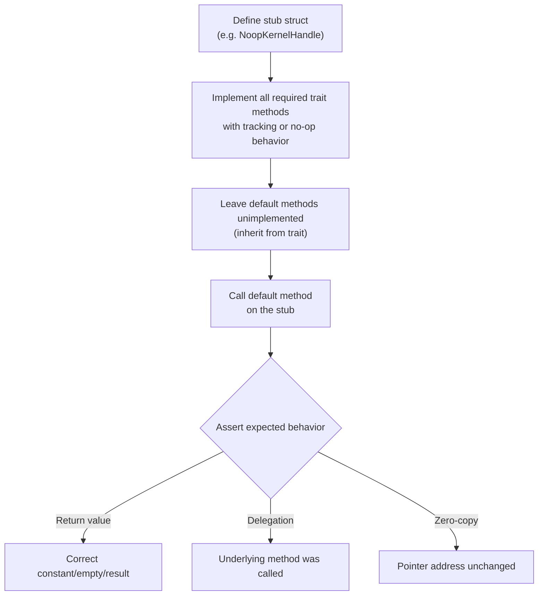

# Other — librefang-kernel-handle-tests

# librefang-kernel-handle Tests

Integration tests that verify the **default method implementations** provided by the kernel handle trait system. Every trait in `librefang-kernel-handle` ships with sensible defaults so implementors only need to fill in the methods they care about. These tests ensure those defaults remain correct, predictable, and well-documented by the type system.

## Purpose

When a new `KernelHandle` implementation is created, it must satisfy a large surface of traits (`AgentControl`, `MemoryAccess`, `TaskQueue`, `EventBus`, `KnowledgeGraph`, `ApprovalGate`, `ToolPolicy`, etc.). Most of these traits define optional or convenience methods with default implementations. This test suite locks down three categories of behavior:

1. **Default return values** — what a no-op implementation returns for every method.
2. **Delegation chains** — that convenience methods (e.g. `send_to_agent_as`) correctly forward to their underlying required method.
3. **Zero-copy guarantees** — that `Bytes`-based APIs share allocations rather than copying buffers.

## Test Files

### `defaults_approval.rs`

Tests the default behavior of `ApprovalGate` and `ToolPolicy`:

| Test | Trait Method | Expected Default |
|------|-------------|-----------------|
| `test_request_approval_default_auto_approves` | `request_approval` | Returns `ApprovalDecision::Approved` |
| `test_is_tool_denied_with_context_default_false` | `is_tool_denied_with_context` | Returns `false` |
| `test_requires_approval_default_false` | `requires_approval` | Returns `false` |

Uses a single `NoopKernelHandle` struct where every required trait method returns `"not implemented"` errors. The default implementations are the system under test — they must return permissive results even though no real logic backs them.

### `defaults_delegation.rs`

Verifies that higher-level convenience methods delegate to the correct lower-level trait method. Each test uses a tracking struct with an `AtomicBool` flag to confirm the underlying method was actually invoked.

**Delegation pairs tested:**

```
send_to_agent_as(agent_id, msg, parent_id)
  └── delegates to ──► send_to_agent(agent_id, msg)

spawn_agent_checked(toml, parent_id, allowed_agents)
  └── delegates to ──► spawn_agent(toml, parent_id)

requires_approval_with_context(tool, sender, channel)
  └── delegates to ──► requires_approval(tool)
```

Each tracking struct (`TrackingSendHandle`, `TrackingSpawnHandle`, `TrackingApprovalHandle`) implements only the **required** method with observable side effects, then relies on the default implementation for the convenience method being tested.

### `defaults_returns.rs`

Validates the default return values for traits whose defaults provide constant or empty values:

| Test | Trait | Method | Expected Default |
|------|-------|--------|-----------------|
| `test_resolve_user_tool_decision_default_allow` | `ToolPolicy` | `resolve_user_tool_decision` | `UserToolGate::Allow` |
| `test_memory_acl_for_sender_default_none` | `ToolPolicy` | `memory_acl_for_sender` | `None` |
| `test_cron_defaults_return_errors` | `CronControl` | `cron_create`, `cron_list`, `cron_cancel` | `KernelOpError::Unavailable("Cron scheduler")` |
| `test_tool_timeout_defaults` | `ToolPolicy` | `tool_timeout_secs`, `tool_timeout_secs_for` | `120` seconds |
| `test_max_agent_call_depth_default` | `ToolPolicy` | `max_agent_call_depth` | `5` |
| `test_workspace_prefix_defaults_empty` | `ToolPolicy` | `readonly_workspace_prefixes`, `named_workspace_prefixes` | Empty vec |
| `test_wiki_access_defaults_return_unavailable_with_method_name` | `WikiAccess` | `wiki_get`, `wiki_search`, `wiki_write` | `KernelOpError::Unavailable("wiki_<verb>")` |

The wiki test (#3329) is notable: each wiki method returns a **method-specific** `Unavailable` variant (e.g. `"wiki_get"`, `"wiki_search"`, `"wiki_write"`), allowing callers and audit logs to distinguish which entry point was hit when the wiki vault is disabled.

### `send_channel_file_data_zero_copy.rs`

Regression test for issue #3553. The `ChannelSender::send_channel_file_data` method takes `bytes::Bytes` instead of `Vec<u8>`, enabling zero-cost cloning across wrapping layers (retry logic, metering, fan-out).

Three properties are verified:

1. **`cloning_bytes_shares_underlying_allocation`** — Cloning a `Bytes` produced from `Vec<u8>` increments a reference count; all clones share the same pointer address.

2. **`send_channel_file_data_does_not_copy_buffer`** — A `CapturingFileKernel` records the pointer address and length of the `Bytes` it receives. The test clones `Bytes` at the call site (simulating a metering wrapper) and asserts the kernel observed the same allocation.

3. **`vec_to_bytes_round_trip_is_zero_copy_for_unique_bytes`** — `Vec::from(Bytes)` is O(1) when the `Bytes` uniquely owns its allocation. This pins the `bytes` 1.x vtable behavior.

## Test Architecture Pattern

Every test file follows the same structure:



The stub structs implement every trait in the kernel handle prelude (`AgentControl`, `MemoryAccess`, `WikiAccess`, `TaskQueue`, `EventBus`, `KnowledgeGraph`, `CronControl`, `ApprovalGate`, `HandsControl`, `A2ARegistry`, `ChannelSender`, `PromptStore`, `WorkflowRunner`, `GoalControl`, `ToolPolicy`) because the test framework constructs them as concrete types. Only the methods relevant to each test have meaningful implementations.

## Relationship to `librefang-kernel-handle`

This test module lives in the `tests/` directory of `librefang-kernel-handle` and imports everything through `librefang_kernel_handle::prelude::*`. It imports types from `librefang_types` (`ApprovalDecision`, `Entity`, `GraphMatch`, `GraphPattern`, `Relation`, `UserToolGate`) for assertions on default return values.

The tests act as a **contract specification** for anyone implementing the kernel handle traits: if you only override the required methods, these are the behaviors you get for free. Changing any default implementation in the trait definitions must be reflected here, making these tests a safety net for API evolution.