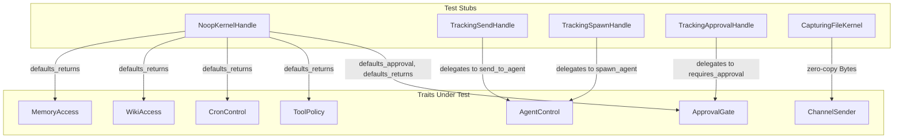

# Other — librefang-kernel-handle-tests

# librefang-kernel-handle — Integration Tests

## Purpose

This test suite validates the **default trait method implementations** provided by `librefang-kernel-handle`. The crate exposes a collection of traits (`AgentControl`, `MemoryAccess`, `TaskQueue`, `EventBus`, `KnowledgeGraph`, `ApprovalGate`, `ToolPolicy`, `ChannelSender`, etc.) that define the kernel's capability surface. Most traits ship default method bodies so that implementors only need to override what they actually support. These tests ensure those defaults are correct, stable, and semantically meaningful.

## Architecture

Every test file follows the same pattern: define a stub struct, implement only the **required** trait methods (often as no-ops or error-returning stubs), leave the default methods untouched, and then assert on the default behavior.

## Test Files

### `defaults_approval.rs`

Verifies default implementations in `ApprovalGate` and `ToolPolicy`.

| Test | What it asserts |
|---|---|
| `test_request_approval_default_auto_approves` | `request_approval()` returns `ApprovalDecision::Approved` without asking anyone |
| `test_is_tool_denied_with_context_default_false` | `is_tool_denied_with_context()` returns `false` regardless of sender/channel |
| `test_requires_approval_default_false` | `requires_approval()` returns `false` for any tool name |

**Key insight:** When a kernel doesn't override approval/tool-policy methods, the system operates in an **unrestricted** mode — all tools are allowed and no approval is required. This is the correct default for development and for kernels that don't need human-in-the-loop gating.

The stub (`NoopKernelHandle`) implements all required methods as errors. The defaults under test never call those required methods, so the errors are never triggered.

### `defaults_delegation.rs`

Ensures that **convenience methods with extra parameters** correctly delegate to the simpler base methods. Each test uses a tracking handle with an `AtomicBool` flag to prove the base method was actually called.

| Test | Default method under test | Delegates to |
|---|---|---|
| `test_send_to_agent_as_delegates_to_send_to_agent` | `send_to_agent_as(agent_id, msg, parent_id)` | `send_to_agent(agent_id, msg)` |
| `test_spawn_agent_checked_delegates_to_spawn_agent` | `spawn_agent_checked(toml, parent_id, &[])` | `spawn_agent(toml, parent_id)` |
| `test_requires_approval_with_context_delegates_to_requires_approval` | `requires_approval_with_context(tool, sender, channel)` | `requires_approval(tool)` |

**Key insight:** The `_with_context` and `_as` / `_checked` variants exist to give implementors richer call sites, but the default behavior is to **ignore the extra parameters** and forward to the base method. If you need context-aware approval logic, you must override `requires_approval_with_context` directly — overriding `requires_approval` alone won't be called.

### `defaults_returns.rs`

Validates the concrete return values of default implementations across multiple traits.

| Test | Default method | Expected return |
|---|---|---|
| `test_resolve_user_tool_decision_default_allow` | `resolve_user_tool_decision(tool, sender, channel)` | `UserToolGate::Allow` |
| `test_memory_acl_for_sender_default_none` | `memory_acl_for_sender(sender, channel)` | `None` |
| `test_cron_defaults_return_errors` | `cron_create`, `cron_list`, `cron_cancel` | `KernelOpError::Unavailable("Cron scheduler")` |
| `test_tool_timeout_defaults` | `tool_timeout_secs()`, `tool_timeout_secs_for(tool)` | `120` |
| `test_max_agent_call_depth_default` | `max_agent_call_depth()` | `5` |
| `test_workspace_prefix_defaults_empty` | `readonly_workspace_prefixes(agent)`, `named_workspace_prefixes(agent)` | empty `Vec` |
| `test_wiki_access_defaults_return_unavailable_with_method_name` | `wiki_get`, `wiki_search`, `wiki_write` | `KernelOpError::Unavailable("wiki_get")` etc. |

**Key design decisions captured by these tests:**

- **`KernelOpError::Unavailable`** carries a capability name string (e.g. `"Cron scheduler"`, `"wiki_get"`), not a human-readable sentence. This makes programmatic matching reliable (#3541).
- **Wiki defaults** are per-method (`"wiki_get"`, `"wiki_search"`, `"wiki_write"`) rather than a single `"wiki"` label. This lets callers and audit logs distinguish which wiki entry-point was hit (#3329).
- **Tool timeouts** default to 120 seconds globally and per-tool. Override either method to customize.

### `send_channel_file_data_zero_copy.rs`

Regression test for issue **#3553**. Validates that `ChannelSender::send_channel_file_data` uses `bytes::Bytes` instead of `Vec<u8>`, enabling **zero-copy buffer sharing** across retry wrappers, metering layers, and fan-out adapters.

| Test | What it asserts |
|---|---|
| `cloning_bytes_shares_underlying_allocation` | `Bytes::clone()` does not allocate a new buffer — the pointer address is identical across all clones |
| `send_channel_file_data_does_not_copy_buffer` | When the caller clones `Bytes` before passing it, the kernel's `CapturingFileKernel` receives the same allocation address |
| `vec_to_bytes_round_trip_is_zero_copy_for_unique_bytes` | `Vec<u8>` → `Bytes::from()` → `Vec::from()` preserves the original allocation address (O(1) when `Bytes` uniquely owns the data) |

The `CapturingFileKernel` stub records the `as_ptr()` address and length received by `send_channel_file_data`. The test compares these against the caller's original `Bytes` to confirm no intermediate copy occurred.

**Why this matters:** Channel adapters that retry on failure or broadcast to multiple recipients can `.clone()` the `Bytes` handle freely. Each clone is a refcount bump (~24 bytes), not a multi-megabyte memcpy. The 10 MiB payload size in `cloning_bytes_shares_underlying_allocation` reflects the real-world scenario that motivated #3553.

## Implementing a New Test Stub

If you add a new trait method with a default implementation, you need to update the existing stubs. Every stub must implement all **required** methods. The pattern is:

1. Create a struct (or reuse an existing one if the method is on a trait already covered).
2. Implement the trait's required methods — return errors, empty collections, or `Ok(default)`.
3. Add the trait impl block with empty braces for marker-style traits (`CronControl`, `A2ARegistry`, etc.).
4. Write the test calling the **default** method and asserting its return value.
5. For delegation tests, add an `AtomicBool` field to the struct and flip it inside the base method, then assert it was set.

### Required trait methods reference

Every stub in this suite implements the following required methods:

| Trait | Required methods |
|---|---|
| `AgentControl` | `spawn_agent`, `send_to_agent`, `list_agents`, `kill_agent`, `find_agents` |
| `MemoryAccess` | `memory_store`, `memory_recall`, `memory_list` |
| `WikiAccess` | none (all default) |
| `TaskQueue` | `task_post`, `task_claim`, `task_complete`, `task_list`, `task_delete`, `task_retry`, `task_get`, `task_update_status` |
| `EventBus` | `publish_event` |
| `KnowledgeGraph` | `knowledge_add_entity`, `knowledge_add_relation`, `knowledge_query` |
| `ChannelSender` | `send_channel_file_data` (required; tested explicitly in the zero-copy file) |

Traits with **no required methods** (marker-style, all defaults): `CronControl`, `ApprovalGate`, `HandsControl`, `A2ARegistry`, `PromptStore`, `WorkflowRunner`, `GoalControl`, `ToolPolicy`.