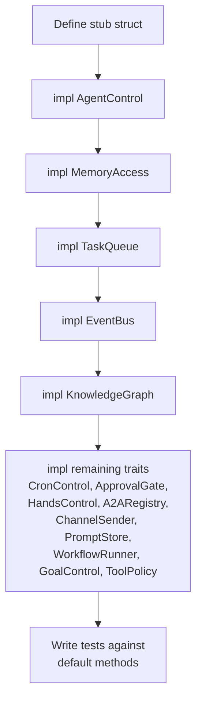

# Other — librefang-kernel-handle-tests

# librefang-kernel-handle Tests

## Purpose

This module contains integration tests for `librefang-kernel-handle`'s **default trait method implementations**. The kernel handle defines a large surface of traits (`AgentControl`, `MemoryAccess`, `TaskQueue`, `ChannelSender`, etc.) where many methods have default implementations. These tests verify that those defaults behave correctly — delegating to the right underlying methods, returning the expected sentinel values, and maintaining zero-copy guarantees where performance matters.

## Test Files

### `defaults_approval.rs` — Approval & Tool Policy Defaults

Validates that implementors who leave `ApprovalGate` and `ToolPolicy` at their defaults get permissive behavior:

| Test | Behavior Verified |
|------|-------------------|
| `test_request_approval_default_auto_approves` | `request_approval()` returns `ApprovalDecision::Approved` without prompting |
| `test_is_tool_denied_with_context_default_false` | `is_tool_denied_with_context()` returns `false` regardless of tool/sender/channel |
| `test_requires_approval_default_false` | `requires_approval()` returns `false` for any tool name |

The `NoopKernelHandle` stub implements every required method to return errors, proving the default methods on `ApprovalGate` and `ToolPolicy` never call into the underlying trait — they have fully self-contained default logic.

### `defaults_delegation.rs` — Delegation Patterns

Tests that convenience methods on traits correctly delegate to their underlying core methods. Each test uses an `AtomicBool` flag inside a tracking struct to prove the delegation actually occurs:

| Default Method | Delegates To | Tracking Struct |
|----------------|-------------|-----------------|
| `send_to_agent_as(agent, msg, parent)` | `send_to_agent(agent, msg)` | `TrackingSendHandle` |
| `spawn_agent_checked(toml, parent, allowed)` | `spawn_agent(toml, parent)` | `TrackingSpawnHandle` |
| `requires_approval_with_context(tool, sender, channel)` | `requires_approval(tool)` | `TrackingApprovalHandle` |

The `TrackingApprovalHandle` is notable because it overrides `requires_approval` from `ApprovalGate` (which is normally a default impl) to set its flag, while still using the default `requires_approval_with_context`. This confirms the default context-aware method calls into the simpler method.

### `defaults_returns.rs` — Default Return Values

Tests that default implementations return sensible sentinel values for operational configuration methods:

| Test | Default Value |
|------|--------------|
| `test_resolve_user_tool_decision_default_allow` | `UserToolGate::Allow` |
| `test_memory_acl_for_sender_default_none` | `None` (no ACL restrictions) |
| `test_cron_defaults_return_errors` | `KernelOpError::Unavailable("Cron scheduler")` for `cron_create`, `cron_list`, `cron_cancel` |
| `test_tool_timeout_defaults` | `120` seconds for both `tool_timeout_secs()` and `tool_timeout_secs_for(tool)` |
| `test_max_agent_call_depth_default` | `5` |
| `test_workspace_prefix_defaults_empty` | Empty vec for `readonly_workspace_prefixes` and `named_workspace_prefixes` |

The cron test (`#3541`) specifically validates that the error is a typed `KernelOpError::Unavailable` variant rather than a generic string, allowing callers to match on the variant directly while still producing `"Cron scheduler not available"` in `Display` output.

### `send_channel_file_data_zero_copy.rs` — Zero-Copy Regression (Issue #3553)

A regression test ensuring that `ChannelSender::send_channel_file_data` accepts `bytes::Bytes` and that cloning the buffer is a refcount bump, not a heap allocation. This matters because channel adapters (retry logic, metering, fan-out) clone the buffer at call boundaries.

Three tests:

1. **`cloning_bytes_shares_underlying_allocation`** — Constructs a 10 MiB `Bytes`, clones it three times, asserts all four values share the same pointer address.

2. **`send_channel_file_data_does_not_copy_buffer`** — The `CapturingFileKernel` stub records the pointer address and length inside `send_channel_file_data`. The test clones `Bytes` at the call site (simulating a wrapper layer) and asserts the kernel sees the same allocation.

3. **`vec_to_bytes_round_trip_is_zero_copy_for_unique_bytes`** — Validates that `Vec::from(Bytes)` is O(1) when the `Bytes` uniquely owns its allocation, pinning the `bytes` 1.x vtable `into_vec` behavior.

## Test Architecture

Every test file follows the same pattern to create a valid kernel handle stub:

The required traits (`AgentControl`, `MemoryAccess`, `TaskQueue`, `EventBus`, `KnowledgeGraph`) demand method bodies. The marker/default-only traits (`CronControl`, `ApprovalGate`, `HandsControl`, `A2ARegistry`, `ChannelSender`, `PromptStore`, `WorkflowRunner`, `GoalControl`, `ToolPolicy`) use empty `impl` blocks in most tests, relying entirely on default methods.

## Conventions for Adding Tests

When adding a new default method to a kernel handle trait, add a corresponding test here:

1. **Find or create** a `NoopKernelHandle` (or tracking variant) in the appropriate test file.
2. **Import** the new return type from `librefang_types` if needed.
3. **Assert** the default return value or delegation behavior.
4. For delegation tests, use `AtomicBool` flags (with `Ordering::SeqCst`) to prove the underlying method is called — do not rely on side-effect observation.