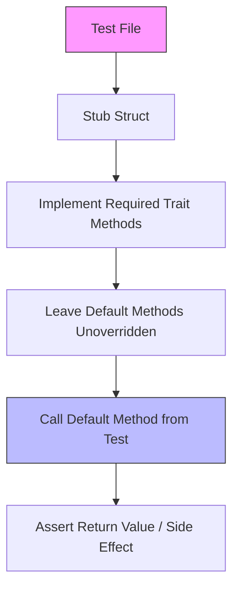

# Other — librefang-kernel-handle-tests

# librefang-kernel-handle/tests

Integration tests for the `librefang-kernel-handle` crate's default trait implementations and delegation contracts.

## Purpose

The `librefang-kernel-handle` crate defines a set of traits that abstract kernel operations (agent lifecycle, memory, task queues, events, knowledge graph, cron, wiki, channel I/O, etc.). Many of these traits provide **default method implementations** so that concrete kernel adapters only need to override the methods they actually support.

This test module locks down those defaults with three goals:

1. **Pin return values** — default methods must return documented sentinel values (`Allow`, `false`, `120`, empty collections, `Unavailable` errors).
2. **Verify delegation** — composite methods like `send_to_agent_as` must delegate to their simpler counterpart (`send_to_agent`), not bypass it.
3. **Assert zero-copy contracts** — the `Bytes`-based `send_channel_file_data` path must never silently clone the underlying buffer.

## File Overview

```
tests/
├── defaults_approval.rs              # ApprovalGate & ToolPolicy default returns
├── defaults_delegation.rs            # Delegation: _as → base, _checked → base, _with_context → base
├── defaults_returns.rs               # Scalar & collection defaults, Unavailable error variants
└── send_channel_file_data_zero_copy.rs  # Regression: Bytes zero-copy contract (#3553)
```

## Test Architecture

Every test file follows the same pattern: define a stub struct, implement all kernel traits (required methods return stub values or errors), then call the **default** method under test. This is only possible because the traits are object-safe and the default methods are callable on any implementor.



### Required Trait Implementations

Each stub must implement every trait in the kernel surface area, even if the test only targets one. The traits and their required methods are:

| Trait | Required Methods | Default Methods Tested |
|---|---|---|
| `AgentControl` | `spawn_agent`, `send_to_agent`, `list_agents`, `kill_agent`, `find_agents` | `send_to_agent_as`, `spawn_agent_checked` |
| `MemoryAccess` | `memory_store`, `memory_recall`, `memory_list` | `memory_acl_for_sender` |
| `WikiAccess` | *(none required)* | `wiki_get`, `wiki_search`, `wiki_write` |
| `TaskQueue` | `task_post`, `task_claim`, `task_complete`, `task_list`, `task_delete`, `task_retry`, `task_get`, `task_update_status` | *(none)* |
| `EventBus` | `publish_event` | *(none)* |
| `KnowledgeGraph` | `knowledge_add_entity`, `knowledge_add_relation`, `knowledge_query` | *(none)* |
| `CronControl` | *(none required)* | `cron_create`, `cron_list`, `cron_cancel` |
| `ApprovalGate` | *(none required)* | `request_approval`, `requires_approval`, `requires_approval_with_context` |
| `ToolPolicy` | *(none required)* | `is_tool_denied_with_context`, `resolve_user_tool_decision`, `tool_timeout_secs`, `tool_timeout_secs_for`, `max_agent_call_depth`, `readonly_workspace_prefixes`, `named_workspace_prefixes` |
| `ChannelSender` | *(none required — but tested via override)* | `send_channel_file_data` |
| `HandsControl`, `A2ARegistry`, `PromptStore`, `WorkflowRunner`, `GoalControl` | *(none required)* | *(none — marker-like)* |

## Test Details

### defaults_approval.rs

Tests that the default `ApprovalGate` and `ToolPolicy` implementations provide permissive, pass-through behavior:

- **`test_request_approval_default_auto_approves`** — `request_approval` returns `ApprovalDecision::Approved` unconditionally, regardless of the agent ID, tool name, summary, or context.
- **`test_is_tool_denied_with_context_default_false`** — `is_tool_denied_with_context` returns `false` for any tool/sender/channel combination.
- **`test_requires_approval_default_false`** — `requires_approval` returns `false` for any tool name.

Uses a fully no-op `NoopKernelHandle` where every required method returns `"not implemented"` errors (unreachable in these tests).

### defaults_delegation.rs

Verifies that default composite methods delegate to their simpler counterparts using `AtomicBool` flags. Three separate stub structs isolate each delegation:

#### `TrackingSendHandle` → `send_to_agent_as`

```
send_to_agent_as("agent1", "msg", "parent1")
  → calls send_to_agent("agent1", "<prefixed msg>")
```

The test confirms `send_to_agent` was invoked (`send_called` flag) and the result propagates unchanged.

#### `TrackingSpawnHandle` → `spawn_agent_checked`

```
spawn_agent_checked("toml", None, &[])
  → calls spawn_agent("toml", None)
```

The empty `&[]` forbidden-tools list means no filtering occurs; the raw `(id, name)` tuple passes through.

#### `TrackingApprovalHandle` → `requires_approval_with_context`

```
requires_approval_with_context("tool", Some("sender"), Some("channel"))
  → calls requires_approval("tool")
```

Only the `ApprovalGate` trait has a custom `requires_approval` override (sets `approval_checked`, returns `true`). All other traits remain no-op.

### defaults_returns.rs

Pins the scalar and collection defaults, plus the `Unavailable` error variant pattern:

| Test | Method | Expected Default |
|---|---|---|
| `test_resolve_user_tool_decision_default_allow` | `resolve_user_tool_decision` | `UserToolGate::Allow` |
| `test_memory_acl_for_sender_default_none` | `memory_acl_for_sender` | `None` |
| `test_cron_defaults_return_errors` | `cron_create`, `cron_list`, `cron_cancel` | `Err(KernelOpError::Unavailable("Cron scheduler"))` |
| `test_tool_timeout_defaults` | `tool_timeout_secs`, `tool_timeout_secs_for` | `120` |
| `test_max_agent_call_depth_default` | `max_agent_call_depth` | `5` |
| `test_workspace_prefix_defaults_empty` | `readonly_workspace_prefixes`, `named_workspace_prefixes` | empty `Vec` |
| `test_wiki_access_defaults_return_unavailable_with_method_name` | `wiki_get`, `wiki_search`, `wiki_write` | `Err(KernelOpError::Unavailable("wiki_get"))` etc. |

The `Unavailable` variant tests (#3541, #3329) are notable: they match on the **variant and capability string** rather than substring-matching the error message. This lets callers discriminate programmatically in `match` arms while the `Display` impl still produces human-readable logs.

### send_channel_file_data_zero_copy.rs

Regression test for **issue #3553**. When `send_channel_file_data` was changed from `Vec<u8>` to `bytes::Bytes`, the motivation was zero-cost cloning for wrapping layers (retry, metering, fan-out). This test locks that property down.

Uses `CapturingFileKernel` which implements `ChannelSender` by recording the pointer address and length of the received `Bytes`:

- **`cloning_bytes_shares_underlying_allocation`** — pure `bytes` crate test: three successive clones of a 10 MiB `Bytes` all share the same pointer address. No allocation occurs on clone.
- **`send_channel_file_data_does_not_copy_buffer`** — calls the trait method with `original.clone()`, then asserts the kernel observed the same pointer. Simulates the real-world pattern where a wrapper clones before forwarding.
- **`vec_to_bytes_round_trip_is_zero_copy_for_unique_bytes`** — verifies `Vec::from(Bytes)` is O(1) when the `Bytes` uniquely owns its allocation (the `into_vec` vtable path in bytes 1.x).

## Adding New Tests

When adding a default method to any kernel trait:

1. **Add a return-value test** in `defaults_returns.rs` (or the appropriate file) using `NoopKernelHandle`.
2. **If the method delegates**, add a delegation test with a tracking struct using `AtomicBool` flags, following the pattern in `defaults_delegation.rs`.
3. **If the method involves data-transfer semantics** (buffers, slices), consider a zero-copy assertion in a dedicated file, similar to `send_channel_file_data_zero_copy.rs`.
4. **Update the stub** in every test file to satisfy the new required method (if any), keeping the stub implementations consistent across files.