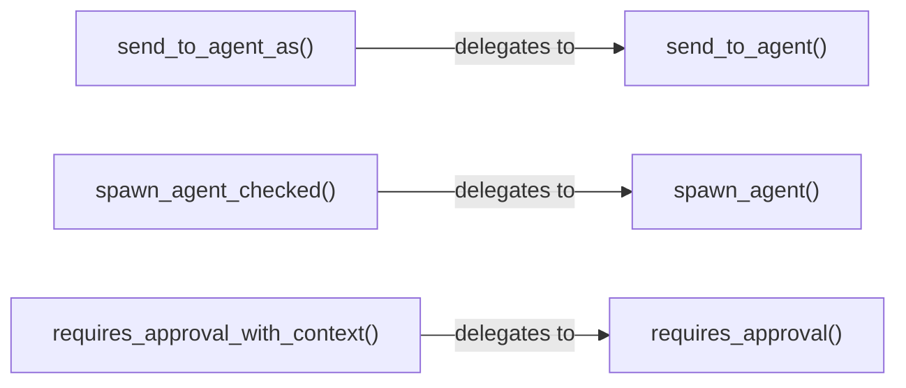

# Other — librefang-kernel-handle-tests

# librefang-kernel-handle Tests

Integration tests that verify the **default method implementations** on the `KernelHandle` trait. The `KernelHandle` trait provides default behaviors for convenience methods, approval flows, ACLs, cron scheduling, and configuration — these tests ensure those defaults remain stable and correct.

## Test Organization

Three test files, each covering a distinct category of default behavior:

| File | Focus |
|---|---|
| `defaults_approval.rs` | Approval gating defaults (auto-approve, no denials) |
| `defaults_delegation.rs` | Delegation from convenience methods to core trait methods |
| `defaults_returns.rs` | Default return values for ACL, cron, timeout, workspace config |

## Testing Strategy

All three files share the same approach: implement `KernelHandle` with minimal stubs for the **required** methods, then call the **provided (default)** methods and assert their behavior. This proves the trait's default implementations work independently of any real kernel backend.

A typical stub struct (e.g., `NoopKernelHandle`) returns `Err("not implemented")` or empty collections for every required method, since the tests never invoke those paths directly.

## Approval Defaults (`defaults_approval.rs`)

Uses `NoopKernelHandle` to verify that when no approval policy is configured, the system is permissive:

| Test | Method | Expected Default |
|---|---|---|
| `test_request_approval_default_auto_approves` | `request_approval(agent_id, tool, summary, None)` | `Ok(ApprovalDecision::Approved)` |
| `test_is_tool_denied_with_context_default_false` | `is_tool_denied_with_context(tool, sender, channel)` | `false` |
| `test_requires_approval_default_false` | `requires_approval(tool)` | `false` |

These defaults mean that a bare `KernelHandle` implementation without overridden approval methods will allow all tool usage without human-in-the-loop gating.

## Delegation Defaults (`defaults_delegation.rs`)

Verifies that convenience methods on the trait delegate to the correct core methods. Each test uses an `AtomicBool` flag inside the stub struct to confirm the underlying method was actually called.

| Test | Stub Struct | Delegation Verified |
|---|---|---|
| `test_send_to_agent_as_delegates_to_send_to_agent` | `TrackingSendHandle` | `send_to_agent_as` → `send_to_agent` |
| `test_spawn_agent_checked_delegates_to_spawn_agent` | `TrackingSpawnHandle` | `spawn_agent_checked` → `spawn_agent` |
| `test_requires_approval_with_context_delegates_to_requires_approval` | `TrackingApprovalHandle` | `requires_approval_with_context` → `requires_approval` |

The delegation pattern is important: implementors only need to override the core method (`send_to_agent`, `spawn_agent`, `requires_approval`), and the context-aware variant (`send_to_agent_as`, `spawn_agent_checked`, `requires_approval_with_context`) automatically picks up the behavior. This keeps the trait implementation surface small.

## Return Value Defaults (`defaults_returns.rs`)

Tests the remaining default implementations using `NoopKernelHandle`:

### User Policy and ACL

| Test | Method | Expected Default |
|---|---|---|
| `test_resolve_user_tool_decision_default_allow` | `resolve_user_tool_decision(tool, sender, channel)` | `UserToolGate::Allow` |
| `test_memory_acl_for_sender_default_none` | `memory_acl_for_sender(sender, channel)` | `None` |

### Cron Scheduling

`test_cron_defaults_return_errors` confirms all three cron methods return an error containing `"Cron scheduler not available"`:

- `cron_create(agent, config)` → `Err`
- `cron_list(agent)` → `Err`
- `cron_cancel(job_id)` → `Err`

This ensures that implementors who don't override cron methods get a clear, descriptive error rather than a panic or silent failure.

### Configuration Constants

| Test | Method | Expected Default |
|---|---|---|
| `test_tool_timeout_defaults` | `tool_timeout_secs()` / `tool_timeout_secs_for(tool)` | `120` seconds |
| `test_max_agent_call_depth_default` | `max_agent_call_depth()` | `5` |
| `test_workspace_prefix_defaults_empty` | `readonly_workspace_prefixes(agent)` / `named_workspace_prefixes(agent)` | Empty `Vec` |

## Relationship to `KernelHandle`

These tests live in the `librefang-kernel-handle` crate's test directory because they exercise the **trait's default method bodies** — not any particular concrete implementation. The Rust trait system allows default method definitions that call other (required) trait methods. This test suite locks in the contract for those defaults.

When adding a new default method to `KernelHandle`, add a corresponding test here following the existing pattern:

1. Either reuse `NoopKernelHandle` (if the test only checks a return value) or create a new tracking struct with `AtomicBool` flags (if the test verifies delegation).
2. Implement all required `KernelHandle` methods with stubs.
3. Assert the default method's behavior.