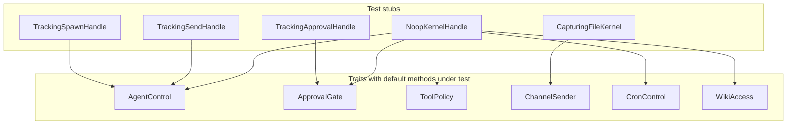

# Other — librefang-kernel-handle-tests

# librefang-kernel-handle — Test Suite

## Purpose

The test suite for `librefang-kernel-handle` validates the **default trait method** behavior and **zero-copy semantics** of the kernel handle abstraction layer. The kernel handle is the primary interface through which agents interact with the platform kernel — it defines traits for agent lifecycle, memory, tasks, events, knowledge graphs, cron scheduling, approvals, channels, and more.

Because the crate exposes many traits with default implementations, the tests serve a critical role: they pin the contract that implementors can rely on when they don't override a particular method.

## Test Files

| File | Focus |
|---|---|
| `defaults_approval.rs` | Default approval and tool-policy decisions |
| `defaults_delegation.rs` | Delegation chains between convenience methods and their base implementations |
| `defaults_returns.rs` | Default return values for cron, wiki, tool timeouts, ACLs, and workspace prefixes |
| `send_channel_file_data_zero_copy.rs` | Zero-copy guarantee for `Bytes` payloads through `ChannelSender` |

## Architecture

The tests use **stub implementors** — minimal structs that implement only the required trait methods, leaving default methods untouched. This isolates the default method logic from any real kernel behavior.


```mermaid
graph TD
    subgraph "Traits with default methods under test"
        AG[AgentControl]
        AP[ApprovalGate]
        TP[ToolPolicy]
        CS[ChannelSender]
        CR[CronControl]
        WA[WikiAccess]
    end

    subgraph "Test stubs"
        N1[NoopKernelHandle]
        TS[TrackingSendHandle]
        TSP[TrackingSpawnHandle]
        TA[TrackingApprovalHandle]
        CF[CapturingFileKernel]
    end

    N1 --> AG
    N1 --> AP
    N1 --> TP
    N1 --> CR
    N1 --> WA
    TS --> AG
    TSP --> AG
    TA --> AP
    CF --> CS
```

## Default Behavior Contracts

### ApprovalGate Defaults (`defaults_approval.rs`)

When an implementor does not override the approval methods, the defaults provide a **permissive** baseline:

| Method | Default Behavior |
|---|---|
| `request_approval(agent_id, tool_name, summary, None)` | Returns `ApprovalDecision::Approved` |
| `is_tool_denied_with_context(tool, sender, channel)` | Returns `false` — nothing is denied |
| `requires_approval(tool_name)` | Returns `false` — no tool requires approval |

These defaults mean that a bare-bones kernel handle operates in an **unrestricted mode**. Any real deployment must override these methods to enforce policy.

### Delegation Chains (`defaults_delegation.rs`)

Several convenience methods are defined as default trait methods that delegate to a single underlying method. The tests verify these chains using **tracking stubs** with `AtomicBool` flags:

#### `send_to_agent_as` → `send_to_agent`

`send_to_agent_as(agent_id, message, parent_id)` delegates directly to `send_to_agent(agent_id, message)`, discarding the `parent_id` context. Verified by `TrackingSendHandle` which sets `send_called` when `send_to_agent` is invoked.

#### `spawn_agent_checked` → `spawn_agent`

`spawn_agent_checked(manifest_toml, parent_id, &[])` delegates directly to `spawn_agent(manifest_toml, parent_id)`. The allowed-tools slice is consumed by the default implementation but not enforced. Verified by `TrackingSpawnHandle`.

#### `requires_approval_with_context` → `requires_approval`

`requires_approval_with_context(tool, sender, channel)` delegates to `requires_approval(tool)`, discarding sender and channel context. Verified by `TrackingApprovalHandle` which overrides only `requires_approval` and checks the `approval_checked` flag.

#### Extended delegation: `_with_key` variants

Two additional convenience methods form longer chains:

- `send_to_agent_with_key(agent_id, msg, key)` → `send_to_agent(agent_id, msg)`
- `send_to_agent_as_with_key(agent_id, msg, parent, key)` → `send_to_agent_as(agent_id, msg, parent)` → `send_to_agent(agent_id, msg)`

The `key` parameter is consumed at the default level but not forwarded. These exist so implementors can add key-based routing in a single override point.

### Return Value Defaults (`defaults_returns.rs`)

#### ToolPolicy defaults

| Method | Default |
|---|---|
| `resolve_user_tool_decision(tool, sender, channel)` | `UserToolGate::Allow` |
| `tool_timeout_secs()` | `120` |
| `tool_timeout_secs_for(tool)` | `120` |
| `max_agent_call_depth()` | `5` |
| `readonly_workspace_prefixes(agent)` | empty `Vec` |
| `named_workspace_prefixes(agent)` | empty `Vec` |
| `memory_acl_for_sender(sender, channel)` | `None` |

#### CronControl defaults

All three cron methods return `KernelOpError::Unavailable("Cron scheduler")`:

- `cron_create(agent, config)`
- `cron_list(agent)`
- `cron_cancel(job_id)`

This is a **typed error** variant rather than a string match, allowing callers to pattern-match directly:

```rust
match handle.cron_create("agent", json!({})).await {
    Err(KernelOpError::Unavailable(c)) if c == "Cron scheduler" => { /* handle */ }
    _ => { /* ... */ }
}
```

#### WikiAccess defaults

Each wiki method returns `KernelOpError::Unavailable` with a **method-specific** capability name:

| Method | Error variant |
|---|---|
| `wiki_get(key)` | `Unavailable("wiki_get")` |
| `wiki_search(query, limit)` | `Unavailable("wiki_search")` |
| `wiki_write(path, body, meta, overwrite)` | `Unavailable("wiki_write")` |

The per-method capability name lets callers and audit logs distinguish which wiki entry point was invoked while the wiki vault was disabled.

## Zero-Copy File Transfer (`send_channel_file_data_zero_copy.rs`)

This test guards issue **#3553**: `ChannelSender::send_channel_file_data` takes `bytes::Bytes` instead of `Vec<u8>`.

### Why this matters

Channel adapters (retry wrappers, metering, fan-out) clone the buffer before passing it down the stack. With `Vec<u8>`, each clone is a full heap allocation. With `Bytes`, cloning is a reference-count bump — the underlying allocation is shared.

### What the tests verify

**`cloning_bytes_shares_underlying_allocation`** — Creates a 10 MiB payload, clones it three times, and asserts all clones share the same pointer address.

**`send_channel_file_data_does_not_copy_buffer`** — Uses `CapturingFileKernel` which records the pointer address and length of the `Bytes` it receives. The test clones `Bytes` at the call site (simulating a wrapper layer) and asserts the kernel sees the same allocation.

**`vec_to_bytes_round_trip_is_zero_copy_for_unique_bytes`** — Verifies `Bytes::from(Vec)` and `Vec::from(Bytes)` are both O(1) pointer transfers when the `Bytes` uniquely owns its allocation. This pins the contract so a future `bytes` crate upgrade that changes the vtable behavior is caught.

### CapturingFileKernel internals

The stub stores `data.as_ptr() as usize` in a `Mutex<Option<usize>>` rather than a raw pointer, keeping the struct auto-`Send + Sync` without unsafe impls. It only compares addresses — never dereferences them.

## Test Stub Pattern

Every test file follows the same pattern for creating stubs:

1. Define a struct with optional tracking fields (`AtomicBool`, `Mutex<Option<usize>>`)
2. Implement the required methods of each trait — either returning `Err("not implemented".into())` (no-op stubs) or updating tracking state (tracking stubs)
3. Leave all other traits as empty `impl` blocks to accept their defaults
4. Test the default method by calling it on the stub and asserting the expected result

The full list of traits that must be implemented for a complete stub:

`AgentControl`, `MemoryAccess`, `WikiAccess`, `TaskQueue`, `EventBus`, `KnowledgeGraph`, `CronControl`, `ApprovalGate`, `HandsControl`, `A2ARegistry`, `ChannelSender`, `PromptStore`, `WorkflowRunner`, `GoalControl`, `ToolPolicy`

## Adding New Default Method Tests

When adding a new default method to any trait in `librefang-kernel-handle`:

1. If the default returns a fixed value, add a test to `defaults_returns.rs` using `NoopKernelHandle`
2. If the default delegates to another method, add a tracking stub and test to `defaults_delegation.rs`
3. If the default relates to approval/tool policy, add a test to `defaults_approval.rs`
4. Use `KernelOpError::Unavailable(capability_name)` for any new "not supported" defaults, and test the variant match — not the display string