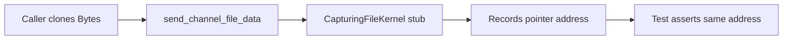

# Other — librefang-kernel-handle-tests

# librefang-kernel-handle — Integration Tests

## Purpose

This test suite validates the **default method implementations** provided by the kernel-handle traits in `librefang-kernel-handle`. The crate defines a large trait surface (agent control, memory, tasks, events, knowledge graph, wiki, cron, channels, etc.) where many methods have default implementations. These defaults either return sentinel values, delegate to a simpler base method, or signal unavailability. The tests ensure those contract promises hold and that implementors who only override the base methods still get correct behavior from the derived ones.

## Test File Organization

```
tests/
├── defaults_approval.rs           # ApprovalGate, ToolPolicy default behaviors
├── defaults_delegation.rs         # Delegation chains (X_with_context → X)
├── defaults_returns.rs            # Sentinel return values for optional traits
└── send_channel_file_data_zero_copy.rs  # Regression: Bytes zero-copy (#3553)
```

## Test Infrastructure Pattern

Every test file follows the same structural pattern: a **stub struct** implementing all kernel traits. This is necessary because the traits are not object-safe in isolation — a single type must satisfy the full surface. Two flavors of stubs are used:

| Stub Type | When Used | Behavior |
|---|---|---|
| **Noop** (all methods return errors) | Testing default return values where the underlying method is never called | `Err("noop".into())` or `Err("not implemented".into())` |
| **Tracking** (methods set `AtomicBool` flags) | Testing that a default method delegates to its base method | Sets a flag and returns `Ok(...)` |

For example, `TrackingSendHandle` wraps `send_to_agent` to flip `send_called: AtomicBool`, letting tests assert that `send_to_agent_as` (a default method) actually invokes the base.

## Test Coverage by File

### `defaults_approval.rs`

Verifies that traits with no-op blanket impls return safe defaults:

| Test | Trait Method | Expected Default |
|---|---|---|
| `test_request_approval_default_auto_approves` | `ApprovalGate::request_approval` | `ApprovalDecision::Approved` |
| `test_is_tool_denied_with_context_default_false` | `ToolPolicy::is_tool_denied_with_context` | `false` |
| `test_requires_approval_default_false` | `ApprovalGate::requires_approval` | `false` |

**Key insight:** When a kernel backend doesn't implement `ApprovalGate` or `ToolPolicy`, tools are allowed through without gating. This is the "open by default" policy — production kernels override these.

### `defaults_delegation.rs`

Validates the delegation chain — default methods that are convenience wrappers around a simpler required method:

```
send_to_agent_as_with_key
  └─► send_to_agent_as
        └─► send_to_agent           ← base method (required)

spawn_agent_checked
  └─► spawn_agent                   ← base method (required)

requires_approval_with_context
  └─► requires_approval             ← base method (required)

send_to_agent_with_key
  └─► send_to_agent                 ← base method (required)
```

Each test uses a tracking stub to confirm the base method is actually invoked:

- **`test_send_to_agent_as_delegates_to_send_to_agent`** — `send_to_agent_as("agent1", "msg", "parent1")` calls `send_to_agent`.
- **`test_spawn_agent_checked_delegates_to_spawn_agent`** — `spawn_agent_checked("toml", None, &[])` calls `spawn_agent`.
- **`test_requires_approval_with_context_delegates_to_requires_approval`** — `requires_approval_with_context("tool", ...)` calls `requires_approval`.
- **`test_send_to_agent_with_key_delegates_to_send_to_agent`** — `send_to_agent_with_key(...)` calls `send_to_agent`.
- **`test_send_to_agent_as_with_key_delegates_to_send_to_agent_as`** — double-delegation through `send_to_agent_as` down to `send_to_agent`.

### `defaults_returns.rs`

Tests that optional trait methods return sensible sentinel values when not overridden:

| Test | Method | Expected Default |
|---|---|---|
| `test_resolve_user_tool_decision_default_allow` | `ToolPolicy::resolve_user_tool_decision` | `UserToolGate::Allow` |
| `test_memory_acl_for_sender_default_none` | `ToolPolicy::memory_acl_for_sender` | `None` |
| `test_cron_defaults_return_errors` | `CronControl::cron_create/list/cancel` | `KernelOpError::Unavailable("Cron scheduler")` |
| `test_tool_timeout_defaults` | `ToolPolicy::tool_timeout_secs` / `tool_timeout_secs_for` | `120` |
| `test_max_agent_call_depth_default` | `ToolPolicy::max_agent_call_depth` | `5` |
| `test_workspace_prefix_defaults_empty` | `readonly_workspace_prefixes` / `named_workspace_prefixes` | empty vec |
| `test_wiki_access_defaults_return_unavailable_with_method_name` | `WikiAccess::wiki_get/search/write` | `KernelOpError::Unavailable("wiki_get")` etc. |

**Design note (#3541, #3329):** Error returns use the structured `KernelOpError::Unavailable(capability_name)` variant rather than string matching, so callers can match programmatically. The Display impl still produces human-readable messages for logs.

### `send_channel_file_data_zero_copy.rs`

Regression test for **issue #3553**. The `ChannelSender::send_channel_file_data` signature was changed from `Vec<u8>` to `bytes::Bytes` to allow zero-copy cloning in wrapping layers (retry, metering, fan-out).

Three tests:

1. **`cloning_bytes_shares_underlying_allocation`** — Pure `bytes` crate property: cloning a `Bytes` from `Vec<u8>` shares the same allocation address across all clones.
2. **`send_channel_file_data_does_not_copy_buffer`** — End-to-end: calls the trait method with `original.clone()`, and the `CapturingFileKernel` stub records the pointer. Asserts the kernel sees the same allocation as the caller.
3. **`vec_to_bytes_round_trip_is_zero_copy_for_unique_bytes`** — `Vec::from(Bytes)` is O(1) when the `Bytes` uniquely owns its allocation. Pins this `bytes` 1.x vtable behavior.


```mermaid
flowchart LR
    A[Caller clones Bytes] --> B[send_channel_file_data]
    B --> C[CapturingFileKernel stub]
    C --> D[Records pointer address]
    D --> E[Test asserts same address]
```

## How to Add a New Default-Method Test

1. Decide which existing stub fits. If testing a return value, use the `Noop` pattern (all methods error). If testing delegation, create a `Tracking*Handle` with an `AtomicBool` on the base method.
2. Implement all required trait methods. The stub must implement every trait — `AgentControl`, `MemoryAccess`, `WikiAccess`, `TaskQueue`, `EventBus`, `KnowledgeGraph`, `CronControl`, `ApprovalGate`, `HandsControl`, `A2ARegistry`, `ChannelSender`, `PromptStore`, `WorkflowRunner`, `GoalControl`, and `ToolPolicy`.
3. For marker-style traits with no required methods (`CronControl`, `HandsControl`, `A2ARegistry`, etc.), use empty impls: `impl CronControl for MyStub {}`.
4. Write the test targeting the specific default method.
5. If the test is about a return value, place it in `defaults_returns.rs`. If it's about delegation, place it in `defaults_delegation.rs`. If it's about approval/policy gating, place it in `defaults_approval.rs`.

## Relationship to the Parent Crate

These tests live in `librefang-kernel-handle/tests/` (integration tests) rather than inside the crate's `src/` because they exercise the trait defaults through an external implementor. The default methods are defined in `librefang-kernel-handle`'s trait definitions; the tests confirm that the contract those defaults promise (delegation, sentinels, zero-copy) actually holds when consumed from outside the crate.