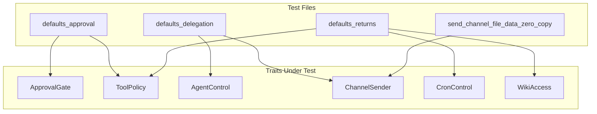

# Other — librefang-kernel-handle-tests

# librefang-kernel-handle Tests

## Purpose

This is the integration test suite for the `librefang-kernel-handle` crate. It validates the **default method implementations** provided by the kernel handle traits — ensuring that delegating methods, fallback return values, and error behaviors are correct and remain stable across refactors.

The tests do not test a real kernel. Instead, they build minimal stub implementors of each trait and assert the behavior of the **provided (default) method bodies** that ship inside the trait definitions.

## Architecture

```mermaid
graph TD
    subgraph "Test Files"
        DA[defaults_approval]
        DD[defaults_delegation]
        DR[defaults_returns]
        ZC[send_channel_file_data_zero_copy]
    end

    subgraph "Traits Under Test"
        AG[ApprovalGate]
        TP[ToolPolicy]
        AC[AgentControl]
        CS[ChannelSender]
        CC[CronControl]
        WA[WikiAccess]
    end

    DA --> AG
    DA --> TP
    DD --> AC
    DD --> CS
    DR --> TP
    DR --> CC
    DR --> WA
    ZC --> CS
```

## Test Files

### `defaults_approval.rs`

Validates default implementations for approval and tool-policy gates when a kernel does **not** override them.

| Test | Trait | Asserted Default |
|------|-------|-----------------|
| `test_request_approval_default_auto_approves` | `ApprovalGate` | `request_approval()` returns `ApprovalDecision::Approved` |
| `test_is_tool_denied_with_context_default_false` | `ToolPolicy` | `is_tool_denied_with_context()` returns `false` |
| `test_requires_approval_default_false` | `ApprovalGate` | `requires_approval()` returns `false` |

Uses a single `NoopKernelHandle` stub where every required method returns `Err("not implemented")`.

### `defaults_delegation.rs`

Proves that convenience methods delegate to their primitive counterparts. Each test uses an `AtomicBool` inside the stub to detect whether the base method was actually called.

| Test | Caller → Callee | Mechanism |
|------|-----------------|-----------|
| `test_send_to_agent_as_delegates_to_send_to_agent` | `send_to_agent_as` → `send_to_agent` | `TrackingSendHandle.send_called` |
| `test_spawn_agent_checked_delegates_to_spawn_agent` | `spawn_agent_checked` → `spawn_agent` | `TrackingSpawnHandle.spawn_called` |
| `test_requires_approval_with_context_delegates_to_requires_approval` | `requires_approval_with_context` → `requires_approval` | `TrackingApprovalHandle.approval_checked` |
| `test_send_to_agent_with_key_delegates_to_send_to_agent` | `send_to_agent_with_key` → `send_to_agent` | `TrackingSendHandle.send_called` |
| `test_send_to_agent_as_with_key_delegates_to_send_to_agent_as` | `send_to_agent_as_with_key` → `send_to_agent_as` → `send_to_agent` | `TrackingSendHandle.send_called` |

The key insight: `send_to_agent_as_with_key` chains through `send_to_agent_as`, which itself falls through to `send_to_agent`. The test confirms the full delegation chain reaches the base method.

### `defaults_returns.rs`

Validates default return values for traits that provide sensible fallbacks. Uses `NoopKernelHandle` where all required methods error.

| Test | Trait Method | Expected Return |
|------|-------------|-----------------|
| `test_resolve_user_tool_decision_default_allow` | `ToolPolicy::resolve_user_tool_decision` | `UserToolGate::Allow` |
| `test_memory_acl_for_sender_default_none` | `MemoryAccess::memory_acl_for_sender` | `None` |
| `test_cron_defaults_return_errors` | `CronControl::cron_create`, `cron_list`, `cron_cancel` | `KernelOpError::Unavailable("Cron scheduler")` |
| `test_tool_timeout_defaults` | `ToolPolicy::tool_timeout_secs`, `tool_timeout_secs_for` | `120` |
| `test_max_agent_call_depth_default` | `ToolPolicy::max_agent_call_depth` | `5` |
| `test_workspace_prefix_defaults_empty` | `ToolPolicy::readonly_workspace_prefixes`, `named_workspace_prefixes` | empty `Vec` |
| `test_wiki_access_defaults_return_unavailable_with_method_name` | `WikiAccess::wiki_get`, `wiki_search`, `wiki_write` | `KernelOpError::Unavailable("wiki_get")` etc. |

The cron and wiki tests specifically match on the `KernelOpError::Unavailable` variant with its capability name, ensuring callers can programmatically distinguish *which* capability is missing rather than string-matching error messages.

### `send_channel_file_data_zero_copy.rs`

Regression test for issue #3553. Validates that `ChannelSender::send_channel_file_data` accepts `bytes::Bytes` without copying the underlying buffer.

Three tests:

1. **`cloning_bytes_shares_underlying_allocation`** — Confirms that `Bytes::clone()` is a reference-count bump, not a deep copy. Clones a 10 MiB payload and asserts all clones share the same pointer address.

2. **`send_channel_file_data_does_not_copy_buffer`** — Uses `CapturingFileKernel` which records the pointer address and length of received `Bytes`. The test clones `Bytes` at the call site (simulating retry/metering wrappers) and asserts the kernel received the same allocation.

3. **`vec_to_bytes_round_trip_is_zero_copy_for_unique_bytes`** — Pins the `Vec<u8> → Bytes → Vec<u8>` round-trip as O(1) when `Bytes` uniquely owns its allocation, so future `bytes` crate changes are caught.

## Stub Implementor Pattern

Every test file builds one or more stub structs that implement all kernel handle traits. The pattern is:

- **Required methods**: Return `Err("not implemented")` or `Ok(default)` depending on whether the test needs them to succeed.
- **Marker traits** (`CronControl`, `HandsControl`, `A2ARegistry`, `PromptStore`, `WorkflowRunner`, `GoalControl`, `ToolPolicy`): Empty `impl` blocks relying entirely on default method bodies.
- **Tracking variants**: Some stubs (`TrackingSendHandle`, `TrackingSpawnHandle`, `TrackingApprovalHandle`) embed `AtomicBool` fields to detect whether a specific base method was invoked, proving delegation occurred.

## Relationship to `librefang-kernel-handle`

The parent crate defines the kernel handle traits with **provided methods** that offer sensible defaults. These tests are the correctness gate for those defaults. When adding a new default method to any trait in `librefang-kernel-handle`, a corresponding test should be added here to pin its behavior. The stubs must also be updated to satisfy any new required trait methods.