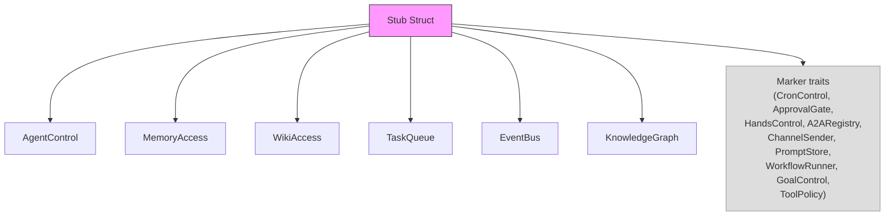

# Other — librefang-kernel-handle-tests

# `librefang-kernel-handle` — Integration Tests

## Purpose

This test module validates the **default method implementations** provided by the kernel handle traits. The `librefang-kernel-handle` crate defines a set of traits (`AgentControl`, `MemoryAccess`, `TaskQueue`, `ChannelSender`, etc.) where many methods have default implementations. These defaults allow kernel implementors to opt into only the capabilities they need while still satisfying the full trait signature.

The tests here guarantee three properties of those defaults:

1. **Safe fallback values** — methods return permissive, no-op, or clearly-unavailable results.
2. **Correct delegation chains** — convenience methods (e.g., `send_to_agent_as`) call through to their underlying primitive method.
3. **Zero-copy semantics** — the `ChannelSender::send_channel_file_data` path preserves `Bytes` reference-counted sharing across clones.

---

## Test Files

### `defaults_approval.rs`

Verifies the default behaviour of security-sensitive traits when no custom logic is provided.

| Test | Trait | Default Behaviour |
|------|-------|-------------------|
| `test_request_approval_default_auto_approves` | `ApprovalGate` | `request_approval` returns `ApprovalDecision::Approved` |
| `test_is_tool_denied_with_context_default_false` | `ToolPolicy` | `is_tool_denied_with_context` returns `false` |
| `test_requires_approval_default_false` | `ApprovalGate` | `requires_approval` returns `false` |

Uses a single `NoopKernelHandle` struct that stubs every required method with errors (since the default methods under test never invoke them).

### `defaults_delegation.rs`

Ensures that higher-level convenience methods are thin wrappers around their base primitives. Each test uses a tracking struct with an `AtomicBool` to prove the base method was actually invoked.

| Test | Method Under Test | Delegates To |
|------|-------------------|-------------|
| `test_send_to_agent_as_delegates_to_send_to_agent` | `send_to_agent_as` | `send_to_agent` |
| `test_send_to_agent_with_key_delegates_to_send_to_agent` | `send_to_agent_with_key` | `send_to_agent` |
| `test_send_to_agent_as_with_key_delegates_to_send_to_agent_as` | `send_to_agent_as_with_key` | `send_to_agent_as` → `send_to_agent` |
| `test_spawn_agent_checked_delegates_to_spawn_agent` | `spawn_agent_checked` | `spawn_agent` |
| `test_requires_approval_with_context_delegates_to_requires_approval` | `requires_approval_with_context` | `requires_approval` |

Three tracking structs are defined, each instrumenting exactly one base method:

- **`TrackingSendHandle`** — sets `send_called` when `send_to_agent` is invoked.
- **`TrackingSpawnHandle`** — sets `spawn_called` when `spawn_agent` is invoked.
- **`TrackingApprovalHandle`** — sets `approval_checked` when `requires_approval` is invoked (this one overrides the `ApprovalGate` default).

### `defaults_returns.rs`

Validates that default implementations for optional capabilities return sensible, typed error values or safe constants.

**Unavailable capabilities** return `KernelOpError::Unavailable` with a specific capability name, not a generic string match. This was introduced in issue #3541.

| Test | Methods | Expected Result |
|------|---------|----------------|
| `test_cron_defaults_return_errors` | `cron_create`, `cron_list`, `cron_cancel` | `Err(KernelOpError::Unavailable("Cron scheduler"))` |
| `test_wiki_access_defaults_return_unavailable_with_method_name` | `wiki_get`, `wiki_search`, `wiki_write` | `Err(KernelOpError::Unavailable("wiki_get"))` etc. |

**Safe defaults** for configuration queries:

| Test | Method | Default Value |
|------|--------|---------------|
| `test_resolve_user_tool_decision_default_allow` | `resolve_user_tool_decision` | `UserToolGate::Allow` |
| `test_memory_acl_for_sender_default_none` | `memory_acl_for_sender` | `None` |
| `test_tool_timeout_defaults` | `tool_timeout_secs`, `tool_timeout_secs_for` | `120` seconds |
| `test_max_agent_call_depth_default` | `max_agent_call_depth` | `5` |
| `test_workspace_prefix_defaults_empty` | `readonly_workspace_prefixes`, `named_workspace_prefixes` | empty `Vec` |

### `send_channel_file_data_zero_copy.rs`

Regression test for issue #3553. When `send_channel_file_data` was changed from `Vec<u8>` to `bytes::Bytes`, the contract became that wrapping layers (retry, metering, fan-out) can `.clone()` the buffer for free.

The test uses a `CapturingFileKernel` that records the pointer address and length of the `Bytes` it receives, then asserts the address is identical to the caller's clone — proving no copy occurred.

Three subtests:

| Test | What It Proves |
|------|----------------|
| `cloning_bytes_shares_underlying_allocation` | `Bytes::clone()` bumps refcount, preserves pointer (10 MiB payload) |
| `send_channel_file_data_does_not_copy_buffer` | The trait method receives the same allocation the caller held |
| `vec_to_bytes_round_trip_is_zero_copy_for_unique_bytes` | `Vec::from(Bytes)` is O(1) when `Bytes` uniquely owns the allocation |

---

## Architecture of the Test Stubs

Every test file defines one or more stub structs that implement the full kernel handle trait set. This is necessary because the traits are not object-safe in isolation — a test needs a concrete type satisfying all bounds.

```mermaid
graph TD
    A[Stub Struct] --> B[AgentControl]
    A --> C[MemoryAccess]
    A --> D[WikiAccess]
    A --> E[TaskQueue]
    A --> F[EventBus]
    A --> G[KnowledgeGraph]
    A --> H["Marker traits<br/>(CronControl, ApprovalGate,<br/>HandsControl, A2ARegistry,<br/>ChannelSender, PromptStore,<br/>WorkflowRunner, GoalControl,<br/>ToolPolicy)"]

    style A fill:#f9f,stroke:#333
    style H fill:#ddd,stroke:#999
```

Marker traits (shown grayed) have empty `impl` blocks. The test only overrides the specific method it needs to track; everything else is either a no-op success or a descriptive error.

---

## Adding New Default-Method Tests

When a new default method is added to any kernel handle trait:

1. **Determine the category:**
   - Returns a safe constant or `Unavailable` error → add to `defaults_returns.rs`
   - Delegates to another method → add to `defaults_delegation.rs` with a new tracking struct
   - Security/approval gate → add to `defaults_approval.rs`

2. **Minimize stub boilerplate** — copy the closest existing stub struct. If the new method is on a trait that existing stubs already implement, you may only need to update that one `impl` block.

3. **Match on `KernelOpError` variants** — for unavailable defaults, assert on `KernelOpError::Unavailable(name)` rather than checking the `Display` string. This keeps tests resilient to message wording changes.

4. **Zero-copy tests** — any new `Bytes`-accepting method should follow the `CapturingFileKernel` pattern: record `as_ptr() as usize` inside the stub, compare in the assertion.