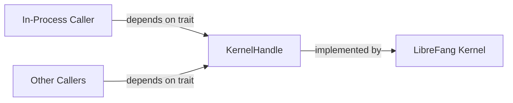

# Other — librefang-kernel-handle

# librefang-kernel-handle

Provides the `KernelHandle` trait — the primary in-process interface for interacting with the LibreFang kernel.

## Purpose

This module defines the contract that in-process callers use to communicate with the LibreFang kernel. Rather than coupling callers directly to a concrete kernel implementation, `KernelHandle` abstracts the interface behind an async trait. Any component that needs to send requests, query state, or invoke kernel operations depends on this trait, while the kernel itself provides the implementation.

## Role in the Architecture



Consumers depend on the trait defined here; they never reference the kernel's concrete types directly. This separation keeps the kernel's internals encapsulated while allowing test doubles, mocks, or alternative implementations during development and testing.

## Dependencies and Their Purpose

| Dependency | Reason |
|---|---|
| `librefang-types` | Shared domain types exchanged between caller and kernel |
| `async-trait` | Enables `#[async_trait]` on the `KernelHandle` trait, since Rust natively does not support async methods in traits in all edition contexts |
| `bytes` | Efficient byte-buffer handling for raw data payloads |
| `serde_json` | JSON serialization for structured kernel messages |
| `thiserror` | Derives ergonomic error types for handle operations |
| `tracing` | Structured logging and span instrumentation |
| `uuid` | Unique identifiers for sessions, requests, or kernel-managed entities |

## Error Handling

The module uses `thiserror` to define error types specific to handle operations. Callers should expect these errors from trait methods and handle them appropriately — common cases include kernel unavailability, invalid request payloads, and internal kernel failures.

## Usage Example

```rust
use librefang_kernel_handle::KernelHandle;
use librefang_types::SomeRequest;

async fn do_work(handle: &dyn KernelHandle) -> Result<(), Box<dyn std::error::Error>> {
    let response = handle.some_operation(SomeRequest::new()).await?;
    // process response
    Ok(())
}
```

The key pattern: accept `&dyn KernelHandle` (or a generic `H: KernelHandle`) as a parameter rather than a concrete type. This keeps functions testable and decoupled from the kernel's implementation details.

## Testing

Tests in downstream crates can provide a mock or stub implementation of `KernelHandle` without needing a live kernel. The `tokio` dev-dependency (with `macros` and `rt` features) supports writing async test functions that exercise the trait contract.

## Integration Points

- **librefang-types**: All shared types flow through this dependency. Changes to the type definitions in `librefang-types` may affect the trait's method signatures here.
- **LibreFang Kernel**: The concrete crate implements the `KernelHandle` trait, bridging the abstract interface to actual kernel logic.
- **In-process callers**: Any crate that needs kernel access adds a dependency on `librefang-kernel-handle` and works against the trait.