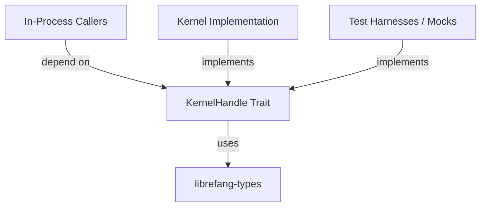

# Other — librefang-kernel-handle

# librefang-kernel-handle

## Purpose

`librefang-kernel-handle` defines the `KernelHandle` trait — the primary abstraction for in-process callers that need to interact with the LibreFang kernel. It provides a unified interface that decouples callers from the kernel's concrete implementation, allowing different parts of the system to issue kernel operations through a consistent contract.

This crate is intentionally minimal: it contains only the trait definition and associated types, keeping the boundary specification separate from both the kernel implementation and its consumers.

## Role in the Architecture



The trait lives in its own crate so that:

- **Callers** only depend on the lightweight trait crate, not the full kernel.
- **The kernel** depends on this crate to implement the trait.
- **Test code** can provide mock/stub implementations without pulling in real kernel dependencies.

## Dependencies

| Dependency | Purpose |
|---|---|
| `librefang-types` | Shared domain types exchanged across the kernel boundary (requests, responses, errors) |
| `async-trait` | Enables async methods in the trait definition |
| `serde_json` | JSON serialization for message payloads passed through the handle |
| `tracing` | Structured logging and diagnostic spans within trait interactions |
| `uuid` | Unique identifiers for sessions, requests, or other kernel-tracked entities |

The presence of `async-trait` confirms that the `KernelHandle` trait includes asynchronous methods — callers should expect to `await` kernel operations.

## Usage Patterns

### Implementing the Trait

The kernel's concrete type implements `KernelHandle`, translating each trait method into internal kernel operations. Because the trait uses `async-trait`, implementations use `async fn` syntax directly:

```rust
#[async_trait]
impl KernelHandle for MyKernel {
    async fn some_operation(&self, /* ... */) -> Result</* ... */> {
        // delegate to internal kernel machinery
    }
}
```

### Consuming the Trait

Callers accept a `dyn KernelHandle` (or a generic constrained by the trait) rather than a concrete kernel type:

```rust
async fn do_work(kernel: &dyn KernelHandle) {
    // invoke kernel operations through the trait
}
```

This inversion keeps caller code agnostic to the kernel's internals and simplifies testing.

## Relationship to `librefang-types`

All data structures flowing through the `KernelHandle` interface are defined in `librefang-types`. This crate re-exports nothing — it relies on callers and implementors to import types from `librefang-types` directly. Keeping types in a separate crate ensures a stable, shared vocabulary across the entire LibreFang workspace without circular dependencies.

## Design Notes

- **Zero execution flows**: This crate is purely a trait definition. It has no runtime behavior, no internal call graph, and no side effects. Its value is architectural — it defines the contract.
- **No outgoing calls**: The trait declares methods but delegates all real work to implementors.
- **Serialization with `serde_json`**: Some trait methods likely accept or return JSON values, enabling flexible, schema-tolerant communication across the kernel boundary.