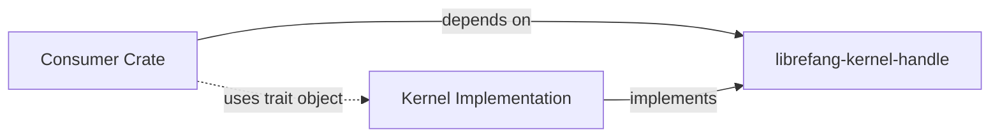

# Other — librefang-kernel-handle

# librefang-kernel-handle

Defines the `KernelHandle` trait — the primary in-process interface for callers that need to interact with the LibreFang kernel.

## Purpose

This crate provides a stable, trait-based contract between the LibreFang kernel and any in-process caller (drivers, services, test harnesses). By separating the *interface definition* into its own crate, the kernel implementation and its consumers can depend on the trait without creating circular dependencies or pulling in unnecessary implementation details.

## Role in the Architecture



Any crate that needs to call into the kernel depends on `librefang-kernel-handle` for the trait definition. The kernel crate itself implements the trait and constructs concrete instances that consumers receive (typically via dependency injection or a factory).

## Dependencies

| Dependency | Purpose |
|---|---|
| `librefang-types` | Shared domain types passed across the trait boundary (commands, events, error types) |
| `async-trait` | Enables `async` methods in the trait definition |
| `serde_json` | JSON serialization for message payloads crossing the handle boundary |
| `tracing` | Structured logging and span instrumentation |
| `uuid` | Unique identifiers for sessions, requests, or correlation tokens |

## Usage

### Implementing the Trait

A kernel implementation provides a concrete type that satisfies the trait. Because the trait uses `async-trait`, implementors apply `#[async_trait]` to their impl block:

```rust
use librefang_kernel_handle::KernelHandle;
use async_trait::async_trait;

struct MyKernel { /* ... */ }

#[async_trait]
impl KernelHandle for MyKernel {
    // ...
}
```

### Consuming the Trait

Callers receive the trait (often as `Arc<dyn KernelHandle>` or a generic parameter) and invoke methods without knowing the concrete kernel type:

```rust
use librefang_kernel_handle::KernelHandle;

async fn do_work(kernel: &dyn KernelHandle) {
    // Call trait methods defined in this crate
}
```

### Testing

The `dev-dependencies` section includes `tokio` with `macros` and `rt` features, indicating that doc tests and unit tests for the trait or mock implementations use the Tokio async runtime. When writing tests against `KernelHandle`, annotate test functions with `#[tokio::test]`.

## Design Notes

- **No execution flows or internal call graph.** This crate contains only trait definitions and possibly default method implementations. There is no runtime logic, no internal state, and no outbound calls to other LibreFang crates at the trait-definition level.
- **Trait-only crate.** Keeping the interface in a standalone crate enforces a clean boundary. Changes to the kernel's internals do not require recompiling consumers unless the trait signature itself changes.
- **Serialization boundary.** The presence of `serde_json` suggests that the handle may abstract over a serialization step — callers pass structured types, and the handle is responsible for encoding/decoding as needed by the underlying transport or IPC mechanism.