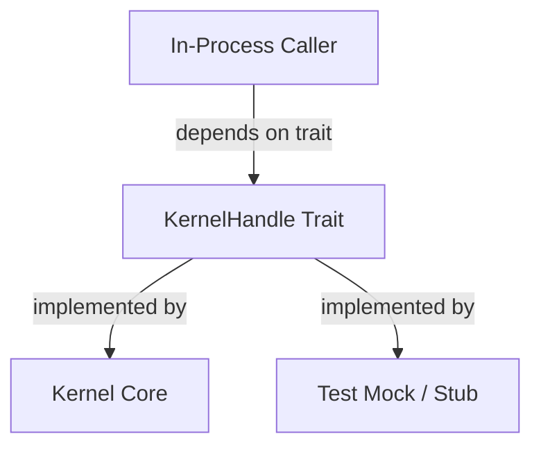

# Other — librefang-kernel-handle

# librefang-kernel-handle

Provides the `KernelHandle` trait — the primary in-process interface for callers that need to interact with the LibreFang kernel.

## Purpose

This crate defines a trait abstraction that decouples kernel consumers from the kernel's concrete implementation. Any component running in the same process as the LibreFang kernel (services, plugins, internal subsystems) depends on a `KernelHandle` implementation rather than the kernel directly, which keeps coupling loose and makes testing straightforward.

## Dependencies and What They Imply

| Dependency | Role in this crate |
|---|---|
| `librefang-types` | Shared domain types exchanged across kernel boundaries |
| `async-trait` | The `KernelHandle` trait methods are async |
| `serde` / `serde_json` | Request/response serialization for kernel operations |
| `tokio` | Async runtime primitives |
| `tracing` | Structured logging and span instrumentation on kernel calls |
| `uuid` | Identifier generation, likely for correlating requests or tracking kernel operations |

## Architecture

The trait sits between callers and the kernel. Production callers receive a real kernel-backed implementation. Tests substitute a lightweight mock that satisfies the same contract without needing kernel state.

## Usage Pattern

Callers receive a `KernelHandle` — typically through dependency injection or a constructor argument — and invoke its async methods to perform kernel operations. The caller never knows (or cares) whether it is talking to the live kernel or a test double.

Because the call graph shows no outgoing or incoming edges, this module is purely definitional: it declares the interface without pulling in additional internal crates at runtime. The only substantive dependency is `librefang-types` for the shared vocabulary.