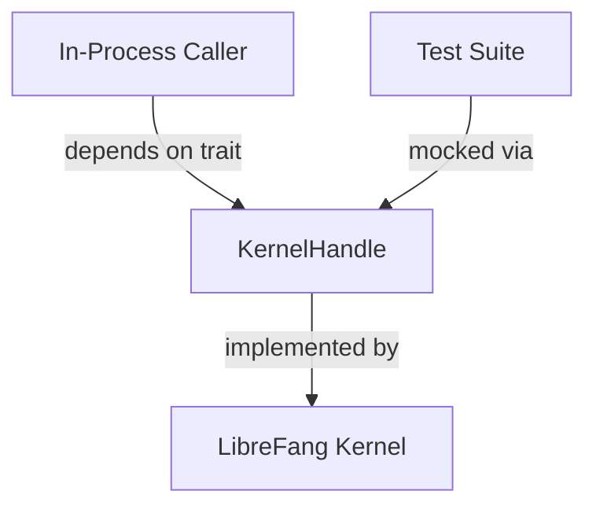

# Other — librefang-kernel-handle

# librefang-kernel-handle

A trait-based abstraction for in-process communication with the LibreFang kernel. This module defines the `KernelHandle` interface that embedded or co-hosted callers use to interact with the kernel without going through an external transport layer.

## Purpose

When the LibreFang kernel runs inside the same process as the caller (e.g., in embedded deployments, testing scenarios, or single-process builds), there is no need for IPC or network overhead. This module provides the contract that such in-process consumers rely on to invoke kernel operations.

By depending only on a trait, callers remain decoupled from the kernel's concrete implementation, allowing substitution with mocks or fakes during testing.

## Role in the Architecture



Any crate that needs to talk to the kernel from within the same process depends on `librefang-kernel-handle` rather than on the kernel directly.

## Key Dependencies

| Crate | Reason |
|---|---|
| `librefang-types` | Shared domain types exchanged between caller and kernel |
| `async-trait` | Enables async methods in the trait definition |
| `serde` / `serde_json` | Serialization of messages and payloads |
| `tokio` | Async runtime primitives |
| `tracing` | Structured logging and span instrumentation |
| `uuid` | Unique identifiers for requests, sessions, or entities |

## Using the Trait

A caller obtains a type that implements `KernelHandle` and invokes its async methods. The trait itself is defined with `#[async_trait]`, so implementations must respect that attribute.

```rust
use librefang_kernel_handle::KernelHandle;

async fn do_work(handle: &dyn KernelHandle) {
    // Call methods defined on KernelHandle
}
```

## Implementing the Trait

The kernel (or a test double) provides the concrete implementation:

```rust
use librefang_kernel_handle::KernelHandle;
use async_trait::async_trait;

struct InProcessKernel { /* ... */ }

#[async_trait]
impl KernelHandle for InProcessKernel {
    // Provide concrete method bodies
}
```

Because the module has no internal call graph or execution flows, it is intentionally thin — it exists to define the interface, not to carry logic.

## When to Depend on This Crate

- You are writing code that runs inside the same process as the LibreFang kernel and needs to call into it.
- You are building a test harness and need to mock or stub kernel interactions.
- You are extending the kernel and want to ensure your additions satisfy the handle contract.

Do **not** depend on this crate if you are communicating with the kernel over a network boundary; use the appropriate remote client crate instead.