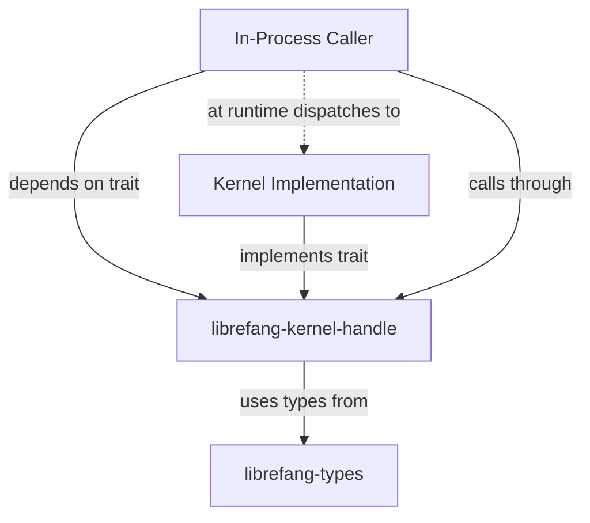

# Other — librefang-kernel-handle

# librefang-kernel-handle

Defines the `KernelHandle` trait — the primary interface for in-process callers to interact with the LibreFang kernel.

## Purpose

This crate provides a standardized abstraction for components that need to call into the LibreFang kernel from within the same process. Rather than coupling callers directly to kernel internals, the `KernelHandle` trait offers a stable, async-aware contract that decouples the caller from the kernel's implementation details.

This is a foundational crate: it contains the trait definition and supporting types, with no concrete kernel implementation. Downstream crates provide the actual `KernelHandle` implementations.

## When to Use This Crate

Import `librefang-kernel-handle` when you are:

- **Implementing a kernel** — you will provide a concrete type that satisfies the `KernelHandle` trait.
- **Writing an in-process caller** — such as a plugin, FFI boundary shim, or embedded runtime — that needs to invoke kernel operations without going through IPC or a network boundary.

## Dependencies and What They Signal

| Dependency | Role in This Crate |
|---|---|
| `librefang-types` | Shared domain types passed between caller and kernel (messages, error types, etc.) |
| `async-trait` | The `KernelHandle` trait uses async methods; `async-trait` provides the proc-macro support |
| `serde` / `serde_json` | Trait methods likely accept or return serializable payloads |
| `tokio` | Async runtime backing the trait's futures |
| `tracing` | Instrumentation spans on kernel interactions for observability |
| `uuid` | Correlation or request identifiers for tracing kernel calls |

## Architecture



The caller depends only on the trait crate, never on the kernel implementation directly. This allows swapping kernel backends (e.g., a real kernel vs. a test double) without modifying caller code.

## Relationship to the Wider Codebase

- **`librefang-types`** — The shared vocabulary. Any struct or enum that crosses the `KernelHandle` boundary is defined there, not here.
- **Kernel implementation crates** — Live elsewhere in the workspace and provide `impl KernelHandle for …`.
- **Caller crates** — Accept a `dyn KernelHandle` (or generic `H: KernelHandle`) and invoke methods through it.

Because this crate has no outgoing or incoming internal calls, it is purely definitional. It introduces no side effects, no global state, and no build-time code generation beyond the `async-trait` macro expansion.

## Usage Pattern

A typical caller takes the handle as a dependency:

```rust
use librefang_kernel_handle::KernelHandle;

async fn do_work<H: KernelHandle>(kernel: &H) {
    // Call through the trait — actual dispatch is transparent
}
```

A typical kernel implementation:

```rust
use librefang_kernel_handle::KernelHandle;

struct MyKernel { /* ... */ }

#[async_trait]
impl KernelHandle for MyKernel {
    // concrete method bodies
}
```

Testing is straightforward: substitute a mock or stub implementation of `KernelHandle` without modifying the code under test.