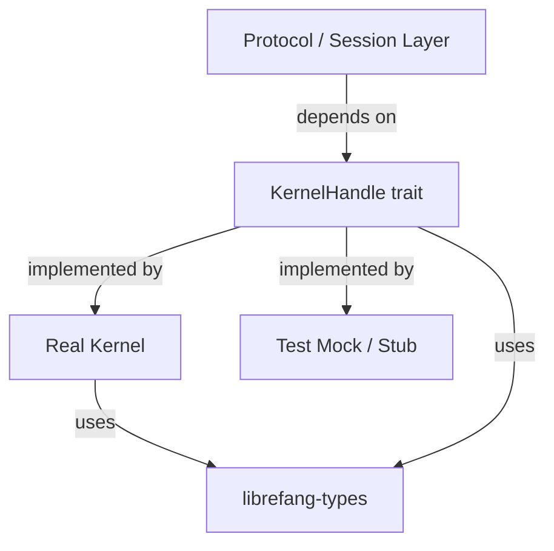

# Other — librefang-kernel-handle

# librefang-kernel-handle

A thin abstraction layer that defines the `KernelHandle` trait — the primary interface through which in-process callers interact with the LibreFang kernel.

## Purpose

This crate exists to decouple **"what it means to talk to the kernel"** from **"how the kernel is actually implemented."** Any component that needs to invoke kernel operations — protocol handlers, session managers, integration tests — depends on this trait rather than on a concrete kernel implementation. This enables:

- **Dependency injection** in production code (swap real kernel for a test double).
- **Layer isolation** — higher-level crates never see kernel internals.
- **Async-first design** — all kernel interactions are inherently asynchronous.

## Role in the Architecture

Consumers depend on the *trait* defined here. The concrete kernel (likely in a separate crate) implements the trait. Tests can substitute their own implementation without touching production kernel code.

## Dependencies and Why They Matter

| Dependency | Reason |
|---|---|
| `librefang-types` | Shared domain types (request/response structs, error codes, etc.) that flow across the trait boundary. |
| `async-trait` | Makes the trait object-safe for async methods, allowing `dyn KernelHandle` to be used with `Box::pin`. |
| `bytes` | Efficient byte-buffer handling for raw packet/message payloads. |
| `serde_json` | JSON (de)serialization for message bodies that cross the trait boundary. |
| `thiserror` | Derives the `Error` enum returned by trait methods. |
| `tracing` | Structured logging spans for observability of kernel calls. |
| `uuid` | Correlation/trace IDs attached to kernel requests. |

`tokio` appears only in `[dev-dependencies]` — it powers the async test runtime and is not a runtime requirement of the crate itself.

## Implementing the Trait

To provide your own `KernelHandle`:

1. Add `librefang-kernel-handle` and `librefang-types` as dependencies.
2. Implement the `KernelHandle` trait for your type.
3. Ensure every async method respects cancellation and returns the expected error type defined in this crate.

For testing, implement the trait with stubbed responses. Because the trait is defined with `async-trait`, it is object-safe and can be used as `Box<dyn KernelHandle>` or `Arc<dyn KernelHandle>`.

## Linting

This crate inherits workspace-level lints, ensuring consistency with the broader LibreFang codebase.