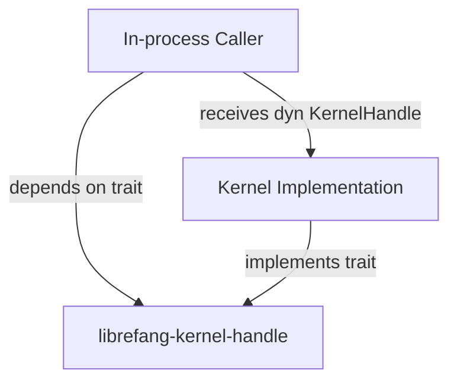

# Other — librefang-kernel-handle

# librefang-kernel-handle

Trait definition for in-process callers that need to interact with the LibreFang kernel.

## Purpose

This crate defines the `KernelHandle` trait — the primary interface through which in-process components communicate with the LibreFang kernel. Rather than routing calls through IPC or network boundaries, consumers receive a trait object and invoke kernel operations directly within the same process.

Because this crate contains only the trait definition (and no concrete implementation), it serves as a lightweight contract that both the kernel and its consumers can depend on without creating circular dependencies.

## Architecture


```mermaid
graph TD
    A[In-process Caller] -->|depends on trait| B[librefang-kernel-handle]
    C[Kernel Implementation] -->|implements trait| B
    A -->|receives dyn KernelHandle| C
```

The kernel implementation crate provides a concrete type implementing `KernelHandle` and hands instances (or `Box<dyn KernelHandle>`) to callers that need kernel access. Callers only depend on this trait crate, keeping them decoupled from kernel internals.

## Dependencies

| Crate | Role |
|---|---|
| `librefang-types` | Shared domain types used in trait method signatures |
| `async-trait` | Enables `async` methods in the trait definition |
| `bytes` | Efficient byte buffer handling for payload data |
| `serde_json` | JSON serialization for message payloads |
| `tracing` | Structured logging and span instrumentation |
| `uuid` | Unique identifiers for requests, sessions, or entities |

## Usage

### Implementing the Trait

A concrete kernel implementation provides the real logic:

```rust
use librefang_kernel_handle::KernelHandle;
use async_trait::async_trait;

struct LocalKernel {
    // internal state
}

#[async_trait]
impl KernelHandle for LocalKernel {
    // implement required methods
}
```

### Consuming the Trait

Callers accept a trait object and invoke through it:

```rust
use librefang_kernel_handle::KernelHandle;

async fn do_work(kernel: &dyn KernelHandle) {
    // call trait methods on kernel
}
```

This indirection allows swapping implementations (real kernel, mock for testing, instrumented wrapper) without changing caller code.

## Testing

The `dev-dependencies` section includes `tokio` with `macros` and `rt` features, indicating that any doc tests or integration tests for this crate use the Tokio runtime to exercise async trait methods.