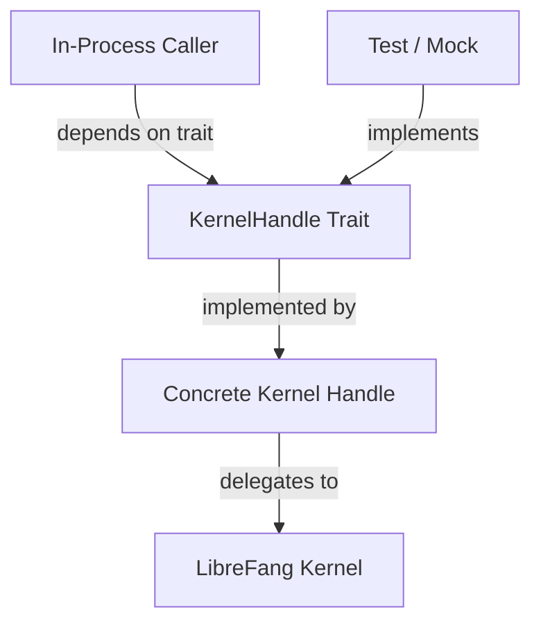

# Other — librefang-kernel-handle

# librefang-kernel-handle

A trait abstraction for in-process callers to interact with the LibreFang kernel.

## Purpose

This crate defines the `KernelHandle` trait — the primary interface through which in-process components communicate with the LibreFang kernel. It serves as the boundary layer between the kernel's core logic and the various callers that need to invoke it, without requiring out-of-process or IPC communication.

By abstracting the kernel interaction behind a trait, this module enables:

- **Testability** — callers can be injected with mock or stub implementations.
- **Decoupling** — the kernel's concrete implementation is separated from its consumers.
- **Flexibility** — different handle implementations can be swapped at runtime (e.g., a direct handle vs. a sandboxed or rate-limited wrapper).

## Dependencies and What They Imply

| Dependency | Role |
|---|---|
| `librefang-types` | Shared type definitions (requests, responses, errors) exchanged across the kernel boundary |
| `async-trait` | The `KernelHandle` trait is async — callers `await` kernel operations |
| `bytes` | Efficient byte buffer handling for payload transport |
| `serde_json` | JSON serialization/deserialization for message payloads |
| `tracing` | Structured logging and span instrumentation for observability |
| `uuid` | Unique identifiers for correlating requests and tracking sessions |

## Architecture


```mermaid
graph TD
    A[In-Process Caller] -->|depends on trait| B[KernelHandle Trait]
    B -->|implemented by| C[Concrete Kernel Handle]
    C -->|delegates to| D[LibreFang Kernel]
    E[Test / Mock] -->|implements| B
```

The `KernelHandle` trait sits between callers and the kernel. Production code uses a concrete implementation that directly invokes kernel operations. Tests and specialized environments substitute their own implementations.

## Usage

Consumers depend on this crate to accept a `KernelHandle`-typed parameter, typically through dependency injection:

```rust
use librefang_kernel_handle::KernelHandle;

async fn process_request(handle: &dyn KernelHandle) {
    // Call into the kernel through the trait interface
}
```

Implementors provide the concrete behavior:

```rust
struct DirectKernelHandle { /* ... */ }

#[async_trait]
impl KernelHandle for DirectKernelHandle {
    // trait method implementations
}
```

## Relationship to the Wider Codebase

- **librefang-types** — Defines the request/response/error types that flow through the `KernelHandle` interface. This crate re-exports or references those types in its trait signatures.
- **LibreFang kernel** — The downstream consumer of requests dispatched through a handle. The kernel itself is unaware of the trait; the handle implementation bridges the gap.
- **Callers** — Any in-process component that needs to submit work to the kernel accepts a `&dyn KernelHandle` or a generic `H: KernelHandle`.

## Notes

- This crate contains no executable logic of its own — it defines a trait and supporting types only.
- The `async-trait` dependency indicates all trait methods are async, meaning callers must operate within an async runtime (e.g., Tokio, as reflected in dev-dependencies).
- No incoming or outgoing call edges exist within this module's own code, confirming its role as a pure interface definition.