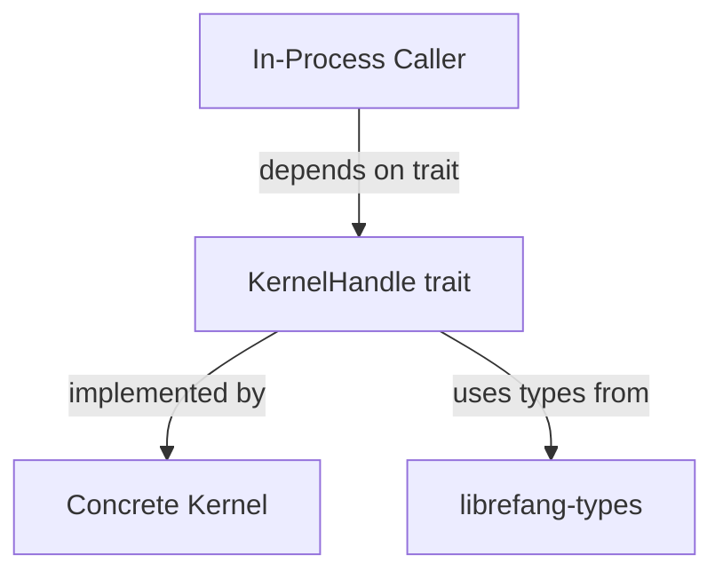

# Other — librefang-kernel-handle

# librefang-kernel-handle

Defines the `KernelHandle` trait — the primary in-process interface for callers interacting with the LibreFang kernel.

## Purpose

This crate provides a stable, async-aware abstraction that allows components within the same process to call into the LibreFang kernel. Rather than coupling callers directly to a concrete kernel implementation, dependents code against the `KernelHandle` trait. This separation enables:

- **Testability** — substitute a mock or stub implementation during unit tests without spawning a real kernel.
- **Decoupling** — callers remain agnostic to whether the kernel is a single-threaded service, a threaded actor, or any other execution strategy.
- **Boundary clarity** — the trait acts as a well-defined API contract at the kernel edge.

## Architecture


```mermaid
graph TD
    A[In-Process Caller] -->|depends on trait| B[KernelHandle trait]
    B -->|implemented by| C[Concrete Kernel]
    B -->|uses types from| D[librefang-types]
```

Any in-process component that needs to interact with the kernel receives a `dyn KernelHandle` (or a generic constrained by the trait) and calls methods defined here. The concrete kernel lives in a separate crate and provides the actual implementation.

## Dependencies and Their Roles

| Dependency | Role |
|---|---|
| `librefang-types` | Shared domain types passed across the trait boundary — request/response structs, error types, identifiers. |
| `async-trait` | Enables `async` methods in the trait definition. All kernel interactions are inherently asynchronous (I/O, timers, message passing), so callers `await` trait methods. |
| `bytes` | Efficient byte-buffer handling, likely used for raw frame or payload data flowing through the kernel. |
| `serde_json` | JSON serialization for message payloads or configuration data exchanged via the handle. |
| `tracing` | Structured logging and span instrumentation on trait method boundaries. |
| `uuid` | Unique identifiers for sessions, requests, or kernel-managed entities. |

## Relationship to Other Crates

- **librefang-types** — supplies the data types that appear in `KernelHandle` method signatures. This is the only LibreFang crate this module depends on, keeping the interface layer thin.
- **Consumer crates** — any crate that needs to call into the kernel adds a dependency on `librefang-kernel-handle` and accepts a `KernelHandle` implementor through dependency injection.
- **Concrete kernel crate** — implements `KernelHandle`, wiring trait methods to internal kernel state, actors, or message queues.

## Usage Pattern

A typical caller receives a handle at construction time:

```rust
use librefang_kernel_handle::KernelHandle;

struct SomeService {
    kernel: Box<dyn KernelHandle>,
}

impl SomeService {
    pub async fn do_work(&self) -> Result<(), MyError> {
        // Call into the kernel through the trait
        let response = self.kernel.some_operation(/* ... */).await?;
        Ok(())
    }
}
```

During testing, inject a lightweight stub; in production, inject the full kernel implementation.

## Testing

The `tokio` dev-dependency (with `macros` and `rt` features) supports async test functions in this crate's own tests. When writing tests against `KernelHandle`, you typically:

1. Implement the trait on a test helper struct with controlled responses.
2. Use `#[tokio::test]` to drive async trait method calls.
3. Assert that the caller under test behaves correctly given specific kernel responses.

## Build Configuration

This crate inherits workspace-level settings for `version`, `edition`, `license`, and lint rules via the `[workspace]` inheritance mechanism (`workspace = true`). It follows the same edition and linting standards as the rest of the LibreFang project.