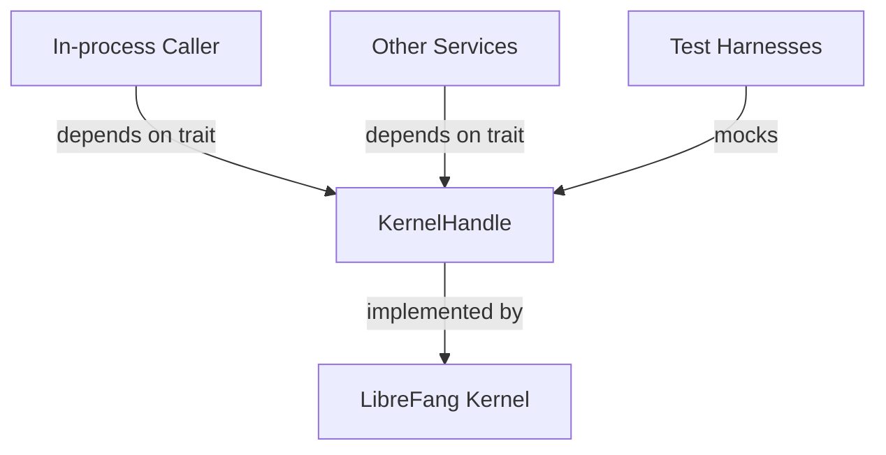

# Other — librefang-kernel-handle

# librefang-kernel-handle

A thin abstraction layer defining the `KernelHandle` trait — the primary interface for in-process callers to interact with the LibreFang kernel.

## Purpose

This crate provides a stable, trait-based contract that decouples consumers of the LibreFang kernel from its concrete implementation. Any component running in the same process (services, plugins, middleware) that needs to invoke kernel operations does so through `KernelHandle`, rather than depending on the kernel directly.

## Role in the Architecture


```mermaid
graph TD
    A[In-process Caller] -->|depends on trait| B[KernelHandle]
    B -->|implemented by| C[LibreFang Kernel]
    D[Other Services] -->|depends on trait| B
    E[Test Harnesses] -->|mocks| B
```

`librefang-kernel-handle` sits between the kernel implementation and its consumers. Callers only need to depend on this lightweight crate — not the full kernel — keeping dependency graphs clean and compilation fast.

## Dependencies and Their Roles

| Dependency | Purpose |
|---|---|
| `librefang-types` | Shared domain types (messages, errors, identifiers) exchanged across the trait boundary |
| `async-trait` | Enables `#[async_trait]` on the `KernelHandle` trait, since kernel operations are asynchronous |
| `bytes` | Efficient byte buffer handling for raw data passing (e.g., network payloads, serialized messages) |
| `serde_json` | JSON serialization/deserialization for structured data exchanged through the handle |
| `tracing` | Instrumentation spans and diagnostic logging within trait operations |
| `uuid` | Unique identifier generation for requests, sessions, or entity correlation |

## Usage Patterns

### Depending on the Trait

Add this crate to your `Cargo.toml`:

```toml
[dependencies]
librefang-kernel-handle = { path = "../librefang-kernel-handle" }
```

Accept a `KernelHandle` as a parameter rather than constructing one:

```rust
use librefang_kernel_handle::KernelHandle;

async fn process_request(kernel: &dyn KernelHandle) {
    // invoke kernel operations through the trait
}
```

### Implementing the Trait

The kernel crate itself provides the concrete implementation. If you are extending or replacing the kernel, implement `KernelHandle` for your type:

```rust
use librefang_kernel_handle::KernelHandle;

struct MyKernel { /* ... */ }

#[async_trait]
impl KernelHandle for MyKernel {
    // trait method implementations
}
```

### Testing with Mocks

In dev/test contexts, `KernelHandle` can be mocked or stubbed since it is a trait. The crate's `dev-dependencies` include `tokio` with `macros` and `rt` features specifically to support writing async test harnesses.

## Design Notes

- **Trait-only crate.** This module intentionally contains no business logic or runtime state. It exists solely to define the `KernelHandle` interface and any supporting types that should be visible to callers.
- **No outgoing calls.** The crate has no internal execution flow — it is a pure type definition module. All behavior lives in the implementing crate.
- **Stability surface.** Because in-process callers depend on this trait, changes to the `KernelHandle` signature are the primary compatibility concern. Avoid breaking changes; prefer adding new methods with default implementations or introducing extension traits.