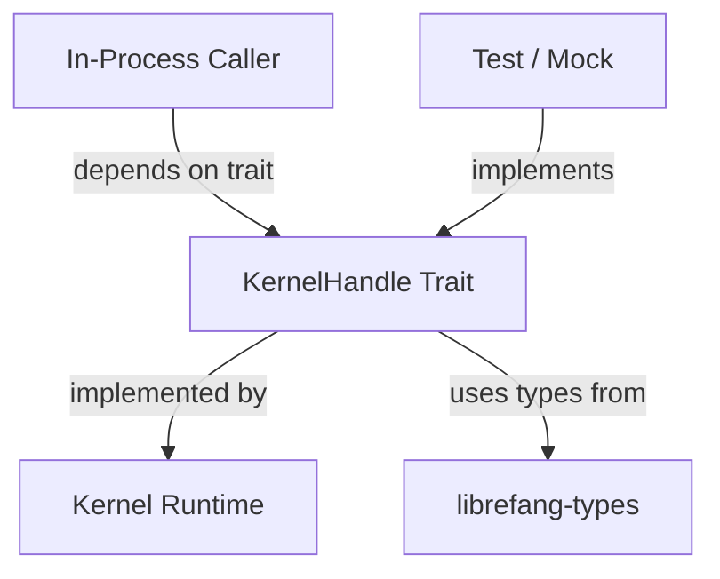

# Other — librefang-kernel-handle

# librefang-kernel-handle

A trait definition module providing the `KernelHandle` abstraction for in-process callers that need to interact with the LibreFang kernel.

## Purpose

This crate defines the interface contract between in-process callers and the LibreFang kernel. Rather than performing IPC (inter-process communication) or network calls, components running within the same process as the kernel use a `KernelHandle` trait implementation to communicate directly. This enables:

- **Zero-copy in-process communication** between kernel services and their callers.
- **Testability** — callers depend on the trait, allowing mock or stub implementations in tests.
- **Decoupling** — the kernel's concrete implementation is separated from the interface consumers rely on.

## Architecture


```mermaid
graph TD
    A[In-Process Caller] -->|depends on trait| B[KernelHandle Trait]
    B -->|implemented by| C[Kernel Runtime]
    D[Test / Mock] -->|implements| B
    B -->|uses types from| E[librefang-types]
```

The trait is the sole public export of this crate. Concrete implementations live elsewhere in the LibreFang workspace, while consumers depend only on this trait definition.

## Dependencies

| Dependency | Role |
|---|---|
| `librefang-types` | Shared domain types used in trait method signatures (requests, responses, errors). |
| `async-trait` | Enables `async` methods in the trait definition, since Rust natively does not support async fns in traits (prior to stable RPITIT). |
| `bytes` | Efficient byte buffer handling for binary message payloads. |
| `serde_json` | JSON (de)serialization for structured message content. |
| `tracing` | Instrumentation and diagnostic logging within trait default methods or implementations. |
| `uuid` | Identifier types for correlating requests, sessions, or kernel resources. |

## Usage

### Depending on the Trait

Add `librefang-kernel-handle` to your crate's `Cargo.toml`:

```toml
[dependencies]
librefang-kernel-handle = { path = "../librefang-kernel-handle" }
```

Then accept a `KernelHandle` as a generic bound or `dyn` reference:

```rust
use librefang_kernel_handle::KernelHandle;

async fn do_work(handle: &dyn KernelHandle) {
    // Call trait methods on handle
}
```

### Implementing the Trait

The kernel runtime provides the concrete implementation. If you need a mock for testing, implement the trait directly:

```rust
use librefang_kernel_handle::KernelHandle;

struct MockHandle;

impl KernelHandle for MockHandle {
    // implement required methods
}
```

## Relationship to the Rest of the Workspace

This is a **leaf-interface crate** — it has no outgoing calls to other LibreFang crates (beyond `librefang-types` for shared data structures) and no internal module structure. Its value is architectural: it is the seam that allows kernel callers and kernel implementors to evolve independently.

- **Downstream consumers**: Any crate that needs to invoke kernel operations in-process.
- **Upstream implementors**: The kernel runtime crate(s) that provide the live `KernelHandle` implementation.
- **Test crates**: Use dev-dependencies on `tokio` (with `macros` and `rt` features) for writing async test cases against mock implementations.